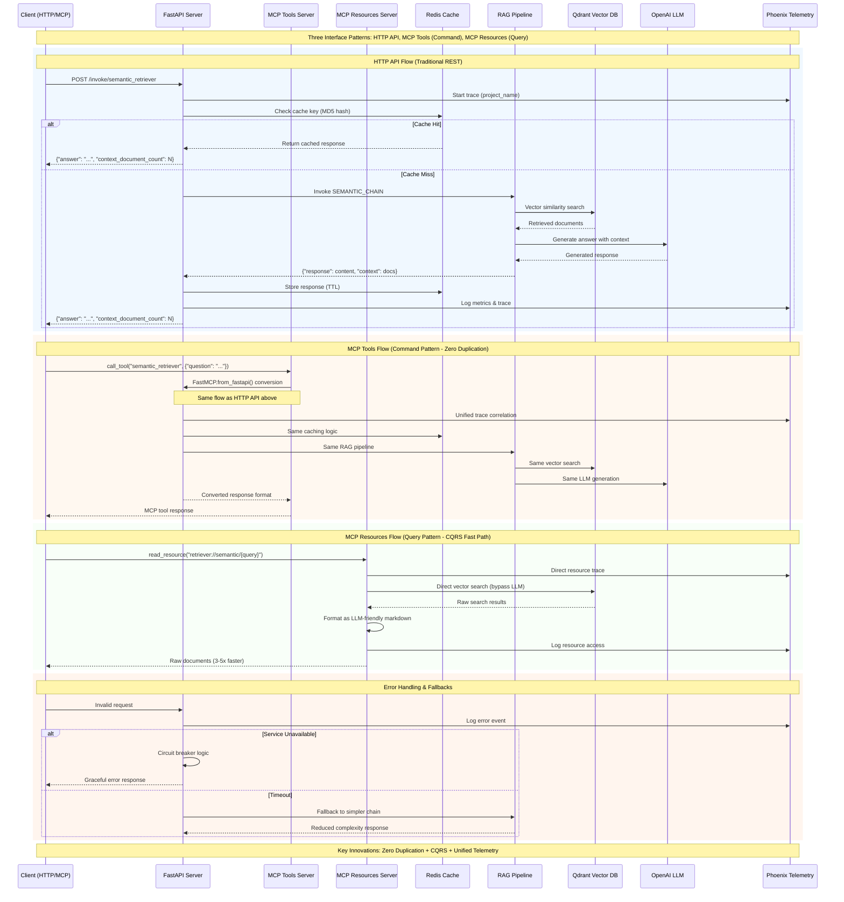

# CLAUDE.md

This file provides guidance to Claude Code (claude.ai/code) when working with code in this repository.

**System Version**: Advanced RAG with CQRS MCP Resources v2.5  
**Last Updated**: 2025-06-25  
**Status**: ✅ FULLY OPERATIONAL - All components tested and working  
**Key Feature**: Dual MCP interface (Tools + Resources) with zero duplication + external MCP ecosystem + comprehensive observability  
**Python Requirement**: Python >=3.13 (runtime), py311 target (tooling compatibility)

## 🎯 System Overview

This is a production-ready RAG system with **dual MCP interfaces** and comprehensive telemetry:
- **6 Retrieval Strategies**: naive, semantic, bm25, compression, multiquery, ensemble
- **Dual MCP Architecture**: Tools (8 endpoints) + Resources (5 URI patterns) with zero code duplication
- **Phoenix Telemetry Integration**: Complete AI agent observability and experiment tracking
- **FastAPI→MCP Conversion**: Automatic tools generation via FastMCP
- **CQRS Pattern**: Command (full processing) vs Query (direct data access) optimization

### Performance Verified
✅ **All 5 Tiers Operational**: Environment → Infrastructure → Application → MCP → Data  
✅ **6 Retrieval Strategies**: Working with proper context (3-10 docs per query)  
✅ **Sub-30 Second Response Times**: System handles retrieval queries efficiently  
✅ **Vector Collections**: 100+ points (baseline), 179+ points (semantic)  

## ⚠️ Critical Architectural Constraints (IMMUTABLE)

### Tier-Based Architecture Rules
This system follows strict **tier-based modification rules**. Understanding these is critical:

| Tier | Components | Modification Rule | Examples |
|------|------------|-------------------|----------|
| **Tier 1: Core** | Model pinning, settings | ❌ **NEVER MODIFY** | `src/core/settings.py`, model configurations |
| **Tier 2: Workflow** | Environment, testing | ✅ **REQUIRED** | Virtual environment, testing patterns |
| **Tier 3: Foundation** | RAG pipeline, LangChain | ❌ **NEVER MODIFY** | `src/rag/` core components |
| **Tier 4: Interface** | API endpoints, MCP | ✅ **SAFE TO MODIFY** | `src/api/app.py`, `src/mcp/` |
| **Tier 5: Tooling** | Scripts, validation | ✅ **SAFE TO MODIFY** | `scripts/`, schema export |

### Non-Negotiable Rules
- **Model Pinning**: Always use `ChatOpenAI(model="gpt-4.1-mini")` and `OpenAIEmbeddings(model="text-embedding-3-small")`
- **Virtual Environment**: REQUIRED for all development - system will fail without `.venv` activation
- **MCP Interface Layer**: MCP serves as interface only - never modify core RAG business logic
- **Import Convention**: Use absolute imports from `src` package structure consistently

### Modification Decision Tree
```
Is your change in Tier 1-3? → ❌ STOP - Requires architectural review
Is your change in Tier 4-5? → ✅ PROCEED - Add to interface/tooling layers
```

## 🚀 Essential Commands

⚠️ **CRITICAL**: Always activate virtual environment first: `source .venv/bin/activate`

### Quick Start (4 Steps)
```bash
# 1. Environment Setup
source .venv/bin/activate && uv sync --dev

# 2. Infrastructure & Configuration  
docker-compose up -d && cp .env.example .env
# Edit .env with your API keys (OPENAI_API_KEY, COHERE_API_KEY)

# 3. Data & Server
python scripts/ingestion/csv_ingestion_pipeline.py && python run.py

# 4. Verify (in another terminal)
curl -X POST "http://localhost:8000/invoke/semantic_retriever" \
     -H "Content-Type: application/json" \
     -d '{"question": "What makes John Wick movies popular?"}'
```

### Development Servers
```bash
# Start FastAPI server (port 8000)
python run.py

# Start MCP Tools server (Command Pattern - stdio mode)
python src/mcp/server.py

# Start MCP Resources server (Query Pattern - separate terminal)
python src/mcp/resources.py
```

### Testing & Validation
```bash
# Run all tests with markers from pytest.ini
pytest tests/ -v                    # All tests
pytest tests/ -m unit -v            # Unit tests only
pytest tests/ -m integration -v     # Integration tests
pytest tests/ -m requires_llm -v    # Tests needing API keys

# Test specific components
pytest tests/rag/test_chain.py::test_semantic_retriever -v
bash tests/integration/test_api_endpoints.sh
python tests/integration/verify_mcp.py

# System health validation
python scripts/validation/system_health_check.py
python scripts/status.py --verbose
```

### Code Quality (from pyproject.toml)
```bash
# Format and lint code
black src/ tests/ --line-length 88
ruff check src/ tests/ --fix

# Install/update dependencies
uv sync --dev
```

### Data Pipeline & Evaluation
```bash
# Ingest sample data (John Wick movie reviews)
python scripts/ingestion/csv_ingestion_pipeline.py

# Compare all 6 retrieval strategies
python scripts/evaluation/retrieval_method_comparison.py

# Run semantic architecture benchmark
python scripts/evaluation/semantic_architecture_benchmark.py
```

### Infrastructure Health Checks
```bash
# Start services
docker-compose up -d

# Verify all services
curl http://localhost:6333           # Qdrant: {"title":"qdrant - vector search engine"}
curl http://localhost:6006           # Phoenix: HTML response  
curl http://localhost:8000/health    # FastAPI: {"status":"healthy"}
curl http://localhost:6379           # Redis: +PONG

# Check collections
curl http://localhost:6333/collections
```

## 🏗️ Architecture Overview

### Core Components
- **`src/api/app.py`** - FastAPI server with 6 retrieval endpoints
- **`src/mcp/server.py`** - MCP Tools via `FastMCP.from_fastapi()` conversion
- **`src/mcp/resources.py`** - Native FastMCP Resources for CQRS data access
- **`src/rag/`** - Core RAG components (IMMUTABLE: Tier 3)
- **`src/core/settings.py`** - Centralized configuration (IMMUTABLE: Tier 1)

### 6 Retrieval Strategies Available
| Strategy | Endpoint | Use Case |
|----------|----------|----------|
| **Naive** | `/invoke/naive_retriever` | Fast baseline vector similarity |
| **BM25** | `/invoke/bm25_retriever` | Traditional keyword search |
| **Semantic** | `/invoke/semantic_retriever` | Advanced semantic with context |
| **Compression** | `/invoke/contextual_compression_retriever` | AI reranking with filtering |
| **Multi-Query** | `/invoke/multi_query_retriever` | Query expansion for coverage |
| **Ensemble** | `/invoke/ensemble_retriever` | Hybrid approach combining strategies |

### Request/Response Schema
```json
// Request (all endpoints)
{"question": "What makes John Wick movies popular?"}

// Response
{
  "answer": "Generated response based on retrieved context",
  "context_document_count": 5
}
```

## 🔌 MCP Dual Interface Architecture

### Interface Selection Guide

| Need | Use | Performance | Output |
|------|-----|-------------|--------|
| **Complete analysis** | MCP Tools | ~20-30 sec | Formatted answer + context |
| **Raw data for processing** | MCP Resources | ~3-5 sec ⚡ | Document list + metadata |
| **HTTP integration** | FastAPI | ~15-25 sec | JSON response |

### 1. MCP Tools Server (Command Pattern)
**Purpose**: Complete RAG pipeline with LLM synthesis  
**Use When**: Need ready-to-use answers for users

```bash
# Start tools server
python src/mcp/server.py

# Available tools (8 total):
# - semantic_retriever, ensemble_retriever, naive_retriever
# - contextual_compression_retriever, multi_query_retriever, bm25_retriever

# Test tools
python tests/integration/verify_mcp.py
```

### 2. MCP Resources Server (Query Pattern)  
**Purpose**: Direct data access with 3-5x faster performance  
**Use When**: Need raw data for further agent processing

```bash
# Start resources server
python src/mcp/resources.py

# Available resources (5 URI patterns):
# - retriever://semantic_retriever/{query}
# - retriever://ensemble_retriever/{query}  
# - retriever://naive_retriever/{query}
# - system://health

# Test resources (OPERATIONAL - All tests pass)
python tests/integration/test_cqrs_resources.py
```

### 3. External MCP Ecosystem Integration
Access external MCP services via Claude Code CLI:

**Data Storage & Memory**:
- `qdrant-code-snippets` (Port 8002) - Code pattern storage
- `qdrant-semantic-memory` (Port 8003) - Contextual insights  
- `memory` - Official MCP knowledge graph

**Observability & Analysis**:
- `phoenix` (localhost:6006) - **Critical for AI agent behavior analysis**

**Development Tools**:
- `ai-docs-server` - Documentation access (FastMCP, LangChain, etc.)
- `sequential-thinking` - Enhanced reasoning for complex problems

### Schema Management
```bash
# Native MCP discovery (RECOMMENDED)
python src/mcp/server.py
curl -X POST http://127.0.0.1:8000/mcp \
  -H "Content-Type: application/json" \
  -d '{"jsonrpc":"2.0","id":1,"method":"rpc.discover","params":{}}'

# Legacy schema export (development only)
python scripts/mcp/export_mcp_schema.py
python scripts/mcp/validate_mcp_schema.py
```

## 🧠 Phoenix Telemetry & AI Agent Observability

### Key Capabilities
- **Automatic Tracing**: All retrieval operations and agent decision points
- **Experiment Tracking**: `johnwick_golden_testset` for performance analysis  
- **Three-Tier Memory Architecture**:
  1. **Knowledge Graph** (`memory` MCP): Structured entities/relationships
  2. **Semantic Memory** (`qdrant-semantic-memory`): Contextual insights  
  3. **Telemetry Data** (`phoenix`): Performance metrics and behavior analysis

### Access Patterns
```bash
# Direct Phoenix UI
open http://localhost:6006

# MCP-based Phoenix integration (via Claude Code CLI)
# Query performance metrics across retrieval strategies
# Analyze agent decision patterns and effectiveness
```

## 🔄 Development Patterns

### Adding New Retrieval Strategies (Tier 4 - Safe)
1. **Add FastAPI endpoint** in `src/api/app.py` (auto-converts to MCP tool)
2. **Implement retriever** in `src/rag/retriever.py` using factory pattern  
3. **Create LCEL chain** in `src/rag/chain.py` following established patterns
4. **Never modify** existing retrieval logic - only add new strategies

### LangChain LCEL Chain Pattern (Foundation - DO NOT MODIFY)
```python
# Standard pattern from src/rag/chain.py
from langchain_core.runnables import RunnableParallel, RunnablePassthrough
from langchain_core.output_parsers import StrOutputParser

def create_rag_chain(retriever, llm, prompt_template=None):
    prompt = ChatPromptTemplate.from_template(prompt_template or DEFAULT_PROMPT)
    
    rag_chain = (
        RunnableParallel({
            "context": retriever | format_docs,
            "question": RunnablePassthrough()
        })
        | prompt | llm | StrOutputParser()
    )
    return rag_chain
```

### Error Handling & Debugging
```bash
# Service health checks
curl http://localhost:6333     # Qdrant
curl http://localhost:6006     # Phoenix  
curl http://localhost:8000/health  # FastAPI

# Debug tools
python tests/integration/verify_mcp.py  # MCP Tools validation
python tests/integration/test_cqrs_resources.py  # Resources validation
python src/core/settings.py  # Check API keys and environment
```

## 📊 Configuration & Environment

### Required Environment Variables (.env file)
```bash
# Core API Keys (REQUIRED)
OPENAI_API_KEY=your_key_here
COHERE_API_KEY=your_key_here

# Service Endpoints (defaults provided)
QDRANT_URL=http://localhost:6333  
REDIS_URL=redis://localhost:6379
PHOENIX_ENDPOINT=http://localhost:6006

# Cache Configuration (for A/B testing)
CACHE_ENABLED=true  # Set to false to disable caching

# Model Configuration (pinned for stability)  
OPENAI_MODEL_NAME=gpt-4.1-mini
EMBEDDING_MODEL_NAME=text-embedding-3-small
```

### Key Dependencies (from pyproject.toml)
- **FastAPI + FastMCP**: API server and MCP conversion (fastapi>=0.115.12, fastmcp>=2.8.0)
- **LangChain**: RAG pipeline (langchain>=0.3.25, langchain-core>=0.3.65)
- **Qdrant**: Vector database (qdrant-client>=1.11.0)
- **Phoenix**: Telemetry (arize-phoenix>=10.12.0)
- **uv**: Package management (recommended over pip)

## 💾 Cache Configuration & A/B Testing

### Cache Toggle for Strategy Evaluation

The system supports dynamic cache toggling for A/B testing retrieval strategies:

```bash
# Enable cache (default)
export CACHE_ENABLED=true

# Disable cache for testing
export CACHE_ENABLED=false
```

### Cache Architecture

The system uses a **multi-level cache abstraction**:

- **L1 Local Cache**: In-memory with TTL (fast, small capacity)
- **L2 Redis Cache**: Persistent with TTL (slower, large capacity)  
- **NoOp Cache**: When caching disabled (for testing)

### Running Cache A/B Tests

**Method 1: Single Evaluation Script**
```bash
# Test with cache enabled and disabled
CACHE_MODE=both python scripts/evaluation/retrieval_method_comparison.py

# Test only with cache enabled
CACHE_MODE=enabled python scripts/evaluation/retrieval_method_comparison.py

# Test only with cache disabled  
CACHE_MODE=disabled python scripts/evaluation/retrieval_method_comparison.py
```

**Method 2: Benchmark Script**
```bash
# Comprehensive benchmark including cache comparison
python scripts/evaluation/semantic_architecture_benchmark.py
```

### Cache Performance Metrics

Access cache statistics via API:
```bash
curl http://localhost:8000/cache/stats
```

Returns:
```json
{
  "cache_enabled": true,
  "cache_type": "multi_level",
  "cache_stats": {
    "type": "multi_level",
    "hit_rate": 0.75,
    "l1_stats": {"hits": 150, "misses": 50},
    "l2_stats": {"operations": 200, "errors": 0}
  }
}
```

### Experiment Design Patterns

**Ablation Study Example**:
```bash
# 1. Run baseline (no cache)
CACHE_ENABLED=false python scripts/evaluation/retrieval_method_comparison.py

# 2. Run with cache
CACHE_ENABLED=true python scripts/evaluation/retrieval_method_comparison.py

# 3. Compare results in processed/*.json files
```

**Structured Logging Output**:
```json
{
  "experiment_id": "exp_20250627_120000",
  "strategy": "semantic_retriever", 
  "cache_enabled": true,
  "metrics": {
    "latency_ms": 120,
    "cache_hit_rate": 0.67,
    "context_docs": 5
  }
}
```

### Cache Design Benefits

- **Clean A/B Testing**: Toggle cache without code changes
- **Performance Insights**: Measure true cache impact per strategy
- **Development Flexibility**: Disable cache for testing/debugging
- **Production Ready**: Graceful degradation when Redis unavailable

## 🚨 Troubleshooting

### Common Issues
```bash
# Port conflicts
netstat -tulpn | grep -E ":(6333|6379|6006|8000)"

# Virtual environment not activated
which python  # Should show .venv path

# API keys not loading
python src/core/settings.py  # Verify environment

# Services not running
docker-compose ps  # Check service status
docker-compose up -d  # Restart services

# MCP permission errors (Claude Code CLI)
claude -p --allowedTools "qdrant-store" "Store this pattern..."
claude --verbose  # Interactive mode with prompts
```

### Environment Validation Checklist
```bash
# Tier 1: Core Environment
which python  # Must show .venv path
python --version  # Should be Python >= 3.13
python -c "from src.core.settings import get_settings; s=get_settings(); print(f'OpenAI: {bool(s.openai_api_key)}')"

# Tier 2: Infrastructure
docker-compose ps  # All services Up
curl http://localhost:6333 && curl http://localhost:6379 && curl http://localhost:6006

# Tier 3: Application  
curl http://localhost:8000/health  # {"status":"healthy"}

# Tier 4: MCP Interface
python tests/integration/verify_mcp.py  # All 8 tools working

# Tier 5: Data
python tests/integration/test_cqrs_resources.py  # All resources pass
curl http://localhost:6333/collections  # Should show johnwick collections
```

## 📚 Documentation References

**Quick Start & Setup**:
- [docs/SETUP.md](docs/SETUP.md) - Complete bootstrap walkthrough
- [docs/QUICK_REFERENCE.md](docs/QUICK_REFERENCE.md) - Essential commands by function

**Architecture & Implementation**:  
- [docs/ARCHITECTURE.md](docs/ARCHITECTURE.md) - Complete system design
- [docs/CQRS_IMPLEMENTATION_SUMMARY.md](docs/CQRS_IMPLEMENTATION_SUMMARY.md) - MCP Resources details
- [docs/project-structure.md](docs/project-structure.md) - Detailed architecture reference

**Operations & Validation**:
- [docs/SYSTEM_VALIDATION.md](docs/SYSTEM_VALIDATION.md) - Evidence-based validation results
- [docs/MCP_COMMAND_LINE_GUIDE.md](docs/MCP_COMMAND_LINE_GUIDE.md) - MCP testing patterns
- [docs/TROUBLESHOOTING.md](docs/TROUBLESHOOTING.md) - Common issues and solutions

---

## 🎯 Development Decision Matrix

| Task | Tier | Approach | Location | Rule |
|------|------|----------|----------|------|
| Add new retrieval strategy | Tier 4 | FastAPI endpoint → auto-converts to MCP | `src/api/app.py` + `src/rag/` | ✅ Safe |
| Direct data access for LLMs | Tier 4 | CQRS Resource | `src/mcp/resources.py` | ✅ Safe |
| Modify existing retrieval logic | Tier 3 | **FORBIDDEN** | `src/rag/` | ❌ Never |
| Change model configurations | Tier 1 | **FORBIDDEN** | `src/core/settings.py` | ❌ Never |
| Cache integration | Tier 2 | Redis client | `src/integrations/redis_client.py` | ✅ Safe |

**Decision Framework**: 
1. Identify the tier of your change
2. Check modification rules for that tier
3. Use interface layers (Tier 4) to expose new functionality  
4. Never modify foundation layers (Tier 1-3) without architectural review

## 🔄 End-to-End Architecture Flow

This sequence diagram captures the complete interaction flow across all system layers, highlighting the dual interface architecture and CQRS patterns:



### Architecture Highlights

**🔄 Zero-Duplication Pattern**:
- Single FastAPI codebase serves HTTP and MCP Tools interfaces
- `FastMCP.from_fastapi()` automatically converts endpoints to MCP tools
- No code maintenance overhead for dual interfaces

**⚡ CQRS Implementation**:
- **Commands** (MCP Tools): Full RAG pipeline with LLM synthesis
- **Queries** (MCP Resources): Direct data access bypassing LLM
- **Performance**: Resources are 3-5x faster for bulk operations

**📊 Unified Telemetry**:
- Phoenix traces correlate across all interface types
- Shared project names enable cross-system analysis
- Real-time monitoring of retrieval effectiveness

**🛡️ Production Features**:
- Redis caching with intelligent cache key generation
- Circuit breaker patterns for service resilience
- Graceful fallbacks for improved reliability

---

## 📚 Documentation References

- **[docs/SETUP.md](docs/SETUP.md)** - Complete bootstrap walkthrough
- **[docs/QUICK_REFERENCE.md](docs/QUICK_REFERENCE.md)** - Daily commands and validation
- **[docs/TROUBLESHOOTING.md](docs/TROUBLESHOOTING.md)** - Problem-solving guide
- **[docs/ARCHITECTURE.md](docs/ARCHITECTURE.md)** - Deep technical implementation details