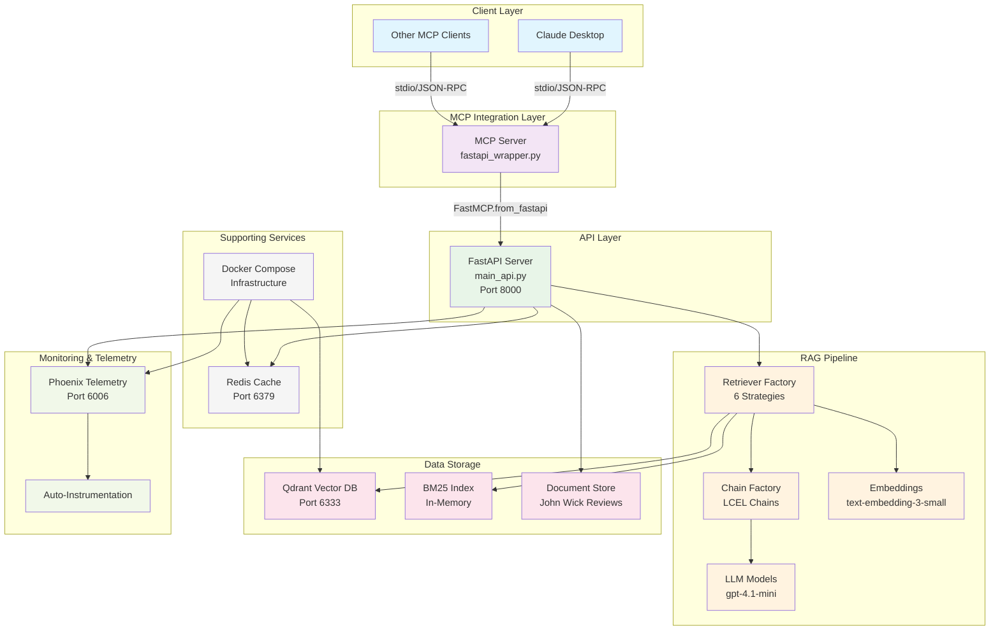

# Advanced RAG with FastAPI → MCP Integration

## 🚀 Master Bootstrap Walkthrough - Complete System Setup

This guide walks you through setting up the complete Advanced RAG system from scratch, 
including Docker infrastructure, data ingestion, FastAPI server, MCP integration, and 
telemetry-driven evaluation.

### Prerequisites
```bash
# Required software
- Docker & Docker Compose
- Python 3.11+
- uv (recommended) or pip
- OpenAI API key
- Cohere API key (for reranking)
```

### 🔄 Step-by-Step Bootstrap Process

#### 1. **Infrastructure Foundation** (5 minutes)
```bash
# Clone and setup environment
git clone <repository>
cd adv-rag
source .venv/bin/activate  # or create if needed
uv sync

# Configure environment
cp .env.example .env
# Edit .env with your API keys:
# OPENAI_API_KEY=your_key_here
# COHERE_API_KEY=your_key_here

# Start supporting services
docker-compose up -d

# Verify infrastructure health
curl http://localhost:6333/health    # Qdrant
curl http://localhost:6006           # Phoenix  
curl http://localhost:5540           # RedisInsight
```

#### 2. **Data Ingestion Pipeline** (2-3 minutes)
```bash
# Run complete data ingestion
python scripts/ingestion/csv_ingestion_pipeline.py

# Verify vector stores created
curl http://localhost:6333/collections
# Should show: johnwick_baseline, johnwick_semantic

# Check Phoenix for ingestion telemetry
open http://localhost:6006
```

#### 3. **FastAPI Server** (30 seconds)
```bash
# Start the core RAG API server
python run.py

# In another terminal - verify endpoints
curl http://localhost:8000/health
curl http://localhost:8000/docs    # Swagger UI

# Test a retrieval endpoint
curl -X POST "http://localhost:8000/invoke/semantic_retriever" \
     -H "Content-Type: application/json" \
     -d '{"question": "What makes John Wick movies popular?"}'
```

#### 4. **MCP Server Integration** (30 seconds)
```bash
# Start MCP server (converts FastAPI → MCP tools)
python src/mcp_server/fastapi_wrapper.py

# In another terminal - verify MCP tools
python tests/integration/verify_mcp.py

# Expected: 6 retrieval tools available
```

#### 5. **Claude Desktop Integration** (Optional)
```json
// Add to Claude Desktop MCP settings:
{
  "mcpServers": {
    "advanced-rag": {
      "command": "python",
      "args": ["/full/path/to/src/mcp_server/fastapi_wrapper.py"],
      "env": {
        "OPENAI_API_KEY": "your-key-here",
        "COHERE_API_KEY": "your-key-here"
      }
    }
  }
}
```

#### 6. **Telemetry-Driven Evaluation** (2-3 minutes)
```bash
# Run comprehensive retrieval strategy evaluation
python scripts/evaluation/retrieval_method_comparison.py

# Analyze results in Phoenix dashboard
open http://localhost:6006
# Compare: naive, bm25, compression, multiquery, ensemble, semantic
```

### 🎯 System Architecture Overview



### 📊 Key System Components

| Component | Purpose | Port | Status Check |
|-----------|---------|------|--------------|
| **Qdrant** | Vector database storage | 6333 | `curl localhost:6333/health` |
| **Phoenix** | Telemetry & monitoring | 6006 | `curl localhost:6006` |
| **Redis** | Future caching layer | 6379 | `redis-cli ping` |
| **FastAPI** | 6 retrieval endpoints | 8000 | `curl localhost:8000/health` |
| **MCP Server** | Tool wrapper for Claude | stdio | `python verify_mcp.py` |

### 🎯 Success Validation

After complete bootstrap, you should have:
- ✅ **4 Docker services** running (qdrant, phoenix, redis, redisinsight)
- ✅ **2 Vector collections** populated with John Wick movie data
- ✅ **6 FastAPI endpoints** responding to retrieval queries
- ✅ **6 MCP tools** available for Claude Desktop integration
- ✅ **Phoenix telemetry** tracking all operations automatically
- ✅ **Test validation** passing for both FastAPI and MCP interfaces

### 🚨 Troubleshooting Quick Reference

```bash
# Reset everything if issues occur
docker-compose down -v && docker-compose up -d
python scripts/ingestion/csv_ingestion_pipeline.py
python run.py &
python src/mcp_server/fastapi_wrapper.py &

# Check service health
docker-compose ps          # All services Up
curl localhost:6333/health # Qdrant OK  
curl localhost:8000/health # FastAPI OK
python verify_mcp.py       # MCP tools available
```

### 🔗 Next Steps After Bootstrap

1. **Explore Phoenix telemetry** - Monitor real-time performance at http://localhost:6006
2. **Test retrieval strategies** - Compare performance across all 6 methods
3. **Integrate with Claude** - Use MCP tools in Claude Desktop
4. **Optimize performance** - Use telemetry insights for improvements
5. **Scale for production** - Apply production configurations

This system provides a complete telemetry-driven RAG evaluation platform with seamless
FastAPI ↔ MCP integration for both development and production use cases.

---

# Essential Testing Guide for FastAPI → MCP Prototyping

## Test Structure Overview

# ... rest of existing content ...
