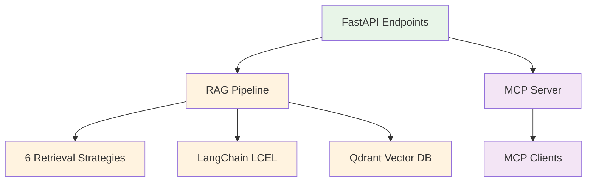

# Advanced RAG with MCP Integration

## 🎯 What Problem This Solves

**Problem**: Developers need to test and compare different RAG (Retrieval-Augmented Generation) strategies, but building evaluation infrastructure is time-consuming and complex.

**Solution**: A production-ready RAG system that provides **6 different retrieval strategies** accessible via both REST API and MCP (Model Context Protocol) tools, with built-in caching, telemetry, and evaluation capabilities.

## 🔍 Core Value Proposition

### For RAG Developers
- **Compare retrieval strategies** side-by-side (naive, BM25, ensemble, semantic, etc.)
- **Production-ready patterns** with error handling, caching, and monitoring
- **Zero-setup evaluation** with John Wick movie data for immediate testing

### For MCP Tool Developers  
- **Reference implementation** of FastAPI → MCP conversion using FastMCP
- **6 working MCP tools** ready for Claude Desktop integration
- **Schema validation** and compliance tooling

### For AI Application Builders
- **HTTP API endpoints** for integration into existing applications
- **Hybrid search capabilities** combining vector and keyword approaches
- **LangChain LCEL patterns** for chain composition

## 🛠️ What This System Provides

### 6 Retrieval Strategies
1. **Naive Retriever** - Basic vector similarity
2. **BM25 Retriever** - Keyword-based search  
3. **Contextual Compression** - AI-powered reranking
4. **Multi-Query** - Query expansion and variation
5. **Ensemble** - Weighted combination of multiple methods
6. **Semantic** - Advanced semantic chunking

### Dual Interface Architecture
- **FastAPI REST API** (`/invoke/semantic_retriever`, etc.)
- **MCP Tools** (automatic conversion via FastMCP)
- **MCP Resources** (direct access via `retriever://{operation_id}/{query}`)
- **Zero code duplication** between interfaces

### Production Features
- **Redis caching** for performance
- **Phoenix telemetry** for monitoring
- **Docker containerization** for deployment
- **Comprehensive test suite** for reliability

## 🚀 Quick Start

### Prerequisites
- Docker & Docker Compose
- Python 3.13+ with uv
- OpenAI API key
- Cohere API key (for reranking)

### 30-Second Demo
```bash
# Start infrastructure
docker-compose up -d

# Install dependencies
uv sync && source .venv/bin/activate

# Ingest sample data
python scripts/ingestion/csv_ingestion_pipeline.py

# Start API server
python run.py

# Test retrieval
curl -X POST "http://localhost:8000/invoke/semantic_retriever" \
     -H "Content-Type: application/json" \
     -d '{"question": "What makes John Wick movies popular?"}'
```

## 🔌 MCP Integration

### Command-Line Testing
```bash
# Verify MCP tools are working
python tests/integration/verify_mcp.py

# Start MCP Tools server (FastAPI conversion)
python src/mcp/server.py

# Start MCP Resources server (CQRS implementation)
python src/mcp/resources.py
```

### Available MCP Tools
- `naive_retriever` - Basic vector search
- `bm25_retriever` - Keyword search
- `ensemble_retriever` - Hybrid approach
- `semantic_retriever` - Advanced semantic search
- `contextual_compression_retriever` - AI reranking
- `multi_query_retriever` - Query expansion

### Available MCP Resources (CQRS)
- `retriever://naive_retriever/{query}` - Direct retrieval results
- `retriever://semantic_retriever/{query}` - Semantic search results
- `retriever://ensemble_retriever/{query}` - Hybrid search results
- `system://health` - System status and configuration

## 📊 Evaluation & Benchmarking

```bash
# Compare all retrieval strategies
python scripts/evaluation/retrieval_method_comparison.py

# View results in Phoenix dashboard
open http://localhost:6006
```

## 🏗️ Architecture



## 📁 Project Structure

- **`src/api/`** - FastAPI endpoints and request handling
- **`src/rag/`** - RAG pipeline components (retrievers, chains, embeddings)
- **`src/mcp/`** - MCP server implementation and resources
- **`src/core/`** - Shared configuration and utilities
- **`tests/`** - Comprehensive test suite
- **`scripts/`** - Data ingestion and evaluation utilities

## 🎯 Use Cases

### Development & Testing
- Test different RAG strategies with real data
- Benchmark retrieval performance
- Validate MCP tool implementations

### Production Integration
- REST API for application integration
- MCP tools and resources for AI assistant workflows
- Containerized deployment

### Research & Learning
- Study RAG implementation patterns
- Compare retrieval strategy effectiveness
- Learn MCP protocol integration

---

## 📋 Detailed Setup Guide

*For complete setup instructions, see [SETUP.md](SETUP.md)*

### Environment Configuration
```bash
# Copy environment template
cp .env.example .env

# Edit with your API keys
OPENAI_API_KEY=your_key_here
COHERE_API_KEY=your_key_here
```

### Infrastructure Services
```bash
# Start supporting services
docker-compose up -d

# Verify services
curl http://localhost:6333/health    # Qdrant
curl http://localhost:6006           # Phoenix
curl http://localhost:6379           # Redis
```

### Data Ingestion
```bash
# Run complete data pipeline
python scripts/ingestion/csv_ingestion_pipeline.py

# Verify collections created
curl http://localhost:6333/collections
```

### Testing
```bash
# Run full test suite
pytest tests/ -v

# Test MCP integration
python tests/integration/verify_mcp.py

# Test API endpoints
bash tests/integration/test_api_endpoints.sh
```

## 🔧 Development

### Key Commands
```bash
# Start development server
python run.py

# Start MCP Tools server
python src/mcp/server.py

# Start MCP Resources server
python src/mcp/resources.py

# Run benchmarks
python scripts/evaluation/retrieval_method_comparison.py

# View telemetry
open http://localhost:6006
```

### Testing Individual Components
```bash
# Test specific retrieval strategy
curl -X POST "http://localhost:8000/invoke/ensemble_retriever" \
     -H "Content-Type: application/json" \
     -d '{"question": "Your test question"}'

# Test MCP tool directly
python -c "
from src.mcp.server import mcp
# Test tool invocation
"
```

## 📚 Documentation

- **[docs/SETUP.md](docs/SETUP.md)** - Complete setup guide  
- **[docs/FUNCTIONAL_OVERVIEW.md](docs/FUNCTIONAL_OVERVIEW.md)** - Technical system overview
- **[docs/project-structure.md](docs/project-structure.md)** - Detailed architecture
- **[docs/CQRS_IMPLEMENTATION_SUMMARY.md](docs/CQRS_IMPLEMENTATION_SUMMARY.md)** - MCP Resources implementation
- **[docs/MCP_COMMAND_LINE_GUIDE.md](docs/MCP_COMMAND_LINE_GUIDE.md)** - MCP testing guide

## 🤝 Contributing

1. Follow the tiered architecture patterns in the codebase
2. Add tests for new functionality
3. Update documentation for API changes
4. Validate MCP schema compliance

## 📄 License

[Add your license here]
