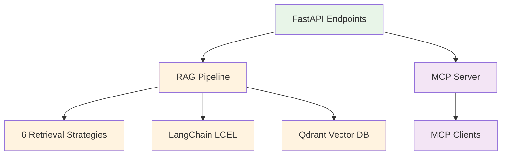

# Advanced RAG with MCP Integration

## 🎯 What Problem This Solves

**Problem**: Developers need to test and compare different RAG (Retrieval-Augmented Generation) strategies, but building evaluation infrastructure is time-consuming and complex.

**Solution**: A production-ready RAG system that provides **6 different retrieval strategies** accessible via both REST API and MCP (Model Context Protocol) tools, with built-in caching, telemetry, and evaluation capabilities.

## 🔍 Core Value Proposition

### For RAG Developers
- **Compare retrieval strategies** side-by-side (naive, BM25, ensemble, semantic, etc.)
- **Production-ready patterns** with error handling, caching, and monitoring
- **Zero-setup evaluation** with John Wick movie data for immediate testing

### For MCP Tool Developers  
- **Reference implementation** of FastAPI → MCP conversion using FastMCP
- **6 working MCP tools** ready for Claude Desktop integration
- **Schema validation** and compliance tooling

### For AI Application Builders
- **HTTP API endpoints** for integration into existing applications
- **Hybrid search capabilities** combining vector and keyword approaches
- **LangChain LCEL patterns** for chain composition

## 🛠️ What This System Provides

### 6 Retrieval Strategies
1. **Naive Retriever** - Basic vector similarity
2. **BM25 Retriever** - Keyword-based search  
3. **Contextual Compression** - AI-powered reranking
4. **Multi-Query** - Query expansion and variation
5. **Ensemble** - Weighted combination of multiple methods
6. **Semantic** - Advanced semantic chunking

### Dual Interface Architecture
- **FastAPI REST API** (`/invoke/semantic_retriever`, etc.)
- **MCP Tools** (automatic conversion via FastMCP)
- **MCP Resources** (direct access via `retriever://{operation_id}/{query}`)
- **Zero code duplication** between interfaces

### Production Features
- **Redis caching** for performance
- **Phoenix telemetry** for monitoring
- **Docker containerization** for deployment
- **Comprehensive test suite** for reliability

## 🚀 Quick Start

### Prerequisites
- **Docker & Docker Compose** - Infrastructure services
- **Python 3.13+** with **uv package manager** 
- **OpenAI API key** - Required for LLM and embeddings
- **Cohere API key** - Required for reranking (optional for basic functionality)

⚠️ **CRITICAL**: Virtual environment activation is REQUIRED for all development work

### 30-Second Demo
```bash
# 1. Start infrastructure services
docker-compose up -d

# 2. Setup Python environment (REQUIRED)
uv venv && source .venv/bin/activate
uv sync --dev

# 3. Configure environment
cp .env.example .env
# Edit .env with your API keys:
# OPENAI_API_KEY=your_key_here
# COHERE_API_KEY=your_key_here

# 4. Verify services are running
curl http://localhost:6333/health    # Qdrant
curl http://localhost:6006           # Phoenix  
curl http://localhost:6379           # Redis

# 5. Ingest sample data (John Wick movie reviews)
python scripts/ingestion/csv_ingestion_pipeline.py

# 6. Start API server
python run.py

# 7. Test retrieval strategies
curl -X POST "http://localhost:8000/invoke/semantic_retriever" \
     -H "Content-Type: application/json" \
     -d '{"question": "What makes John Wick movies popular?"}'

# 8. Start MCP servers (optional - for MCP integration)
# Terminal 2:
python src/mcp/server.py
# Terminal 3:  
python src/mcp/resources.py
```

### Verification Checklist
```bash
# Environment validation (run in order)
which python  # Should show .venv path
python --version  # Should show Python >= 3.13
docker-compose ps  # All services should be "Up"
curl http://localhost:8000/health  # Should return {"status":"healthy"}
```

## 🔌 MCP Integration

This system implements a **dual MCP interface architecture** with zero-duplication patterns:

### 🔧 MCP Tools Server (Command Pattern)
**Purpose**: Full RAG pipeline execution with LLM synthesis
```bash
# Start MCP Tools server (FastAPI→MCP conversion)
python src/mcp/server.py

# Test MCP tools
python tests/integration/verify_mcp.py
```

**Available Tools**:
- `naive_retriever` - Basic vector search with full RAG pipeline
- `bm25_retriever` - Keyword search with response formatting  
- `ensemble_retriever` - Hybrid approach with AI processing
- `semantic_retriever` - Advanced semantic search with context
- `contextual_compression_retriever` - AI reranking with filtering
- `multi_query_retriever` - Query expansion with synthesis

### 📊 MCP Resources Server (Query Pattern - CQRS)
**Purpose**: Direct data access for high-performance retrieval (3-5x faster)
```bash
# Start MCP Resources server (native FastMCP resources)
python src/mcp/resources.py
```

**Available Resources**:
- `retriever://naive_retriever/{query}` - Direct vector search results
- `retriever://semantic_retriever/{query}` - Direct semantic processing
- `retriever://ensemble_retriever/{query}` - Direct hybrid results  
- `system://health` - System status and configuration

### 🌐 External MCP Ecosystem Integration

The system integrates with external MCP servers for enhanced capabilities:

**Data Storage & Memory**:
- `qdrant-code-snippets` (Port 8002) - Code pattern storage and retrieval
- `qdrant-semantic-memory` (Port 8003) - Contextual insights and project decisions
- `memory` - Official MCP knowledge graph for structured relationships

**Observability & Analysis**:  
- `phoenix` (localhost:6006) - **Critical for AI agent observability** and experiment tracking
- Access Phoenix UI data and experiments via MCP for agent behavior analysis

**Development Tools**:
- `ai-docs-server` - Comprehensive documentation access (Cursor, PydanticAI, MCP Protocol, etc.)
- `sequential-thinking` - Enhanced reasoning capabilities for complex problem-solving

### 🔄 Schema Management (MCP 2025-03-26 Compliance)

**Native Schema Discovery** (Recommended):
```bash
# Start server with streamable HTTP
python src/mcp/server.py

# Native MCP discovery
curl -X POST http://127.0.0.1:8000/mcp \
  -H "Content-Type: application/json" \
  -d '{"jsonrpc":"2.0","id":1,"method":"rpc.discover","params":{}}'
```

**Legacy Schema Export** (Development):
```bash
# Generate MCP-compliant schemas
python scripts/mcp/export_mcp_schema.py

# Validate against MCP 2025-03-26 specification  
python scripts/mcp/validate_mcp_schema.py
```

## 📊 Evaluation & Benchmarking

### Retrieval Strategy Comparison
```bash
# Compare all 6 retrieval strategies with quantified metrics
python scripts/evaluation/retrieval_method_comparison.py

# Run semantic architecture benchmark
python scripts/evaluation/semantic_architecture_benchmark.py

# View detailed results in Phoenix dashboard
open http://localhost:6006
```

### 🔍 AI Agent Observability (Phoenix Integration)

This system implements **Samuel Colvin's MCP telemetry patterns** for comprehensive AI agent observability:

**Key Features**:
- **Automatic Tracing**: All retrieval operations and agent decision points  
- **Experiment Tracking**: `johnwick_golden_testset` for performance analysis
- **Real-time Monitoring**: Agent behavior analysis and performance optimization
- **Cross-session Memory**: Three-tier memory architecture with external MCP services

**Telemetry Use Cases**:
- **Agent Performance Analysis**: Query Phoenix via MCP to understand retrieval strategy effectiveness
- **Debugging Agent Decisions**: Trace through agent reasoning with full context  
- **Performance Optimization**: Identify bottlenecks in agent workflows using live telemetry data
- **Experiment Comparison**: Compare different RAG strategies with quantified metrics

**Access Patterns**:
```bash
# Direct Phoenix UI access
curl http://localhost:6006

# MCP-based Phoenix integration (via Claude Code CLI)
# Access Phoenix experiment data through MCP interface
# Query performance metrics across retrieval strategies
# Analyze agent decision patterns and effectiveness
```

### 🧠 Three-Tier Memory Architecture

**1. Knowledge Graph Memory** (`memory` MCP):
- Structured entities, relationships, and observations
- User preferences and project team modeling  
- Cross-session persistence of structured knowledge

**2. Semantic Memory** (`qdrant-semantic-memory`):
- Unstructured learning insights and decisions
- Pattern recognition across development sessions
- Contextual project knowledge

**3. Telemetry Data** (`phoenix`):
- Real-time agent behavior analysis
- `johnwick_golden_testset` performance benchmarking
- Quantified retrieval strategy effectiveness

## 🏗️ Architecture



## 📁 Project Structure

- **`src/api/`** - FastAPI endpoints and request handling
- **`src/rag/`** - RAG pipeline components (retrievers, chains, embeddings)
- **`src/mcp/`** - MCP server implementation and resources
- **`src/core/`** - Shared configuration and utilities
- **`tests/`** - Comprehensive test suite
- **`scripts/`** - Data ingestion and evaluation utilities

## 🎯 Use Cases

### Development & Testing
- Test different RAG strategies with real data
- Benchmark retrieval performance
- Validate MCP tool implementations

### Production Integration
- REST API for application integration
- MCP tools and resources for AI assistant workflows
- Containerized deployment

### Research & Learning
- Study RAG implementation patterns
- Compare retrieval strategy effectiveness
- Learn MCP protocol integration

---

## 📋 Detailed Setup Guide

*For complete setup instructions, see [SETUP.md](SETUP.md)*

### Environment Configuration
```bash
# Copy environment template
cp .env.example .env

# Edit with your API keys
OPENAI_API_KEY=your_key_here
COHERE_API_KEY=your_key_here
```

### Infrastructure Services
```bash
# Start supporting services
docker-compose up -d

# Verify services
curl http://localhost:6333/health    # Qdrant
curl http://localhost:6006           # Phoenix
curl http://localhost:6379           # Redis
```

### Data Ingestion
```bash
# Run complete data pipeline
python scripts/ingestion/csv_ingestion_pipeline.py

# Verify collections created
curl http://localhost:6333/collections
```

### Testing
```bash
# Run full test suite
pytest tests/ -v

# Test MCP integration
python tests/integration/verify_mcp.py

# Test API endpoints
bash tests/integration/test_api_endpoints.sh
```

## 🔧 Development

### Key Commands
```bash
# Start development server
python run.py

# Start MCP Tools server
python src/mcp/server.py

# Start MCP Resources server
python src/mcp/resources.py

# Run benchmarks
python scripts/evaluation/retrieval_method_comparison.py

# View telemetry
open http://localhost:6006
```

### Testing Individual Components
```bash
# Test specific retrieval strategy
curl -X POST "http://localhost:8000/invoke/ensemble_retriever" \
     -H "Content-Type: application/json" \
     -d '{"question": "Your test question"}'

# Test MCP tool directly
python -c "
from src.mcp.server import mcp
# Test tool invocation
"
```

## 📚 Documentation

- **[docs/SETUP.md](docs/SETUP.md)** - Complete setup guide  
- **[docs/FUNCTIONAL_OVERVIEW.md](docs/FUNCTIONAL_OVERVIEW.md)** - Technical system overview
- **[docs/project-structure.md](docs/project-structure.md)** - Detailed architecture
- **[docs/CQRS_IMPLEMENTATION_SUMMARY.md](docs/CQRS_IMPLEMENTATION_SUMMARY.md)** - MCP Resources implementation
- **[docs/MCP_COMMAND_LINE_GUIDE.md](docs/MCP_COMMAND_LINE_GUIDE.md)** - MCP testing guide

## 🤝 Contributing

1. Follow the tiered architecture patterns in the codebase
2. Add tests for new functionality
3. Update documentation for API changes
4. Validate MCP schema compliance

## 📄 License

This project is licensed under the MIT License - see the [LICENSE](LICENSE) file for details.

### MIT License Summary
- ✅ **Commercial use** - Use in commercial projects
- ✅ **Modification** - Modify and distribute modified versions
- ✅ **Distribution** - Distribute original or modified versions
- ✅ **Private use** - Use privately without restrictions
- ⚠️ **Attribution required** - Include copyright notice and license
- ❌ **No warranty** - Software provided "as is"

---

[](https://deepwiki.com/donbr/adv-rag)