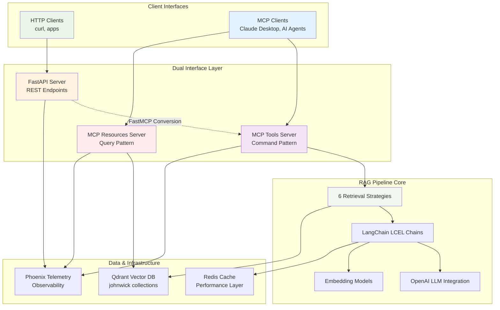
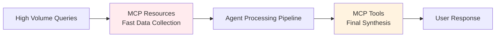

# Advanced RAG with Dual MCP Interface Architecture

## 🎯 The RAG Development Challenge

**The Problem**: Building production-ready RAG systems requires solving multiple complex challenges:
- **Strategy Comparison**: Testing different retrieval approaches (vector vs keyword vs hybrid)
- **Interface Flexibility**: Supporting both traditional APIs and modern AI agent protocols  
- **Performance Optimization**: Balancing comprehensive processing with high-speed data access
- **Evaluation Infrastructure**: Measuring and comparing retrieval effectiveness

**The Solution**: A **Dual Interface Architecture** that eliminates code duplication while providing:
- 🔄 **FastAPI → MCP automatic conversion** (zero duplication patterns)
- ⚡ **Command vs Query optimization** (full processing vs direct data access)
- 📊 **6 retrieval strategies** with built-in benchmarking
- 🔍 **Comprehensive observability** via Phoenix telemetry integration

## 🏗️ Why Dual Interface Architecture?

### The Zero-Duplication Principle

Traditional systems require maintaining separate codebases for different interfaces. Our **Dual Interface Architecture** solves this with:


### Command vs Query: CQRS Explained Simply

**Command Pattern (MCP Tools)**: 
- **Use Case**: When you need complete RAG processing with LLM synthesis
- **What Happens**: Full pipeline → retrieval → synthesis → formatted answer
- **Example**: `"What makes John Wick popular?"` → Full analysis with context

**Query Pattern (MCP Resources)**:
- **Use Case**: When you need fast, direct data access for further processing  
- **What Happens**: Vector search only → raw results → no synthesis
- **Example**: `retriever://semantic/{query}` → Raw documents for agent consumption

**Key Benefit**: Same underlying system, optimized interfaces for different needs.

📖 **Deep Dive**: See [ARCHITECTURE.md](docs/ARCHITECTURE.md) for complete technical details and [CQRS_IMPLEMENTATION_SUMMARY.md](docs/CQRS_IMPLEMENTATION_SUMMARY.md) for implementation specifics.

## 🔍 Core Value Proposition

### For RAG Developers
- **Compare retrieval strategies** side-by-side (naive, BM25, ensemble, semantic, etc.)
- **Production-ready patterns** with error handling, caching, and monitoring
- **Zero-setup evaluation** with John Wick movie data for immediate testing

### For MCP Tool Developers  
- **Reference implementation** of FastAPI → MCP conversion using FastMCP
- **6 working MCP tools** ready for Claude Desktop integration
- **Schema validation** and compliance tooling

### For AI Application Builders
- **HTTP API endpoints** for integration into existing applications
- **Hybrid search capabilities** combining vector and keyword approaches
- **LangChain LCEL patterns** for chain composition

## 🛠️ What This System Provides

### 6 Retrieval Strategies: Choose Your Approach

```mermaid
graph LR
    Q[Query: "John Wick action scenes"] --> S1[Naive<br/>Vector Similarity]
    Q --> S2[BM25<br/>Keyword Search]
    Q --> S3[Contextual<br/>AI Reranking]
    Q --> S4[Multi-Query<br/>Expansion]
    Q --> S5[Ensemble<br/>Hybrid Mix]
    Q --> S6[Semantic<br/>Advanced Chunks]
    
    S1 --> R1[Fast, Direct<br/>Embedding Match]
    S2 --> R2[Traditional IR<br/>Term Frequency]
    S3 --> R3[LLM-Powered<br/>Relevance Scoring]
    S4 --> R4[Multiple Queries<br/>Synthesized Results]
    S5 --> R5[Best of All<br/>Weighted Combination]
    S6 --> R6[Context-Aware<br/>Semantic Chunks]
    
    style S1 fill:#e8f5e8
    style S2 fill:#fff3e0
    style S3 fill:#f3e5f5
    style S4 fill:#e3f2fd
    style S5 fill:#ffebee
    style S6 fill:#f0f8f0
```

**Strategy Details**:
1. **Naive Retriever** - Pure vector similarity, fastest baseline approach
2. **BM25 Retriever** - Traditional keyword matching, excellent for exact term queries  
3. **Contextual Compression** - AI reranks results for relevance, highest quality
4. **Multi-Query** - Generates query variations, best coverage
5. **Ensemble** - Combines multiple methods, balanced performance
6. **Semantic** - Advanced chunking strategy, context-optimized

### Dual Interface Architecture: One System, Two Optimized APIs

```mermaid
graph TB
    A[Single RAG Codebase] --> B[FastAPI Endpoints]
    A --> C[Shared Pipeline]
    
    B --> D[FastMCP Automatic Conversion]
    C --> E[Direct Resource Access]
    
    D --> F[MCP Tools Server<br/>Command Pattern]
    E --> G[MCP Resources Server<br/>Query Pattern]
    
    F --> H[Complete Processing<br/>LLM + Context + Synthesis<br/>~20-30 seconds]
    G --> I[Direct Data Access<br/>Vector Search Only<br/>~3-5 seconds ⚡]
    
    style A fill:#e8f5e8
    style F fill:#fff3e0
    style G fill:#f3e5f5
    style H fill:#e3f2fd
    style I fill:#ffebee
```



**Interface Benefits**:
- **FastAPI REST API** - Traditional HTTP endpoints for web integration
- **MCP Tools** - AI agent workflows with full processing pipeline
- **MCP Resources** - High-speed data access for agent consumption
- **Zero Code Duplication** - Single codebase, multiple optimized interfaces

### Production Features
- **Redis caching** for performance
- **Phoenix telemetry** for monitoring
- **Docker containerization** for deployment
- **Comprehensive test suite** for reliability

## 🚀 Quick Start

### Prerequisites
- **Docker & Docker Compose** - Infrastructure services
- **Python 3.13+** with **uv package manager** 
- **OpenAI API key** - Required for LLM and embeddings
- **Cohere API key** - Required for reranking (optional for basic functionality)

### 4-Step Setup
```bash
# 1. Environment & Dependencies
uv venv && source .venv/bin/activate && uv sync --dev

# 2. Infrastructure & Configuration
docker-compose up -d && cp .env.example .env
# Edit .env with your API keys

# 3. Data & Server
python scripts/ingestion/csv_ingestion_pipeline.py && python run.py

# 4. Test (in another terminal)
curl -X POST "http://localhost:8000/invoke/semantic_retriever" \
     -H "Content-Type: application/json" \
     -d '{"question": "What makes John Wick movies popular?"}'
```

📖 **For complete setup instructions, troubleshooting, and MCP integration**: See **[docs/SETUP.md](docs/SETUP.md)**

## 🔌 MCP Integration: AI Agent Workflows Made Simple

### When to Use Which Interface?

```mermaid
flowchart TD
    A[AI Agent Task] --> B{Need complete<br/>processed answer?}
    B -->|Yes| C[MCP Tools<br/>Command Pattern]
    B -->|No| D[MCP Resources<br/>Query Pattern]
    
    C --> E[Use Case: Research Assistant<br/>Agent needs full analysis<br/>with citations and synthesis]
    D --> F[Use Case: Data Gatherer<br/>Agent collecting raw data<br/>for further processing]
    
    E --> G[Tool: semantic_retriever<br/>Input: Question<br/>Output: Complete answer]
    F --> H[Resource: retriever://semantic/{query}<br/>Input: Query<br/>Output: Raw documents]
    
    style C fill:#fff3e0
    style D fill:#f3e5f5
    style E fill:#e3f2fd
    style F fill:#ffebee
```

### 🔧 MCP Tools Server: Complete AI Agent Processing

**When to Use**: Your AI agent needs a **complete, ready-to-use answer**
- ✅ Research and analysis workflows  
- ✅ Question-answering systems
- ✅ Content generation with citations
- ✅ User-facing responses

**Real Example**:
```python
# Agent Task: "Analyze John Wick's popularity"
tool_result = mcp_client.call_tool("semantic_retriever", {
    "question": "What makes John Wick movies so popular?"
})
# Returns: Complete analysis with context and citations
```

**Available Tools**:
- `semantic_retriever` - Advanced semantic analysis with full context
- `ensemble_retriever` - Hybrid approach combining multiple strategies
- `contextual_compression_retriever` - AI-ranked results with filtering
- `multi_query_retriever` - Query expansion for comprehensive coverage
- `naive_retriever` - Fast baseline vector search
- `bm25_retriever` - Traditional keyword-based retrieval

### 📊 MCP Resources Server: High-Speed Data Access

**When to Use**: Your AI agent needs **raw data for further processing** (3-5x faster)
- ⚡ Multi-step workflows where agent processes data further
- ⚡ Bulk data collection and analysis
- ⚡ Performance-critical applications
- ⚡ Custom synthesis pipelines

**Real Example**:
```python
# Agent Task: "Collect movie data for trend analysis"
raw_docs = mcp_client.read_resource("retriever://semantic/action movies")
# Returns: Raw documents for agent's custom analysis pipeline
```

**Available Resources**:
- `retriever://semantic_retriever/{query}` - Context-aware document retrieval
- `retriever://ensemble_retriever/{query}` - Multi-strategy hybrid results
- `retriever://naive_retriever/{query}` - Direct vector similarity search
- `system://health` - System status and configuration

### 🎯 Performance Comparison

| Interface | Processing Time | Use Case | Output Format |
|-----------|----------------|----------|---------------|
| **MCP Tools** | ~20-30 seconds | Complete analysis | Formatted answer + context |
| **MCP Resources** | ~3-5 seconds ⚡ | Raw data collection | Document list + metadata |
| **FastAPI** | ~15-25 seconds | HTTP integration | JSON response |

### 🚀 Getting Started with MCP

```bash
# 1. Start both MCP servers
python src/mcp/server.py     # Tools (Command Pattern)
python src/mcp/resources.py  # Resources (Query Pattern)

# 2. Test the interfaces
python tests/integration/verify_mcp.py  # Verify tools work
python tests/integration/test_cqrs_resources.py  # Verify resources work

# 3. Use with Claude Desktop or other MCP clients
# Tools: For complete AI assistant responses
# Resources: For high-speed data collection workflows
```

### 🌐 External MCP Ecosystem Integration

The system integrates with external MCP servers for enhanced capabilities:

**Data Storage & Memory**:
- `qdrant-code-snippets` (Port 8002) - Code pattern storage and retrieval
- `qdrant-semantic-memory` (Port 8003) - Contextual insights and project decisions
- `memory` - Official MCP knowledge graph for structured relationships

**Observability & Analysis**:  
- `phoenix` (localhost:6006) - **Critical for AI agent observability** and experiment tracking
- Access Phoenix UI data and experiments via MCP for agent behavior analysis

**Development Tools**:
- `ai-docs-server` - Comprehensive documentation access (Cursor, PydanticAI, MCP Protocol, etc.)
- `sequential-thinking` - Enhanced reasoning capabilities for complex problem-solving

### 🔄 Schema Management (MCP 2025-03-26 Compliance)

**Native Schema Discovery** (Recommended):
```bash
# Start server with streamable HTTP
python src/mcp/server.py

# Native MCP discovery
curl -X POST http://127.0.0.1:8000/mcp \
  -H "Content-Type: application/json" \
  -d '{"jsonrpc":"2.0","id":1,"method":"rpc.discover","params":{}}'
```

**Legacy Schema Export** (Development):
```bash
# Generate MCP-compliant schemas
python scripts/mcp/export_mcp_schema.py

# Validate against MCP 2025-03-26 specification  
python scripts/mcp/validate_mcp_schema.py
```

## 📊 Evaluation & Benchmarking

### Retrieval Strategy Comparison
```bash
# Compare all 6 retrieval strategies with quantified metrics
python scripts/evaluation/retrieval_method_comparison.py

# Run semantic architecture benchmark
python scripts/evaluation/semantic_architecture_benchmark.py

# View detailed results in Phoenix dashboard
open http://localhost:6006
```

### 🔍 AI Agent Observability (Phoenix Integration)

This system implements **Samuel Colvin's MCP telemetry patterns** for comprehensive AI agent observability:

**Key Features**:
- **Automatic Tracing**: All retrieval operations and agent decision points  
- **Experiment Tracking**: `johnwick_golden_testset` for performance analysis
- **Real-time Monitoring**: Agent behavior analysis and performance optimization
- **Cross-session Memory**: Three-tier memory architecture with external MCP services

**Telemetry Use Cases**:
- **Agent Performance Analysis**: Query Phoenix via MCP to understand retrieval strategy effectiveness
- **Debugging Agent Decisions**: Trace through agent reasoning with full context  
- **Performance Optimization**: Identify bottlenecks in agent workflows using live telemetry data
- **Experiment Comparison**: Compare different RAG strategies with quantified metrics

**Access Patterns**:
```bash
# Direct Phoenix UI access
curl http://localhost:6006

# MCP-based Phoenix integration (via Claude Code CLI)
# Access Phoenix experiment data through MCP interface
# Query performance metrics across retrieval strategies
# Analyze agent decision patterns and effectiveness
```

### 🧠 Three-Tier Memory Architecture

**1. Knowledge Graph Memory** (`memory` MCP):
- Structured entities, relationships, and observations
- User preferences and project team modeling  
- Cross-session persistence of structured knowledge

**2. Semantic Memory** (`qdrant-semantic-memory`):
- Unstructured learning insights and decisions
- Pattern recognition across development sessions
- Contextual project knowledge

**3. Telemetry Data** (`phoenix`):
- Real-time agent behavior analysis
- `johnwick_golden_testset` performance benchmarking
- Quantified retrieval strategy effectiveness

## 🏗️ Complete System Architecture

### End-to-End Request Flow



### System Components Deep Dive

**Interface Layer** ([Full Details](docs/ARCHITECTURE.md)):
- **FastAPI Server**: Traditional REST API with 6 retrieval endpoints
- **MCP Tools**: Automatic FastAPI→MCP conversion using FastMCP
- **MCP Resources**: Native CQRS implementation for direct data access

**RAG Processing Core** ([Implementation Guide](docs/CQRS_IMPLEMENTATION_SUMMARY.md)):
- **Strategy Factory**: 6 different retrieval approaches (naive → ensemble)
- **LangChain LCEL**: Composable chain patterns for all strategies  
- **Model Integration**: OpenAI GPT-4.1-mini + text-embedding-3-small

**Data & Observability** ([Setup Guide](docs/SETUP.md)):
- **Qdrant Collections**: Vector storage with semantic chunking
- **Redis Caching**: Performance optimization with TTL management
- **Phoenix Telemetry**: Complete request tracing and experiment tracking

## 📁 Project Structure

- **`src/api/`** - FastAPI endpoints and request handling
- **`src/rag/`** - RAG pipeline components (retrievers, chains, embeddings)
- **`src/mcp/`** - MCP server implementation and resources
- **`src/core/`** - Shared configuration and utilities
- **`tests/`** - Comprehensive test suite
- **`scripts/`** - Data ingestion and evaluation utilities

## 🎯 Real-World Use Cases

### 🔬 RAG Strategy Research & Development

**Scenario**: You're building a document analysis system and need to find the optimal retrieval approach.

**Workflow**:
```bash
# 1. Test all strategies with your domain data
python scripts/evaluation/retrieval_method_comparison.py

# 2. Compare performance in Phoenix dashboard
open http://localhost:6006

# 3. Choose the best strategy for your use case
# Naive: Fast baseline | BM25: Exact keywords | Ensemble: Best overall
```

**Value**: Compare 6 different approaches with quantified metrics instead of guessing.

### 🤖 AI Agent Integration (Claude Desktop, Custom Agents)

**Scenario**: Your AI agent needs intelligent document retrieval for research tasks.

**Command Pattern** (Complete Analysis):
```python
# Agent: "Analyze this topic comprehensively"
response = await mcp_client.call_tool("semantic_retriever", {
    "question": "What are the key themes in John Wick movies?"
})
# Returns: Complete analysis with citations ready for user
```

**Query Pattern** (Data Collection):
```python
# Agent: "Gather data for multi-step analysis"
docs = await mcp_client.read_resource("retriever://ensemble/action movies")
# Returns: Raw documents for agent's custom synthesis pipeline
```

**Value**: Choose optimal interface based on agent workflow needs.

### 🌐 Production Application Integration

**Scenario**: You're building a customer support system that needs contextual responses.

**HTTP API Integration**:
```bash
# Real-time customer query processing
curl -X POST "http://localhost:8000/invoke/contextual_compression_retriever" \
     -H "Content-Type: application/json" \
     -d '{"question": "How do I troubleshoot connection issues?"}'
```

**Benefits**:
- **Redis Caching**: Sub-second responses for repeated queries
- **Phoenix Telemetry**: Monitor query patterns and performance
- **Multiple Strategies**: A/B test different retrieval approaches

### 📊 Performance-Critical AI Workflows

**Scenario**: You're building an AI system that processes hundreds of queries per hour.

**Interface Selection Strategy**:
- **MCP Resources** (3-5 sec): Bulk data collection, preprocessing pipelines
- **MCP Tools** (20-30 sec): User-facing analysis, final report generation  
- **FastAPI** (15-25 sec): Traditional web application integration

**Scaling Pattern**:


### 🧪 Academic Research & Benchmarking

**Scenario**: You're researching RAG effectiveness for your domain.

**Research Workflow**:
```bash
# 1. Ingest your domain data
python scripts/ingestion/csv_ingestion_pipeline.py

# 2. Run comprehensive benchmarks
python scripts/evaluation/semantic_architecture_benchmark.py

# 3. Export Phoenix experiment data
# Use Phoenix MCP integration to query results programmatically
```

**Published Capabilities**:
- **Reproducible Experiments**: Deterministic model pinning
- **Quantified Comparisons**: All 6 strategies with performance metrics
- **Open Architecture**: Extend with your own retrieval methods

---

## 📋 Detailed Setup Guide

*For complete setup instructions, see [SETUP.md](SETUP.md)*

### Environment Configuration
```bash
# Copy environment template
cp .env.example .env

# Edit with your API keys
OPENAI_API_KEY=your_key_here
COHERE_API_KEY=your_key_here
```

### Infrastructure Services
```bash
# Start supporting services
docker-compose up -d

# Verify services
curl http://localhost:6333/health    # Qdrant
curl http://localhost:6006           # Phoenix
curl http://localhost:6379           # Redis
```

### Data Ingestion
```bash
# Run complete data pipeline
python scripts/ingestion/csv_ingestion_pipeline.py

# Verify collections created
curl http://localhost:6333/collections
```

### Testing
```bash
# Run full test suite
pytest tests/ -v

# Test MCP integration
python tests/integration/verify_mcp.py

# Test API endpoints
bash tests/integration/test_api_endpoints.sh
```

## 🔧 Development

### Key Commands
```bash
# Start development server
python run.py

# Start MCP Tools server
python src/mcp/server.py

# Start MCP Resources server
python src/mcp/resources.py

# Run benchmarks
python scripts/evaluation/retrieval_method_comparison.py

# View telemetry
open http://localhost:6006
```

### Testing Individual Components
```bash
# Test specific retrieval strategy
curl -X POST "http://localhost:8000/invoke/ensemble_retriever" \
     -H "Content-Type: application/json" \
     -d '{"question": "Your test question"}'

# Test MCP tool directly
python -c "
from src.mcp.server import mcp
# Test tool invocation
"
```

## 📚 Documentation

- **[docs/SETUP.md](docs/SETUP.md)** - Complete setup guide  
- **[docs/FUNCTIONAL_OVERVIEW.md](docs/FUNCTIONAL_OVERVIEW.md)** - Technical system overview
- **[docs/project-structure.md](docs/project-structure.md)** - Detailed architecture
- **[docs/CQRS_IMPLEMENTATION_SUMMARY.md](docs/CQRS_IMPLEMENTATION_SUMMARY.md)** - MCP Resources implementation
- **[docs/MCP_COMMAND_LINE_GUIDE.md](docs/MCP_COMMAND_LINE_GUIDE.md)** - MCP testing guide

## 🤝 Contributing

1. Follow the tiered architecture patterns in the codebase
2. Add tests for new functionality
3. Update documentation for API changes
4. Validate MCP schema compliance

## 📄 License

This project is licensed under the MIT License - see the [LICENSE](LICENSE) file for details.

### MIT License Summary
- ✅ **Commercial use** - Use in commercial projects
- ✅ **Modification** - Modify and distribute modified versions
- ✅ **Distribution** - Distribute original or modified versions
- ✅ **Private use** - Use privately without restrictions
- ⚠️ **Attribution required** - Include copyright notice and license
- ❌ **No warranty** - Software provided "as is"

---

## 🚀 Ready to Get Started?

### Quick Decision Tree

```mermaid
flowchart TD
    A[I want to...] --> B[Try RAG strategies<br/>with sample data]
    A --> C[Integrate with<br/>my AI agent]
    A --> D[Build a production<br/>application]
    A --> E[Research RAG<br/>effectiveness]
    
    B --> F[🚀 Quick Start<br/>4-step setup above]
    C --> G[📖 MCP Integration<br/>Claude Desktop guide]
    D --> H[🏗️ Architecture Docs<br/>docs/ARCHITECTURE.md]
    E --> I[📊 Evaluation Scripts<br/>Phoenix telemetry]
    
    style F fill:#e8f5e8
    style G fill:#fff3e0
    style H fill:#f3e5f5
    style I fill:#ffebee
```



### 📚 Documentation Roadmap

- **Start Here**: [4-Step Quick Start](#-quick-start) - Get running in 5 minutes
- **Understand the Architecture**: [Why Dual Interface?](#%EF%B8%8F-why-dual-interface-architecture) - Core concepts explained
- **Deep Technical Details**: [docs/ARCHITECTURE.md](docs/ARCHITECTURE.md) - Complete system design
- **MCP Implementation**: [docs/CQRS_IMPLEMENTATION_SUMMARY.md](docs/CQRS_IMPLEMENTATION_SUMMARY.md) - Command vs Query patterns
- **Production Setup**: [docs/SETUP.md](docs/SETUP.md) - Complete installation guide
- **Troubleshooting**: [docs/TROUBLESHOOTING.md](docs/TROUBLESHOOTING.md) - Common issues and solutions

### 🎯 Next Steps

1. **Try the System** - Follow the 4-step quick start above
2. **Explore Strategies** - Run `python scripts/evaluation/retrieval_method_comparison.py`
3. **Integrate with Agents** - Connect to Claude Desktop or build custom MCP clients
4. **Scale to Production** - Use Docker deployment and Redis caching
5. **Contribute** - Submit issues, improvements, or new retrieval strategies

---

**⭐ Star this repo if it's useful!** | **🤝 [Contribute](docs/CONTRIBUTING.md)** | **📖 [Full Documentation](docs/)**

[](https://deepwiki.com/donbr/adv-rag)