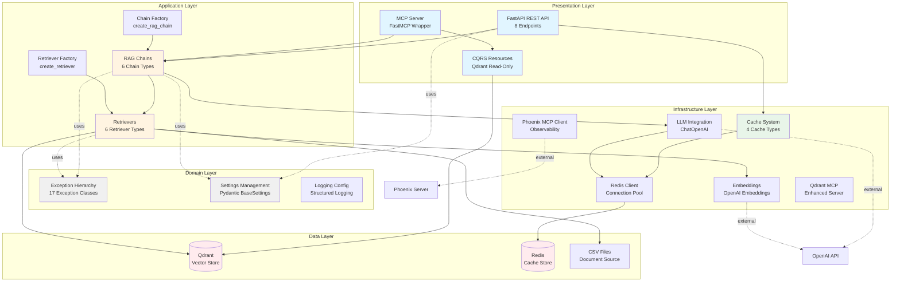
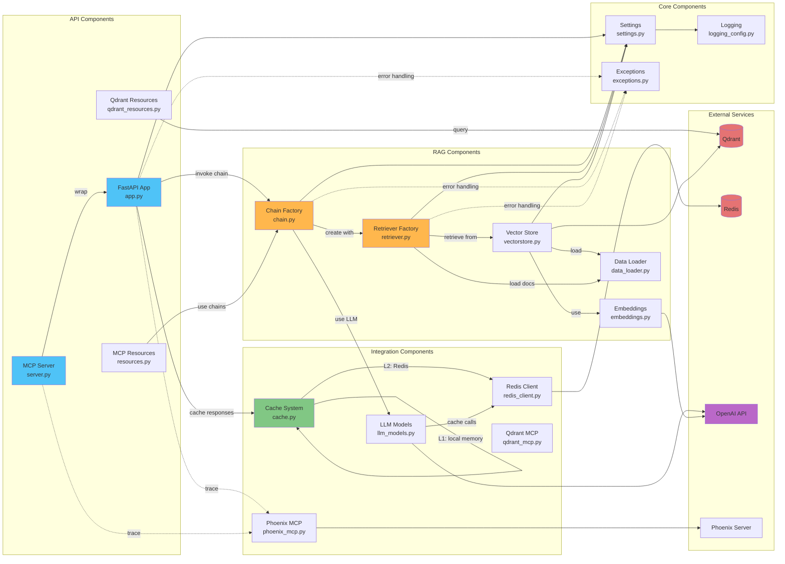
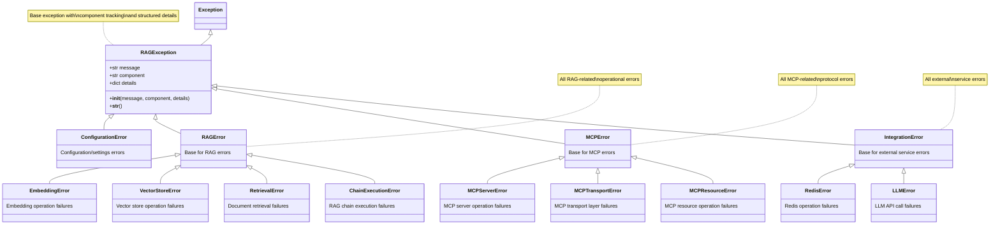
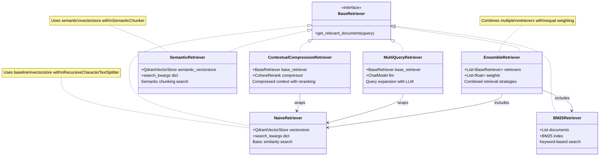
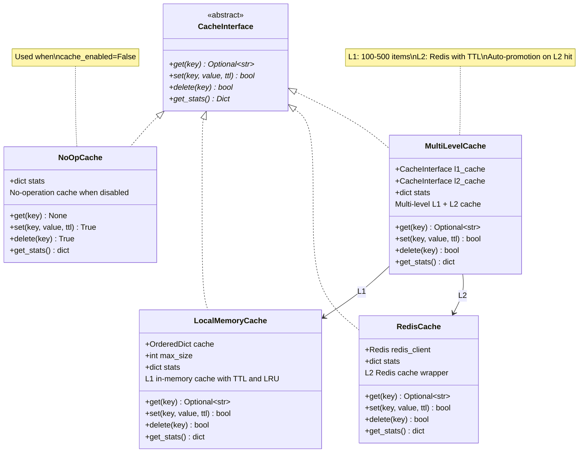
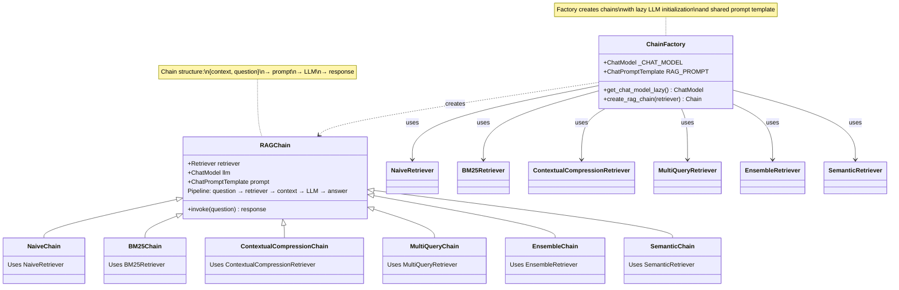
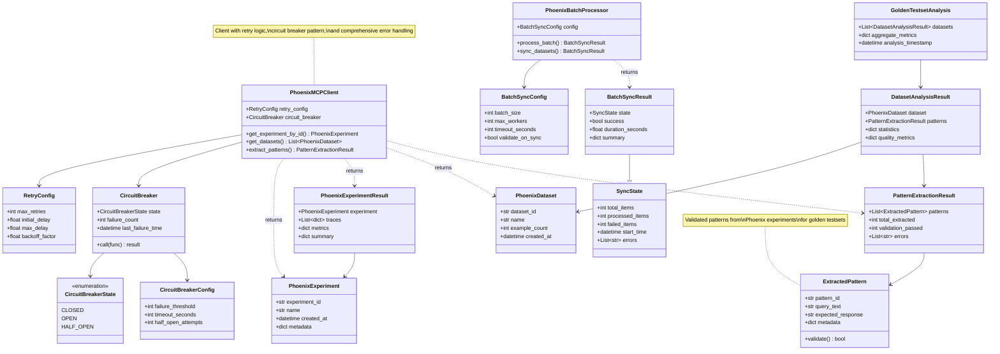
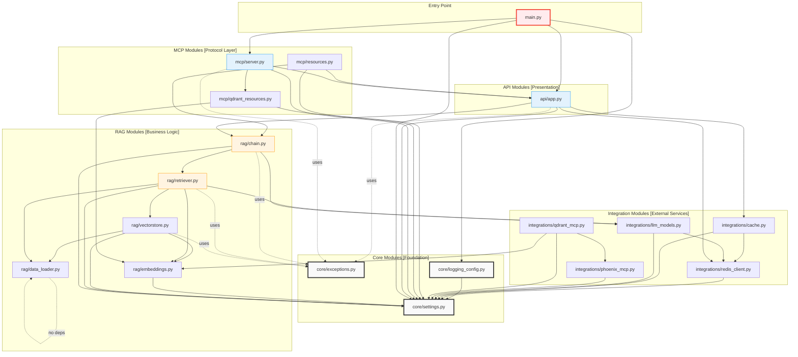
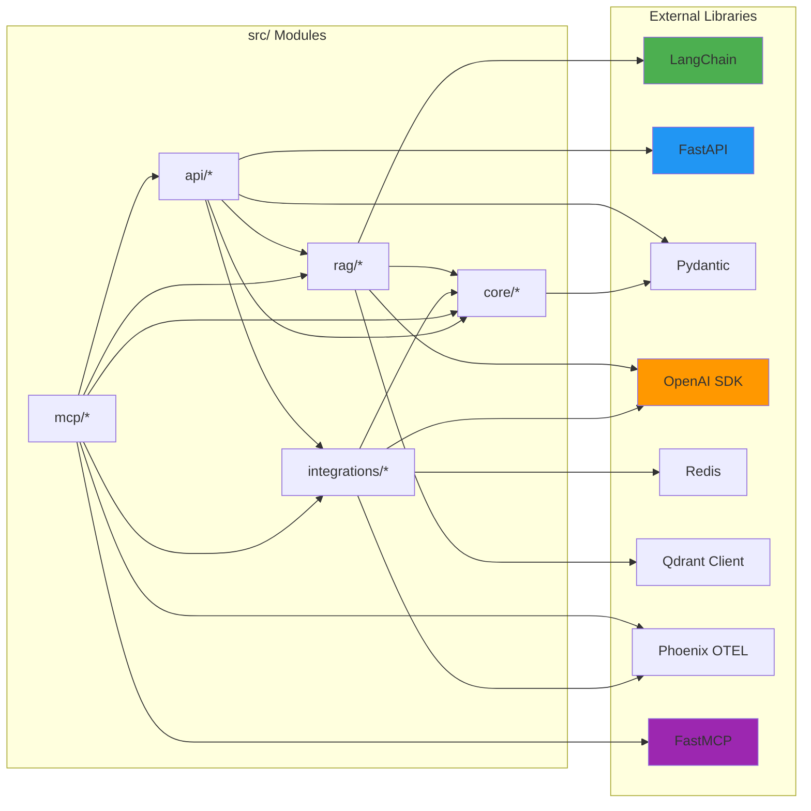

# Architecture Diagrams

This document provides comprehensive Mermaid diagrams visualizing the architecture, component relationships, class hierarchies, and module dependencies of the Advanced RAG system.

---

## System Architecture

The Advanced RAG system follows a layered architecture pattern with clear separation of concerns across five distinct layers.

### Layer Responsibilities

1. **Presentation Layer**: HTTP/MCP interfaces for external access
2. **Application Layer**: RAG business logic, chain orchestration, retrieval strategies
3. **Domain Layer**: Core configuration, exceptions, cross-cutting concerns
4. **Infrastructure Layer**: External service integrations (LLM, cache, observability)
5. **Data Layer**: Persistent storage for vectors, cache, and source documents

---

## Component Relationships

This diagram shows how major components interact and data flows through the system.

### Key Data Flows

1. **Question Flow**: Client → FastAPI → Chain → Retriever → VectorStore → Qdrant → LLM → Response
2. **Cache Flow**: Request → Cache (L1 local, L2 Redis) → Cached or Generate → Store
3. **Observability Flow**: All operations → Phoenix MCP → Phoenix Server for tracing
4. **MCP Flow**: MCP Client → MCP Server → FastAPI wrapper → Chain execution

---

## Class Hierarchies

### 1. Exception Class Hierarchy

The system uses a comprehensive exception hierarchy with 17 custom exception classes organized by functional area.

### 2. Retriever Class Hierarchy

Six retriever types implementing different search strategies, all based on LangChain retriever interfaces.

### 3. Cache Implementation Hierarchy

Four cache types supporting multi-level caching strategy with NoOp pattern for A/B testing.

### 4. Chain Factory Pattern

The chain factory creates RAG chains by combining retrievers with LLM prompts following the factory pattern.

### 5. Phoenix MCP Data Classes Structure

The Phoenix MCP integration uses 15+ data classes for comprehensive observability and error handling.

---

## Module Dependencies

This diagram shows how modules in `src/` depend on each other and identifies core vs peripheral modules.

### Dependency Analysis

#### Core Modules (Foundation - No circular deps)
- `core/settings.py` - Central configuration, depends only on logging
- `core/exceptions.py` - Exception hierarchy, no dependencies
- `core/logging_config.py` - Logging setup, depends on settings

#### RAG Modules (Business Logic)
- **Dependency Chain**: `data_loader` → `embeddings` → `vectorstore` → `retriever` → `chain`
- `rag/chain.py` is the highest-level RAG module, orchestrating retrievers and LLM
- All RAG modules depend on `core/settings.py`

#### Integration Modules (External Services)
- `integrations/redis_client.py` - Redis connection, depends on settings only
- `integrations/cache.py` - Cache abstraction, depends on settings and Redis client
- `integrations/llm_models.py` - LLM integration, depends on settings and Redis client
- `integrations/phoenix_mcp.py` - Observability, depends on settings only
- `integrations/qdrant_mcp.py` - Enhanced Qdrant, depends on settings, embeddings, and Phoenix

#### MCP Modules (Protocol Layer)
- `mcp/qdrant_resources.py` - CQRS resources, depends on settings and embeddings
- `mcp/resources.py` - MCP resource handlers, depends on API app and chains
- `mcp/server.py` - MCP server wrapper, depends on API app and Qdrant resources

#### API Module (Presentation)
- `api/app.py` - FastAPI application, depends on settings, Redis, cache, and chains

#### No Circular Dependencies Detected
The module dependency graph is a Directed Acyclic Graph (DAG), ensuring clean architecture.

---

## Import Relationships by Module

### High-Level Import Patterns

### Module Import Counts

Based on the analysis, here's the import usage pattern:

| Module | Internal Imports | External Imports | Total |
|--------|-----------------|------------------|-------|
| `api/app.py` | 6 | 10 | 16 |
| `mcp/server.py` | 4 | 7 | 11 |
| `mcp/resources.py` | 5 | 8 | 13 |
| `mcp/qdrant_resources.py` | 3 | 9 | 12 |
| `rag/chain.py` | 3 | 5 | 8 |
| `rag/retriever.py` | 5 | 8 | 13 |
| `rag/vectorstore.py` | 3 | 4 | 7 |
| `rag/embeddings.py` | 1 | 2 | 3 |
| `rag/data_loader.py` | 0 | 3 | 3 |
| `integrations/cache.py` | 2 | 6 | 8 |
| `integrations/redis_client.py` | 1 | 4 | 5 |
| `integrations/llm_models.py` | 1 | 5 | 6 |
| `integrations/phoenix_mcp.py` | 1 | 10 | 11 |
| `integrations/qdrant_mcp.py` | 4 | 10 | 14 |
| `core/settings.py` | 1 | 5 | 6 |
| `core/exceptions.py` | 0 | 0 | 0 |
| `core/logging_config.py` | 0 | 3 | 3 |

**Observations**:
- `core/exceptions.py` has zero dependencies (pure exception definitions)
- `rag/data_loader.py` has no internal dependencies (data source layer)
- `api/app.py` has the most dependencies (orchestration layer)
- Average internal imports: 2.3 per module (low coupling)
- Average external imports: 6.1 per module (leveraging libraries)

---

## Summary

This architecture demonstrates:

1. **Clear Layering**: 5 distinct layers with well-defined responsibilities
2. **Low Coupling**: Average 2.3 internal imports per module
3. **High Cohesion**: Modules grouped by functional area (RAG, MCP, Core, etc.)
4. **No Circular Dependencies**: Clean DAG structure in module imports
5. **Factory Patterns**: Chain and retriever factories for flexible instantiation
6. **Comprehensive Error Handling**: 17-class exception hierarchy covering all areas
7. **Multi-Level Caching**: 4 cache implementations with fallback strategies
8. **Robust Observability**: Phoenix MCP with circuit breaker and retry patterns
9. **CQRS Compliance**: Read-only resources for safe Qdrant access
10. **Flexible Retrieval**: 6 retriever types supporting different search strategies

The architecture supports the system's goals of:
- Educational transparency (clear structure, comprehensive documentation)
- Production readiness (error handling, caching, observability)
- Extensibility (factory patterns, interface-based design)
- Maintainability (low coupling, clear dependencies)
