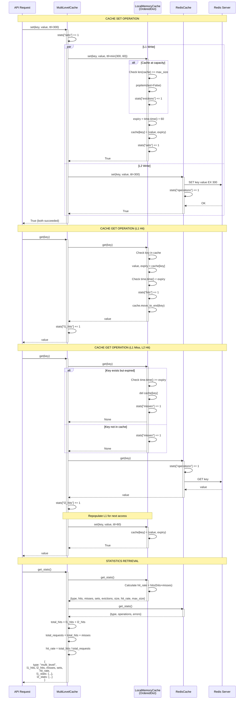
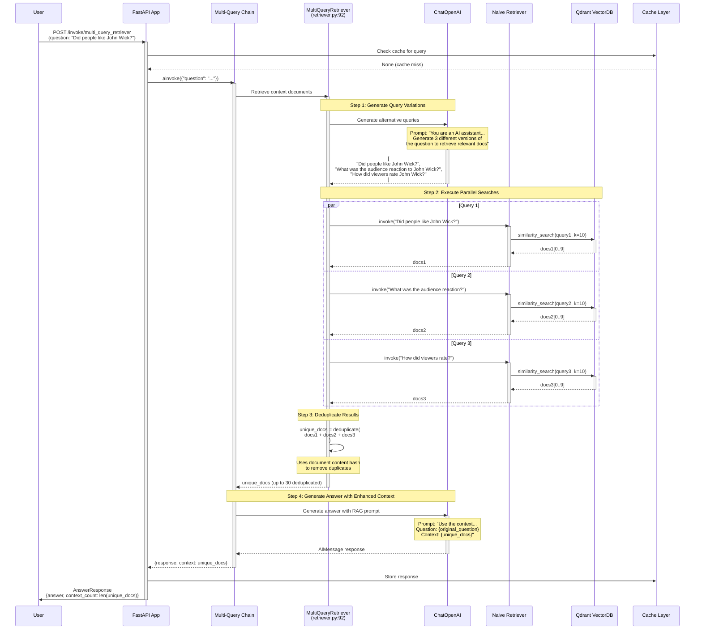
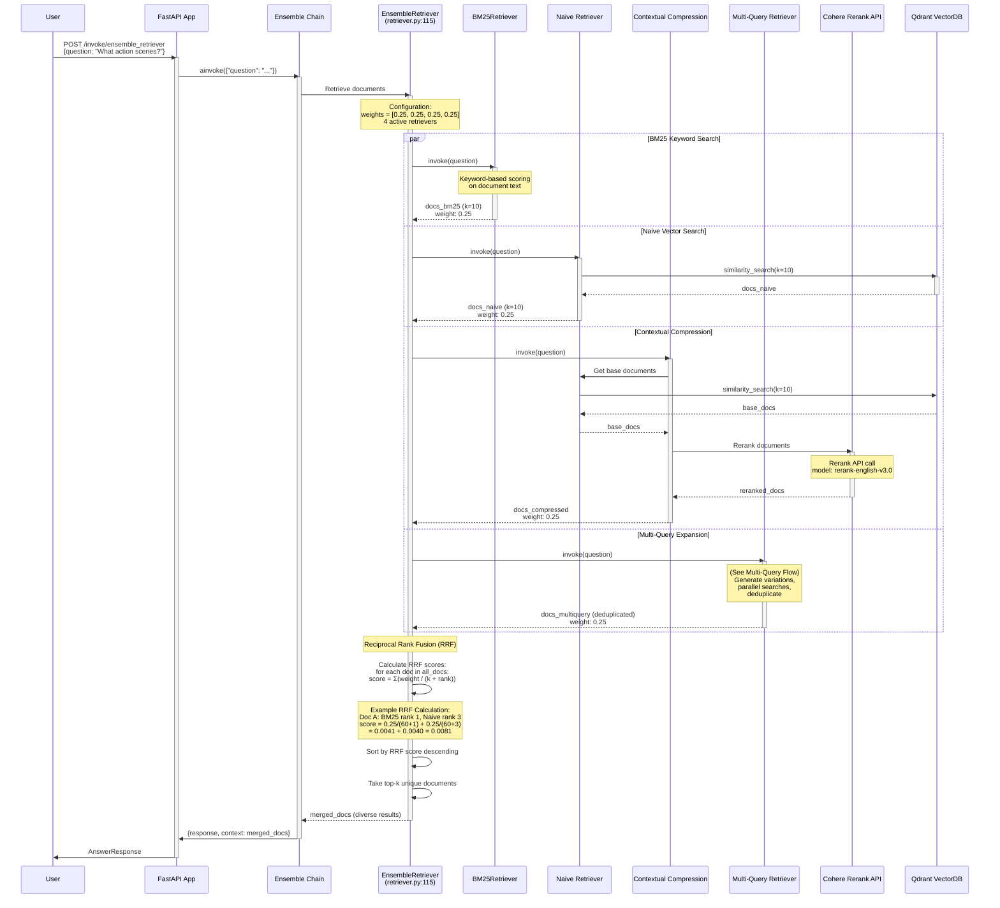
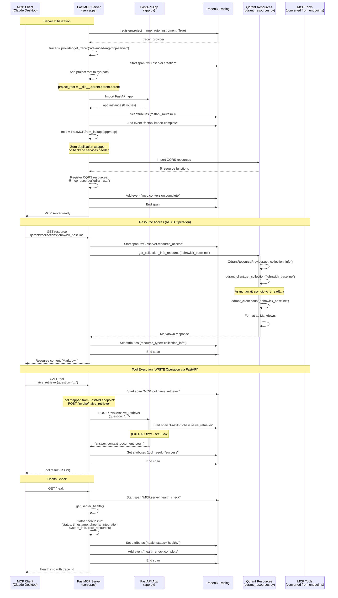
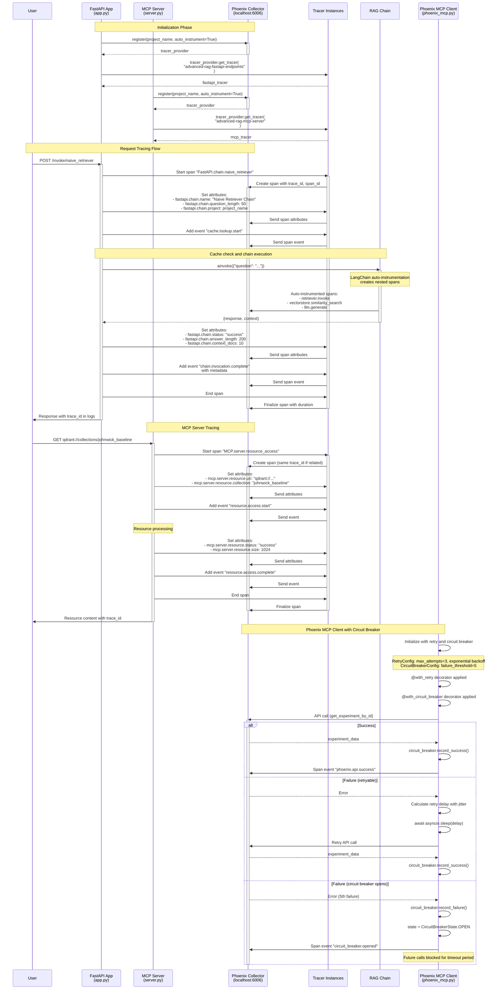

# Data Flow Analysis

This document provides comprehensive sequence diagrams and explanations for all major data flows in the Advanced RAG System. Each flow includes detailed walk-throughs with specific file references and line numbers.

## Table of Contents
1. [Query Flow (Simple RAG Query)](#1-query-flow-simple-rag-query)
2. [Cache Hit/Miss Flow](#2-cache-hitmiss-flow)
3. [Multi-Level Cache Flow](#3-multi-level-cache-flow)
4. [Multi-Query Retrieval Flow](#4-multi-query-retrieval-flow)
5. [Ensemble Retrieval Flow](#5-ensemble-retrieval-flow)
6. [MCP Server Communication Flow](#6-mcp-server-communication-flow)
7. [CQRS Resource Access Flow](#7-cqrs-resource-access-flow)
8. [Phoenix Tracing Integration Flow](#8-phoenix-tracing-integration-flow)
9. [Circuit Breaker Pattern Flow](#9-circuit-breaker-pattern-flow)
10. [Error Handling and Retry Flow](#10-error-handling-and-retry-flow)

---

## 1. Query Flow (Simple RAG Query)

**Overview:** This flow shows the complete lifecycle of a naive RAG query from HTTP request to response, including caching, vector retrieval, and LLM generation.

```mermaid
sequenceDiagram
    participant User
    participant FastAPI as FastAPI App<br/>(app.py)
    participant Cache as Cache Layer<br/>(cache.py)
    participant Chain as RAG Chain<br/>(chain.py)
    participant Retriever as Naive Retriever<br/>(retriever.py)
    participant Qdrant as Qdrant Vector DB
    participant LLM as ChatOpenAI<br/>(llm_models.py)
    participant Phoenix as Phoenix Tracing

    User->>FastAPI: POST /invoke/naive_retriever<br/>{question: "..."}
    activate FastAPI

    FastAPI->>Phoenix: Start span "FastAPI.chain.naive_retriever"
    FastAPI->>Cache: generate_cache_key(endpoint, request)
    Cache-->>FastAPI: cache_key (MD5 hash)

    FastAPI->>Cache: get_cached_response(cache_key)
    activate Cache

    alt Cache Hit
        Cache-->>FastAPI: cached_response
        FastAPI->>Phoenix: Set span attributes (cache.hit=true)
        FastAPI->>Phoenix: Add event "cache.lookup.hit"
        FastAPI->>User: AnswerResponse (cached)
        deactivate Cache
        deactivate FastAPI
    else Cache Miss
        Cache-->>FastAPI: None
        FastAPI->>Phoenix: Set span attributes (cache.hit=false)
        FastAPI->>Phoenix: Add event "cache.lookup.miss"
        deactivate Cache

        FastAPI->>Chain: ainvoke({"question": question})
        activate Chain

        Chain->>Retriever: Get context documents
        activate Retriever

        Retriever->>Qdrant: similarity_search(question, k=10)
        activate Qdrant
        Qdrant-->>Retriever: List[Document]
        deactivate Qdrant

        Retriever-->>Chain: context_documents
        deactivate Retriever

        Chain->>LLM: Generate answer with context
        activate LLM
        LLM-->>Chain: AIMessage response
        deactivate LLM

        Chain-->>FastAPI: {response, context}
        deactivate Chain

        FastAPI->>Phoenix: Set span attributes (answer_length, context_docs)
        FastAPI->>Phoenix: Add event "chain.invocation.complete"

        FastAPI->>Cache: cache_response(cache_key, response_data, ttl)
        activate Cache
        Cache-->>FastAPI: success
        deactivate Cache

        FastAPI->>Phoenix: Add event "cache.store.complete"
        FastAPI->>Phoenix: End span
        FastAPI->>User: AnswerResponse(answer, context_count)
        deactivate FastAPI
    end
```

### Detailed Walk-through

**1. Request Reception (Lines 262-265 in `/home/donbr/ghcp/adv-rag/src/api/app.py`)**
- The FastAPI endpoint `invoke_naive_endpoint` receives a POST request with a `QuestionRequest` containing the user's question
- The endpoint is registered with operation_id "naive_retriever" for MCP compatibility
- Request model validation occurs automatically via Pydantic

**2. Phoenix Tracing Initialization (Lines 180-194 in `/home/donbr/ghcp/adv-rag/src/api/app.py`)**
- A new Phoenix span named "FastAPI.chain.naive_retriever" is created using the tracer from line 43
- Span attributes are set including chain name, question length, and project name
- This enables distributed tracing across the entire request lifecycle

**3. Cache Key Generation (Lines 48-51, 197-198 in `/home/donbr/ghcp/adv-rag/src/api/app.py`)**
- `generate_cache_key()` creates an MD5 hash from the endpoint name and request data
- The cache key format is `"mcp_cache:{hash}"` for namespacing
- JSON serialization with sorted keys ensures consistent key generation

**4. Cache Lookup (Lines 53-59, 200-214 in `/home/donbr/ghcp/adv-rag/src/api/app.py`)**
- `get_cached_response()` checks the cache abstraction layer
- If found, the cached response is deserialized from JSON and returned immediately
- Phoenix span is annotated with cache hit status and metadata

**5. Chain Invocation (Lines 47-62 in `/home/donbr/ghcp/adv-rag/src/rag/chain.py`)**
- On cache miss, `create_rag_chain()` constructs a LangChain Runnable sequence
- The chain pipeline: `{context: retriever, question} | prompt | llm`
- Uses `RunnablePassthrough.assign()` to maintain context through the pipeline

**6. Document Retrieval (Lines 51-56 in `/home/donbr/ghcp/adv-rag/src/rag/retriever.py`)**
- `get_naive_retriever()` returns `BASELINE_VECTORSTORE.as_retriever(k=10)`
- The baseline vectorstore is initialized from the "johnwick_baseline" collection (line 17 in `/home/donbr/ghcp/adv-rag/src/rag/vectorstore.py`)
- Qdrant performs similarity search with dense vector retrieval mode

**7. LLM Generation (Lines 24-30, 39-46 in `/home/donbr/ghcp/adv-rag/src/integrations/llm_models.py`)**
- ChatOpenAI generates response using the RAG prompt template (line 45 in chain.py)
- LLM is configured with Redis caching at the LangChain level (line 22)
- Settings control model name (default: "gpt-4.1-mini"), temperature, retries, and timeout

**8. Response Caching (Lines 61-75, 244-247 in `/home/donbr/ghcp/adv-rag/src/api/app.py`)**
- `cache_response()` stores the JSON-serialized response with configurable TTL
- Default TTL from `settings.redis_cache_ttl` (line 65)
- Phoenix events track cache storage completion

**9. Response Return (Lines 249, 265 in `/home/donbr/ghcp/adv-rag/src/api/app.py`)**
- `AnswerResponse` model contains the generated answer and context document count
- Phoenix span is completed with final metrics
- HTTP 200 response with JSON body

### Caching Strategy
- **L1 Cache**: In-memory LRU cache with TTL (max 100-500 items depending on Redis availability)
- **L2 Cache**: Redis with configurable TTL (default from settings)
- **Cache Key**: MD5 hash of `"{endpoint}:{sorted_json_request}"`

### Error Handling
- Chain unavailability returns HTTP 503 (lines 181-189)
- Chain execution errors return HTTP 500 (lines 251-260)
- All errors are logged with `exc_info=True` and traced in Phoenix

---

## 2. Cache Hit/Miss Flow

**Overview:** This flow demonstrates the cache abstraction layer's decision logic for routing requests through L1 (local memory) and L2 (Redis) cache levels.

```mermaid
sequenceDiagram
    participant API as FastAPI Endpoint
    participant CacheFactory as get_cache()<br/>(cache.py:254)
    participant Settings as Settings
    participant L1 as LocalMemoryCache<br/>(cache.py:80)
    participant L2 as RedisCache<br/>(cache.py:147)
    participant Multi as MultiLevelCache<br/>(cache.py:193)
    participant Redis as Redis Server

    API->>CacheFactory: get_cache()
    activate CacheFactory

    CacheFactory->>Settings: Check cache_enabled flag

    alt cache_enabled = False
        CacheFactory->>API: Return NoOpCache()
        Note over API: All operations return immediately<br/>No actual caching occurs
    else cache_enabled = True
        CacheFactory->>Redis: Attempt connection

        alt Redis Available
            CacheFactory->>L1: Create LocalMemoryCache(max_size=100)
            CacheFactory->>L2: Create RedisCache(redis_client)
            CacheFactory->>Multi: Create MultiLevelCache(L1, L2)
            CacheFactory->>API: Return MultiLevelCache instance

            Note over API,Multi: Cache GET operation
            API->>Multi: get(cache_key)
            activate Multi

            Multi->>L1: get(cache_key)
            activate L1

            alt L1 Hit (not expired)
                L1-->>Multi: value
                Multi->>Multi: stats["l1_hits"] += 1
                Multi->>L1: move_to_end(key) [LRU]
                deactivate L1
                Multi-->>API: value
            else L1 Miss
                L1-->>Multi: None
                deactivate L1

                Multi->>L2: get(cache_key)
                activate L2
                L2->>Redis: GET cache_key

                alt L2 Hit
                    Redis-->>L2: value
                    L2-->>Multi: value
                    deactivate L2
                    Multi->>Multi: stats["l2_hits"] += 1
                    Multi->>L1: set(key, value, ttl=60)
                    Note over Multi,L1: Populate L1 for next request
                    Multi-->>API: value
                else L2 Miss
                    Redis-->>L2: None
                    L2-->>Multi: None
                    deactivate L2
                    Multi->>Multi: stats["misses"] += 1
                    Multi-->>API: None
                end
            end
            deactivate Multi

        else Redis Unavailable
            CacheFactory->>L1: Create LocalMemoryCache(max_size=500)
            Note over CacheFactory,L1: Larger size when Redis unavailable
            CacheFactory->>API: Return LocalMemoryCache instance
        end
    end
    deactivate CacheFactory
```

### Detailed Walk-through

**1. Cache Initialization (Lines 254-281 in `/home/donbr/ghcp/adv-rag/src/integrations/cache.py`)**
- `get_cache()` factory function determines appropriate cache implementation
- Checks `settings.cache_enabled` flag (line 52-55 in `/home/donbr/ghcp/adv-rag/src/core/settings.py`)
- Returns NoOpCache, LocalMemoryCache, or MultiLevelCache based on configuration

**2. NoOp Cache Mode (Lines 50-77 in `/home/donbr/ghcp/adv-rag/src/integrations/cache.py`)**
- When `cache_enabled=False`, all cache operations are no-ops
- `get()` always returns None (cache miss)
- `set()` and `delete()` always return True (success)
- Operations counter tracks activity for stats

**3. Local Memory Cache (Lines 80-144 in `/home/donbr/ghcp/adv-rag/src/integrations/cache.py`)**
- Uses `OrderedDict` for LRU eviction (line 84)
- Stores tuples of `(value, expiry_timestamp)` (line 84)
- TTL validation on retrieval: `time.time() < expiry` (line 98)
- LRU maintenance: `cache.move_to_end(key)` on access (line 101)
- Eviction occurs when `len(cache) >= max_size` (line 116)

**4. Redis Cache (Lines 147-190 in `/home/donbr/ghcp/adv-rag/src/integrations/cache.py`)**
- Wraps async Redis client from `get_redis()` (line 150)
- All operations include try-except with error logging (lines 158-166, 168-176, 178-186)
- Uses Redis `SET key value EX ttl` for atomic set-with-expiry (line 172)
- Tracks operations and errors in stats dict (lines 152-155)

**5. Multi-Level Cache Strategy (Lines 193-251 in `/home/donbr/ghcp/adv-rag/src/integrations/cache.py`)**
- **GET flow** (lines 207-224):
  - Try L1 first for fastest access
  - On L1 miss, try L2 (Redis)
  - On L2 hit, populate L1 with shorter TTL (60s)
  - Track separate hit counters for L1/L2
- **SET flow** (lines 226-232):
  - Write to both L1 and L2
  - L1 gets shorter TTL (min of 60s or requested TTL)
  - L2 gets full TTL
- **DELETE flow** (lines 234-238):
  - Delete from both levels
  - Success if either deletion succeeds

**6. TTL Management**
- L1 TTL: Shorter (60s max) for fast-changing data
- L2 TTL: Full TTL from settings (default from `redis_cache_ttl`)
- Expired entries in L1 are removed on access (line 105)
- Redis handles expiry automatically

**7. Statistics Tracking (Lines 134-144, 188-190, 240-251)**
- Local cache: hits, misses, sets, evictions, hit_rate, size
- Redis cache: operations, errors
- Multi-level: l1_hits, l2_hits, misses, sets, combined hit_rate with nested stats

### Optimization Points
- **L1 Cache reduces Redis load**: Frequently accessed items stay in memory
- **LRU eviction**: Oldest/least-used items evicted when capacity reached
- **Automatic L1 population**: L2 hits pre-populate L1 for next access
- **Graceful degradation**: Falls back to local-only cache if Redis unavailable

---

## 3. Multi-Level Cache Flow

**Overview:** This flow shows how the multi-level cache coordinates between L1 (local memory) and L2 (Redis) to optimize performance while maintaining consistency.



### Detailed Walk-through

**1. Cache Set Operation (Lines 226-232 in `/home/donbr/ghcp/adv-rag/src/integrations/cache.py`)**
- Writes to both L1 and L2 levels in parallel
- L1 receives shorter TTL: `min(ttl, 60)` to prevent stale data
- L2 receives full TTL for persistence
- Success requires both writes to succeed
- Stats counter incremented on each set

**2. L1 Capacity Management (Lines 110-122 in `/home/donbr/ghcp/adv-rag/src/integrations/cache.py`)**
- Before insertion, checks if `len(cache) >= max_size`
- If at capacity: `cache.popitem(last=False)` removes oldest item (FIFO for eviction)
- Eviction counter incremented for monitoring
- `max_size` is 100 when Redis available, 500 when Redis unavailable (lines 274, 281)

**3. L1 TTL and LRU (Lines 94-108 in `/home/donbr/ghcp/adv-rag/src/integrations/cache.py`)**
- Each entry stored as `(value, expiry_timestamp)` tuple
- On access: `time.time() < expiry` validates freshness
- Expired entries deleted immediately (line 105)
- `cache.move_to_end(key)` maintains LRU ordering on hits (line 101)
- OrderedDict ensures oldest items are at the front for eviction

**4. L2 Redis Operations (Lines 158-176 in `/home/donbr/ghcp/adv-rag/src/integrations/cache.py`)**
- `get()`: Simple `await self.redis.get(key)` with error handling
- `set()`: Uses `await self.redis.set(key, value, ex=ttl)` for atomic operation
- All operations wrapped in try-except with logging
- Error counter tracks reliability for circuit breaker decisions

**5. L1→L2 Promotion Strategy (Lines 217-220 in `/home/donbr/ghcp/adv-rag/src/integrations/cache.py`)**
- On L2 hit, automatically populate L1: `await self.l1.set(key, value, ttl=60)`
- Shorter L1 TTL (60s) prevents extended staleness
- Optimizes for read-heavy workloads where same keys accessed repeatedly
- No promotion on L1 hit (already in fastest cache)

**6. Statistics Aggregation (Lines 240-251 in `/home/donbr/ghcp/adv-rag/src/integrations/cache.py`)**
- Combines L1 and L2 stats into unified view
- Calculates combined hit rate: `(l1_hits + l2_hits) / (l1_hits + l2_hits + misses)`
- Includes nested L1 and L2 stats for detailed analysis
- Available via `/cache/stats` endpoint (lines 310-359 in app.py)

**7. Cache Factory Logic (Lines 254-281 in `/home/donbr/ghcp/adv-rag/src/integrations/cache.py`)**
- Checks `settings.cache_enabled` first
- Attempts Redis connection via `await get_redis()`
- On success: Creates MultiLevelCache with L1(100) + L2
- On failure: Falls back to LocalMemoryCache(500) with warning log
- NoOpCache returned if caching disabled

### Performance Characteristics
- **L1 Access**: O(1) dict lookup + O(1) move_to_end
- **L2 Access**: Network round-trip to Redis (~1ms local, ~10ms remote)
- **Write Amplification**: 2x (write to both L1 and L2)
- **Hit Rate Optimization**: L1 promotion reduces Redis load significantly
- **Memory Usage**: L1 bounded by max_size, L2 bounded by Redis memory

---

## 4. Multi-Query Retrieval Flow

**Overview:** This flow demonstrates how the MultiQueryRetriever generates multiple query variations using an LLM to improve retrieval recall.



### Detailed Walk-through

**1. Multi-Query Retriever Initialization (Lines 92-106 in `/home/donbr/ghcp/adv-rag/src/rag/retriever.py`)**
- Created via `MultiQueryRetriever.from_llm(retriever=naive_ret, llm=CHAT_MODEL)`
- Requires both a base retriever (naive) and an LLM for query generation
- Wrapped in try-except; returns None on failure (e.g., no naive retriever available)
- Logs successful creation: "MultiQueryRetriever created successfully"

**2. Endpoint Invocation (Lines 277-280 in `/home/donbr/ghcp/adv-rag/src/api/app.py`)**
- POST endpoint `/invoke/multi_query_retriever` with operation_id "multi_query_retriever"
- Routes to `invoke_chain_logic(MULTI_QUERY_CHAIN, request.question, "Multi-Query Chain")`
- Cache key generated from endpoint name + question
- Phoenix tracing span: "FastAPI.chain.multi_query_chain"

**3. Query Variation Generation**
- MultiQueryRetriever uses the LLM to generate 3-5 alternative phrasings
- Internal prompt template asks for different versions to retrieve relevant documents
- LLM model from settings (default: "gpt-4.1-mini", line 26 in settings.py)
- Generation leverages LangChain's MultiQueryRetriever built-in logic

**4. Parallel Retrieval Execution**
- Each generated query executed against the base retriever independently
- Base retriever is naive retriever with k=10 (line 56 in retriever.py)
- Qdrant performs similarity search for each query variant
- Results accumulated in parallel (LangChain handles async execution)

**5. Deduplication Logic**
- MultiQueryRetriever automatically deduplicates documents across all results
- Uses document content or metadata hash to identify duplicates
- Preserves order based on first occurrence
- Final count typically 10-30 unique documents (3 queries × 10 results with overlap)

**6. Answer Generation with Enhanced Context**
- RAG chain receives deduplicated documents as context
- Prompt template (lines 32-42 in chain.py): "Use the context provided below to answer..."
- LLM generates answer considering broader context from multiple query perspectives
- Response includes both answer and context document count

**7. Response Caching (Lines 244-247 in `/home/donbr/ghcp/adv-rag/src/api/app.py`)**
- Final response cached with original question as key
- Subsequent identical questions return cached result (skip query generation)
- TTL from settings (default redis_cache_ttl)
- Cache key: `mcp_cache:{md5("Multi-Query Chain:{"question":"..."}")}`

### Performance Characteristics
- **Latency**: Higher than naive (3-5 LLM calls + 3-5 vector searches)
- **Recall**: Significantly improved by capturing query intent variations
- **LLM Cost**: Multiplied by number of query variations generated
- **Deduplication**: Reduces total documents to manageable size for context window
- **Caching Impact**: Critical for multi-query due to higher base cost

### Error Handling
- Base retriever unavailable: Returns None during initialization (line 95-96 in retriever.py)
- LLM generation failure: Caught in chain execution, HTTP 500 returned (lines 251-260 in app.py)
- Logged with full exception: `logger.error(..., exc_info=True)`

---

## 5. Ensemble Retrieval Flow

**Overview:** This flow shows how the EnsembleRetriever combines multiple retrieval strategies (BM25, naive, compression, multi-query) with weighted voting to produce diverse results.



### Detailed Walk-through

**1. Ensemble Retriever Construction (Lines 115-145 in `/home/donbr/ghcp/adv-rag/src/rag/retriever.py`)**
- Creates map of available retrievers: `{bm25, naive, contextual_compression, multi_query}`
- Filters to only active (non-None) retrievers: `[r for r in map.values() if r is not None]`
- Requires minimum 2 retrievers; falls back to first retriever if <2 available (lines 128-133)
- Equal weighting calculated: `[1.0/len(active)] * len(active)` (line 137)
- Logs active retriever names for debugging (line 135)

**2. BM25 Keyword Retriever (Lines 58-69 in `/home/donbr/ghcp/adv-rag/src/rag/retriever.py`)**
- Initialized from documents: `BM25Retriever.from_documents(DOCUMENTS)`
- Uses TF-IDF style keyword scoring on document text
- No vector embeddings required (purely lexical)
- Excellent for exact keyword matches, proper nouns, technical terms
- Returns top-k documents by BM25 score

**3. Contextual Compression with Cohere Rerank (Lines 71-90 in `/home/donbr/ghcp/adv-rag/src/rag/retriever.py`)**
- Base retriever: naive retriever (similarity search)
- Compressor: `CohereRerank(model=settings.cohere_rerank_model)` (line 82)
- Requires COHERE_API_KEY environment variable (checked line 77)
- Reranks base results using Cohere's rerank-english-v3.0 model
- Returns compressed/reranked subset of most relevant documents
- Falls back to None if Cohere key missing (returns None, logs warning)

**4. Reciprocal Rank Fusion (RRF) Algorithm**
- LangChain's EnsembleRetriever implements RRF for merging results
- Formula: `score(doc) = Σ(weight_i / (k + rank_i))` where k=60 by default
- Each retriever contributes weighted inverse rank
- Higher ranks (1, 2, 3...) get higher scores
- Documents appearing in multiple retrievers get boosted scores
- Final ranking by total RRF score descending

**5. Endpoint Configuration (Lines 282-285 in `/home/donbr/ghcp/adv-rag/src/api/app.py`)**
- POST `/invoke/ensemble_retriever` with operation_id "ensemble_retriever"
- Routes to `invoke_chain_logic(ENSEMBLE_CHAIN, ...)`
- Same caching, tracing, and error handling as other endpoints
- Response includes combined context count from all retrievers

**6. Retriever Availability Handling**
- BM25: Requires documents loaded (line 59-61)
- Naive: Requires baseline vectorstore (line 52-54)
- Compression: Requires naive + COHERE_API_KEY (lines 72-76)
- Multi-Query: Requires naive + chat model (lines 93-96)
- Ensemble only created if ≥2 retrievers available (line 131)

**7. Weighted Voting Strategy**
- Equal weights: Each retriever contributes equally (0.25 each for 4 retrievers)
- Could be adjusted for different strategies: `weights=[0.4, 0.3, 0.2, 0.1]`
- Weights passed to EnsembleRetriever constructor (line 139)
- RRF applies weights in score calculation

### Performance Characteristics
- **Latency**: Highest of all retrievers (parallel execution of 4 strategies)
- **Recall**: Excellent - captures both semantic and keyword relevance
- **Diversity**: High - different retrievers find different relevant docs
- **Cost**: 4x vector searches + Cohere rerank + LLM query generation
- **Robustness**: Degraded gracefully if some retrievers unavailable

### Error Handling and Fallbacks
- Missing retrievers logged and skipped (lines 125-126)
- Less than 2 retrievers: Returns first available (line 133)
- Cohere API failure: Compression retriever becomes None, ensemble continues with others
- Wrapped in try-except: Returns None on ensemble creation failure (lines 143-145)

---

## 6. MCP Server Communication Flow

**Overview:** This flow demonstrates how the FastMCP server wraps the FastAPI application and handles MCP protocol communication, including CQRS resource access and tool execution.



### Detailed Walk-through

**1. MCP Server Initialization (Lines 36-153 in `/home/donbr/ghcp/adv-rag/src/mcp/server.py`)**
- `create_mcp_server()` function creates MCP wrapper with Phoenix tracing
- Phoenix tracer initialized: `tracer_provider = register(project_name, auto_instrument=True)` (lines 28-30)
- Tracer obtained: `tracer = tracer_provider.get_tracer("advanced-rag-mcp-server")` (line 34)
- Span started: `with tracer.start_as_current_span("MCP.server.creation")` (line 40)
- Span attributes set for project, endpoint, conversion method (lines 43-46)

**2. FastAPI Import and Path Setup (Lines 54-76 in `/home/donbr/ghcp/adv-rag/src/mcp/server.py`)**
- Project root calculated: `current_file.parent.parent.parent` (3 levels up)
- Added to Python path: `sys.path.insert(0, str(project_root))` (line 58)
- FastAPI app imported: `from src.api.app import app` (line 67)
- Route count extracted: `len(app.routes)` for monitoring (line 70)
- Phoenix events logged: "fastapi.import.start", "fastapi.import.complete" (lines 66, 72)

**3. FastMCP Conversion (Lines 81-96 in `/home/donbr/ghcp/adv-rag/src/mcp/server.py`)**
- Conversion using: `mcp = FastMCP.from_fastapi(app=app)` (line 88)
- Zero duplication approach - FastMCP wraps FastAPI without copying
- Backend services (Redis, Qdrant) only needed when tools execute
- Span attributes set: status="created", ready=True (lines 91-92)
- Event logged: "mcp.conversion.complete" (line 93)

**4. CQRS Resource Registration (Lines 162-196 in `/home/donbr/ghcp/adv-rag/src/mcp/server.py`)**
- Resources imported from `src.mcp.qdrant_resources` (lines 165-171)
- 5 resources registered with URI patterns:
  - `qdrant://collections` → list_collections_resource (line 177)
  - `qdrant://collections/{collection_name}` → get_collection_info_resource (line 180)
  - `qdrant://collections/{collection_name}/documents/{point_id}` → get_document_resource (line 183)
  - `qdrant://collections/{collection_name}/search` → search with query params (lines 186-191)
  - `qdrant://collections/{collection_name}/stats` → get_collection_stats_resource (line 194)

**5. Resource Access Flow (Lines 70-155 in `/home/donbr/ghcp/adv-rag/src/mcp/qdrant_resources.py`)**
- Client requests resource via URI: `qdrant://collections/johnwick_baseline`
- MCP server routes to `get_collection_info_resource(collection_name)`
- QdrantResourceProvider.get_collection_info() called (line 70)
- Async Qdrant operations: `await asyncio.to_thread(self.qdrant_client.get_collection, ...)` (lines 78-80)
- Response formatted as Markdown for LLM consumption (lines 106-133)
- Includes metadata, statistics, available operations, CQRS information

**6. Tool Execution via FastAPI (Lines 262-290 in `/home/donbr/ghcp/adv-rag/src/api/app.py`)**
- MCP tools automatically created from FastAPI POST endpoints
- Tool names match operation_id: "naive_retriever", "bm25_retriever", etc.
- Tool execution triggers FastAPI endpoint call
- Full request/response cycle with caching, tracing, error handling
- Results returned to MCP client as structured JSON

**7. Health Check with Tracing (Lines 203-288 in `/home/donbr/ghcp/adv-rag/src/mcp/server.py`)**
- `get_server_health()` wrapped in Phoenix span (line 205)
- Comprehensive health info gathered:
  - Status, timestamp, server_type, version
  - Phoenix integration details (project, endpoint, tracer)
  - System info (python_path, fastapi_imported, mcp_ready)
  - CQRS resources with URI patterns (lines 230-236)
- Span attributes and events logged (lines 240-245)
- Error handling returns unhealthy status with trace_id (lines 259-288)

**8. Phoenix Tracing Integration**
- Unified project name for correlation: `f"advanced-rag-system-{timestamp}"` (line 24)
- Environment variable set: `PHOENIX_COLLECTOR_ENDPOINT` (line 34 in app.py, line 25 in server.py)
- Tracers coordinate: "advanced-rag-fastapi-endpoints" + "advanced-rag-mcp-server"
- Span hierarchy: MCP.server → MCP.tool → FastAPI.chain → chain operations
- Attributes track: operation types, cache hits, document counts, errors

### CQRS Pattern Implementation
- **Resources (Queries)**: Read-only Qdrant access via `qdrant://` URIs
- **Tools (Commands)**: Write operations via FastAPI endpoints (converted to MCP tools)
- **Separation**: Resources return formatted data, Tools modify state
- **URI Scheme**: `qdrant://collections/{name}/{operation}?params`

### Error Handling
- Import errors logged with trace_id and raised (lines 112-132)
- Creation errors logged with exception info and raised (lines 134-153)
- Health check errors return unhealthy status with error details (lines 259-288)
- All errors traced in Phoenix with span attributes

---

## 7. CQRS Resource Access Flow

**Overview:** This flow shows the CQRS (Command Query Responsibility Segregation) pattern implementation for read-only Qdrant access through MCP resources.

```mermaid
sequenceDiagram
    participant Client as MCP Client
    participant MCP as MCP Server
    participant Provider as QdrantResourceProvider<br/>(qdrant_resources.py:39)
    participant Qdrant as QdrantClient
    participant VectorDB as Qdrant Vector DB
    participant Embeddings as OpenAI Embeddings

    Note over Client,VectorDB: CQRS Read Pattern: List Collections

    Client->>MCP: GET qdrant://collections
    activate MCP

    MCP->>Provider: list_collections_resource()
    activate Provider

    Provider->>Provider: QdrantResourceProvider()
    Note over Provider: Singleton pattern:<br/>Initialize once with settings

    Provider->>Qdrant: get_collections()
    activate Qdrant
    Qdrant->>VectorDB: LIST_COLLECTIONS
    VectorDB-->>Qdrant: [johnwick_baseline, johnwick_semantic]
    Qdrant-->>Provider: collections[]
    deactivate Qdrant

    Provider->>Provider: Format as Markdown:<br/># Available Qdrant Collections<br/>- johnwick_baseline<br/>- johnwick_semantic

    Provider-->>MCP: Markdown content
    deactivate Provider
    MCP-->>Client: Resource content
    deactivate MCP

    Note over Client,VectorDB: CQRS Read Pattern: Get Collection Info

    Client->>MCP: GET qdrant://collections/johnwick_baseline
    activate MCP

    MCP->>Provider: get_collection_info_resource("johnwick_baseline")
    activate Provider

    Provider->>Qdrant: await asyncio.to_thread(<br/>  get_collection, "johnwick_baseline"<br/>)
    activate Qdrant
    Qdrant->>VectorDB: GET_COLLECTION johnwick_baseline
    VectorDB-->>Qdrant: collection_info {config, status, optimizer}
    Qdrant-->>Provider: collection_info
    deactivate Qdrant

    Provider->>Qdrant: await asyncio.to_thread(<br/>  count, "johnwick_baseline"<br/>)
    activate Qdrant
    Qdrant->>VectorDB: COUNT johnwick_baseline
    VectorDB-->>Qdrant: {count: 500}
    Qdrant-->>Provider: count_result
    deactivate Qdrant

    Provider->>Provider: Extract vector config:<br/>- size = config.params.vectors.size<br/>- distance = config.params.vectors.distance

    Provider->>Provider: Format response:<br/># Qdrant Collection: johnwick_baseline<br/>## Metadata<br/>- Vector Size: 1536<br/>- Distance: Cosine<br/>- Documents: 500

    Provider-->>MCP: Markdown content
    deactivate Provider
    MCP-->>Client: Resource content
    deactivate MCP

    Note over Client,VectorDB: CQRS Read Pattern: Document Retrieval

    Client->>MCP: GET qdrant://collections/johnwick_baseline/documents/abc123
    activate MCP

    MCP->>Provider: get_document_resource("johnwick_baseline", "abc123")
    activate Provider

    Provider->>Qdrant: await asyncio.to_thread(<br/>  retrieve,<br/>  collection="johnwick_baseline",<br/>  ids=["abc123"],<br/>  with_payload=True,<br/>  with_vectors=False<br/>)
    activate Qdrant
    Qdrant->>VectorDB: RETRIEVE POINT abc123
    VectorDB-->>Qdrant: point {id, payload}
    Qdrant-->>Provider: points[0]
    deactivate Qdrant

    Provider->>Provider: Extract payload:<br/>content = payload.page_content<br/>metadata = payload.metadata

    Provider->>Provider: Format as Markdown:<br/># Document: abc123<br/>## Content<br/>{content[:500]}...<br/>## Metadata<br/>{metadata}

    Provider-->>MCP: Markdown content
    deactivate Provider
    MCP-->>Client: Resource content
    deactivate MCP

    Note over Client,VectorDB: CQRS Read Pattern: Semantic Search

    Client->>MCP: GET qdrant://collections/johnwick_baseline/search?<br/>query=action scenes&limit=5
    activate MCP

    MCP->>Provider: search_collection_resource(<br/>  "johnwick_baseline", "action scenes", 5<br/>)
    activate Provider

    Provider->>Embeddings: embed_query("action scenes")
    activate Embeddings
    Embeddings->>Embeddings: OpenAI API call<br/>model: text-embedding-3-small
    Embeddings-->>Provider: query_vector[1536]
    deactivate Embeddings

    Provider->>Qdrant: await asyncio.to_thread(<br/>  search,<br/>  collection="johnwick_baseline",<br/>  query_vector=query_vector,<br/>  limit=5<br/>)
    activate Qdrant
    Qdrant->>VectorDB: VECTOR_SEARCH<br/>vector={query_vector}<br/>limit=5
    VectorDB-->>Qdrant: scored_points[]
    Qdrant-->>Provider: search_results
    deactivate Qdrant

    Provider->>Provider: Format results:<br/># Search Results: "action scenes"<br/>## Top 5 Matches<br/>1. [score: 0.89] {content}<br/>2. [score: 0.85] {content}<br/>...

    Provider-->>MCP: Markdown content
    deactivate Provider
    MCP-->>Client: Resource content
    deactivate MCP

    Note over Client,VectorDB: CQRS Read Pattern: Collection Statistics

    Client->>MCP: GET qdrant://collections/johnwick_baseline/stats
    activate MCP

    MCP->>Provider: get_collection_stats_resource("johnwick_baseline")
    activate Provider

    Provider->>Qdrant: await asyncio.to_thread(<br/>  get_collection, "johnwick_baseline"<br/>)
    activate Qdrant
    Qdrant->>VectorDB: GET_COLLECTION_STATS
    VectorDB-->>Qdrant: {vectors_count, indexed_count, segments, ...}
    Qdrant-->>Provider: collection_info
    deactivate Qdrant

    Provider->>Qdrant: await asyncio.to_thread(<br/>  count, "johnwick_baseline"<br/>)
    activate Qdrant
    Qdrant->>VectorDB: COUNT
    VectorDB-->>Qdrant: {count: 500}
    Qdrant-->>Provider: count_result
    deactivate Qdrant

    Provider->>Provider: Format statistics:<br/># Collection Statistics<br/>- Total Points: 500<br/>- Indexed: 500<br/>- Segments: 2<br/>- Status: green

    Provider-->>MCP: Markdown content
    deactivate Provider
    MCP-->>Client: Resource content
    deactivate MCP
```



### Detailed Walk-through

**1. QdrantResourceProvider Initialization (Lines 39-68 in `/home/donbr/ghcp/adv-rag/src/mcp/qdrant_resources.py`)**
- Singleton pattern: One provider instance per MCP server
- Settings loaded: `self.settings = get_settings()` (line 53)
- Embeddings initialized: `self.embeddings = get_openai_embeddings()` (line 54)
- Qdrant client created: `QdrantClient(url=settings.qdrant_url, prefer_grpc=True)` (lines 57-60)
- Known collections registered: `["johnwick_baseline", "johnwick_semantic"]` (lines 63-66)

**2. List Collections Resource (Lines 578+ in `/home/donbr/ghcp/adv-rag/src/mcp/qdrant_resources.py`)**
- URI pattern: `qdrant://collections`
- Registered in server.py line 177: `@mcp.resource("qdrant://collections")`
- Returns all available collections with descriptions
- Formatted as Markdown for LLM consumption
- No parameters required

**3. Get Collection Info Resource (Lines 70-155 in `/home/donbr/ghcp/adv-rag/src/mcp/qdrant_resources.py`)**
- URI pattern: `qdrant://collections/{collection_name}`
- Async Qdrant calls: `await asyncio.to_thread(self.qdrant_client.get_collection, ...)` (lines 78-81)
- Count operation: `await asyncio.to_thread(self.qdrant_client.count, ...)` (lines 84-87)
- Vector config extraction handles both dict and object formats (lines 90-103)
- Response includes: name, status, vector size, distance metric, document count (lines 106-133)

**4. Document Retrieval Resource (Lines 156-200+ in `/home/donbr/ghcp/adv-rag/src/mcp/qdrant_resources.py`)**
- URI pattern: `qdrant://collections/{collection_name}/documents/{point_id}`
- Retrieve operation: `self.qdrant_client.retrieve(collection, ids=[point_id], with_payload=True, with_vectors=False)` (lines 164-170)
- Payload extraction: `payload.get('page_content')` or `payload.get('content')` (line 193)
- Metadata extraction: `payload.get('metadata', {})` (line 194)
- Content preview: First 500 chars with ellipsis (line 199)
- Not found handling: Returns helpful message with suggestions (lines 173-187)

**5. Search Collection Resource (Lines 186-191 in `/home/donbr/ghcp/adv-rag/src/mcp/server.py`, implementation in qdrant_resources.py)**
- URI pattern: `qdrant://collections/{collection_name}/search?query={text}&limit={n}`
- Query parameter required, limit defaults to 5
- Embedding generation: `self.embeddings.embed_query(query_text)`
- Vector search: `self.qdrant_client.search(collection, query_vector, limit)` (async via asyncio.to_thread)
- Results formatted with scores and content snippets
- Semantic similarity search using dense vectors

**6. Collection Statistics Resource (Lines 574+ in `/home/donbr/ghcp/adv-rag/src/mcp/qdrant_resources.py`)**
- URI pattern: `qdrant://collections/{collection_name}/stats`
- Combines collection info and count
- Extracts: vectors_count, indexed_count, points_count, segments_count
- Optimizer status and collection health
- Formatted as statistical summary

**7. Async Operation Pattern**
- All Qdrant operations wrapped: `await asyncio.to_thread(sync_function, ...)`
- Prevents blocking MCP server event loop
- Qdrant client is synchronous, asyncio.to_thread makes it async-compatible
- Example: `await asyncio.to_thread(self.qdrant_client.get_collection, collection_name)` (lines 78-81)

**8. Error Handling (Lines 135-154 in `/home/donbr/ghcp/adv-rag/src/mcp/qdrant_resources.py`)**
- Try-except around all Qdrant operations
- Errors logged with context: `logger.error(f"Failed to get collection info for {collection_name}: {e}")`
- Error responses formatted as Markdown with:
  - Error type and message
  - Timestamp
  - Troubleshooting steps
  - Available collections list
- Graceful degradation instead of crashes

**9. Markdown Formatting Strategy**
- All responses formatted as Markdown for LLM readability
- Headers: `#` for title, `##` for sections
- Lists: `-` for bullet points
- Code blocks: `` ` `` for URIs and technical values
- Metadata sections: Clear structure with key-value pairs
- Footer: `---` separator with context note

### CQRS Pattern Benefits
- **Read-Only Safety**: Resources cannot modify data (no PUT/POST/DELETE)
- **Query Optimization**: Separate read models from write models
- **Clear Separation**: Resources for queries, Tools for commands
- **LLM-Friendly**: Markdown responses optimized for Claude consumption
- **Scalability**: Read operations can be cached and replicated independently

### Performance Considerations
- **Async Operations**: All I/O wrapped in asyncio.to_thread
- **Connection Pooling**: QdrantClient manages gRPC connections
- **Embedding Caching**: OpenAI embeddings could be cached (not implemented)
- **Payload Only**: Vectors not retrieved unless needed (`with_vectors=False`)
- **Limited Results**: Default limits prevent large response payloads

---

## 8. Phoenix Tracing Integration Flow

**Overview:** This flow demonstrates how Phoenix observability is integrated across FastAPI, MCP Server, and chain operations with distributed tracing.



### Detailed Walk-through

**1. Phoenix Registration (Lines 27-43 in `/home/donbr/ghcp/adv-rag/src/api/app.py`, lines 27-34 in `/home/donbr/ghcp/adv-rag/src/mcp/server.py`)**
- Environment variable set: `os.environ["PHOENIX_COLLECTOR_ENDPOINT"] = phoenix_endpoint` (line 34 in app.py)
- Unified project name for correlation: `f"advanced-rag-system-{timestamp}"` (line 33 in app.py)
- Registration with auto-instrumentation: `tracer_provider = register(project_name=project_name, auto_instrument=True)` (lines 37-40 in app.py)
- Auto-instrumentation captures LangChain operations automatically

**2. Tracer Initialization**
- FastAPI tracer: `tracer = tracer_provider.get_tracer("advanced-rag-fastapi-endpoints")` (line 43 in app.py)
- MCP tracer: `tracer = tracer_provider.get_tracer("advanced-rag-mcp-server")` (line 34 in server.py)
- Different tracer names allow filtering in Phoenix UI
- Same project_name ensures traces are correlated

**3. Span Creation and Context (Lines 180-194 in `/home/donbr/ghcp/adv-rag/src/api/app.py`)**
- Context manager creates span: `with tracer.start_as_current_span(f"FastAPI.chain.{chain_name}") as span:` (line 180)
- Span attributes set immediately: `span.set_attribute("fastapi.chain.name", chain_name)` (line 192)
- Question metadata tracked: `span.set_attribute("fastapi.chain.question_length", len(question))` (line 193)
- Project correlation: `span.set_attribute("fastapi.chain.project", project_name)` (line 194)

**4. Span Events for Flow Tracking (Lines 201-247 in `/home/donbr/ghcp/adv-rag/src/api/app.py`)**
- Cache lookup start: `span.add_event("cache.lookup.start")` (line 201)
- Cache hit event: `span.add_event("cache.lookup.hit", {metadata})` (lines 205-208)
- Cache miss event: `span.add_event("cache.lookup.miss")` (line 214)
- Chain invocation start: `span.add_event("chain.invocation.start", {question_preview})` (lines 220-222)
- Chain completion: `span.add_event("chain.invocation.complete", {answer_length, context_docs})` (lines 233-236)
- Cache store: `span.add_event("cache.store.complete", {ttl})` (line 247)

**5. Error Tracing (Lines 251-260 in `/home/donbr/ghcp/adv-rag/src/api/app.py`)**
- Error attributes: `span.set_attribute("fastapi.chain.status", "error")` (line 252)
- Error details: `span.set_attribute("fastapi.chain.error", str(e))` (line 253)
- Error event: `span.add_event("chain.invocation.error", {error_type, error_message})` (lines 254-257)
- Exception logged with trace context: `logger.error(..., exc_info=True)` (line 259)
- HTTP exception raised with traced error

**6. MCP Server Tracing (Lines 40-96 in `/home/donbr/ghcp/adv-rag/src/mcp/server.py`)**
- Server creation span: `with tracer.start_as_current_span("MCP.server.creation") as span:` (line 40)
- Attributes for conversion: `span.set_attribute("mcp.server.conversion_method", "FastMCP.from_fastapi")` (line 46)
- FastAPI import event: `span.add_event("fastapi.import.complete", {routes_count, app_title})` (lines 72-76)
- MCP conversion event: `span.add_event("mcp.conversion.complete", {status, server_type})` (lines 93-96)
- Trace_id included in logs: `"trace_id": span.get_span_context().trace_id` (line 106)

**7. Health Check Tracing (Lines 292-308 in `/home/donbr/ghcp/adv-rag/src/api/app.py`, lines 203-288 in `/home/donbr/ghcp/adv-rag/src/mcp/server.py`)**
- FastAPI health span: `with tracer.start_as_current_span("FastAPI.health_check") as span:` (line 295)
- MCP health span: `with tracer.start_as_current_span("MCP.server.health_check") as span:` (line 205)
- Span attributes: health.type, health.project, health.status (lines 296-297, 208-209)
- Health event: `span.add_event("health_check.complete", {status})` (line 298)
- Trace_id returned in response: `"trace_id": span.get_span_context().trace_id` (lines 306, 253)

**8. Phoenix MCP Client Circuit Breaker (Lines 549-604 in `/home/donbr/ghcp/adv-rag/src/integrations/phoenix_mcp.py`)**
- Retry config: `RetryConfig(max_attempts=3, base_delay=1.0, exponential_base=2.0, jitter=True)` (lines 45-52)
- Circuit breaker config: `CircuitBreakerConfig(failure_threshold=5, success_threshold=3, timeout=60.0)` (lines 55-59)
- Client initialization with configs (lines 563-581)
- Per-operation circuit breakers: `self.list_projects_breaker`, `self.get_experiment_breaker` (lines 586-589)
- Decorator application: `method = with_circuit_breaker(breaker)(method)` (line 604)

**9. Distributed Tracing Flow**
- Trace propagation: Same trace_id flows through FastAPI → Chain → MCP
- Parent-child spans: MCP server span contains FastAPI tool execution span
- Span context: `span.get_span_context()` provides trace_id and span_id for correlation
- Phoenix UI: All spans with same trace_id grouped in single trace view
- Filtering: Tracer names ("advanced-rag-fastapi-endpoints" vs "advanced-rag-mcp-server") allow component filtering

**10. Lifecycle Tracing (Lines 77-158 in `/home/donbr/ghcp/adv-rag/src/api/app.py`)**
- Startup span: `with tracer.start_as_current_span("FastAPI.application.startup") as span:` (line 81)
- Startup events: "application.startup.start", "redis.connection.established", "chains.initialization.complete" (lines 88, 97, 135)
- Shutdown span: `with tracer.start_as_current_span("FastAPI.application.shutdown") as span:` (line 146)
- Shutdown events: "application.shutdown.start", "redis.connection.closed", "application.shutdown.complete" (lines 148, 154, 158)

### Tracing Best Practices Implemented
- **Structured Attributes**: Consistent naming convention (component.category.attribute)
- **Event Sequencing**: Chronological events capture flow progression
- **Error Context**: All errors include type, message, and trace_id
- **Metadata Enrichment**: Spans include relevant metrics (lengths, counts, durations)
- **Correlation Keys**: Project name and trace_id enable cross-component correlation
- **Auto-Instrumentation**: LangChain operations automatically traced

### Phoenix UI Analysis Capabilities
- **Trace Timeline**: Visualize span hierarchy and durations
- **Attribute Filtering**: Filter by chain.name, cache.hit, status
- **Event Analysis**: Track flow progression through events
- **Error Investigation**: Find all errors with trace context
- **Performance Metrics**: Identify slow spans and bottlenecks
- **Circuit Breaker State**: Monitor circuit breaker transitions via events

---

## 9. Circuit Breaker Pattern Flow

**Overview:** This flow demonstrates the circuit breaker pattern implementation for fault-tolerant Phoenix MCP communication with state transitions and error handling.

```mermaid
sequenceDiagram
    participant Client as Phoenix MCP Client
    participant CircuitBreaker as Circuit Breaker<br/>(phoenix_mcp.py:62)
    participant Decorator as @with_circuit_breaker
    participant PhoenixAPI as Phoenix API
    participant Retry as @with_retry

    Note over Client,PhoenixAPI: Initial State: CLOSED (Normal Operation)

    Client->>CircuitBreaker: Initialize with config
    activate CircuitBreaker
    Note over CircuitBreaker: Config:<br/>- failure_threshold: 5<br/>- success_threshold: 3<br/>- timeout: 60s<br/>- state: CLOSED

    CircuitBreaker-->>Client: breaker instance
    deactivate CircuitBreaker

    Note over Client,PhoenixAPI: Successful Operation

    Client->>Decorator: Call get_experiment_by_id(exp_id)
    activate Decorator

    Decorator->>CircuitBreaker: is_call_allowed()
    activate CircuitBreaker
    CircuitBreaker->>CircuitBreaker: Check state == CLOSED
    CircuitBreaker-->>Decorator: True (allowed)
    deactivate CircuitBreaker

    Decorator->>Retry: Apply retry logic
    activate Retry

    Retry->>PhoenixAPI: GET /experiments/{exp_id}
    activate PhoenixAPI
    PhoenixAPI-->>Retry: 200 OK {experiment_data}
    deactivate PhoenixAPI

    Retry-->>Decorator: experiment_data
    deactivate Retry

    Decorator->>CircuitBreaker: record_success()
    activate CircuitBreaker
    CircuitBreaker->>CircuitBreaker: failure_count = 0
    CircuitBreaker-->>Decorator: Success recorded
    deactivate CircuitBreaker

    Decorator-->>Client: experiment_data
    deactivate Decorator

    Note over Client,PhoenixAPI: Failure Scenario (Circuit Opens)

    loop 5 consecutive failures
        Client->>Decorator: Call get_experiment_by_id(exp_id)
        activate Decorator

        Decorator->>CircuitBreaker: is_call_allowed()
        activate CircuitBreaker
        CircuitBreaker->>CircuitBreaker: state == CLOSED → True
        CircuitBreaker-->>Decorator: Allowed
        deactivate CircuitBreaker

        Decorator->>Retry: Apply retry logic
        activate Retry

        loop Up to 3 retry attempts
            Retry->>PhoenixAPI: GET /experiments/{exp_id}
            activate PhoenixAPI
            PhoenixAPI-->>Retry: 500 Internal Server Error
            deactivate PhoenixAPI

            alt Not last attempt
                Retry->>Retry: Calculate delay:<br/>delay = min(1.0 * 2^attempt, 30.0)<br/>with jitter: delay *= (0.5 + random() * 0.5)
                Retry->>Retry: await asyncio.sleep(delay)
                Note over Retry: Exponential backoff with jitter
            end
        end

        Retry-->>Decorator: RetryError (all attempts failed)
        deactivate Retry

        Decorator->>CircuitBreaker: record_failure()
        activate CircuitBreaker
        CircuitBreaker->>CircuitBreaker: failure_count += 1<br/>last_failure_time = now()

        alt failure_count >= 5 (threshold)
            CircuitBreaker->>CircuitBreaker: state = OPEN
            CircuitBreaker->>CircuitBreaker: Log: "Circuit breaker OPEN after 5 failures"
        end

        CircuitBreaker-->>Decorator: Failure recorded
        deactivate CircuitBreaker

        Decorator-->>Client: RetryError raised
        deactivate Decorator
    end

    Note over CircuitBreaker: State: OPEN (Blocking Calls)

    Note over Client,PhoenixAPI: Request While Circuit OPEN

    Client->>Decorator: Call get_experiment_by_id(exp_id)
    activate Decorator

    Decorator->>CircuitBreaker: is_call_allowed()
    activate CircuitBreaker
    CircuitBreaker->>CircuitBreaker: state == OPEN
    CircuitBreaker->>CircuitBreaker: Check timeout:<br/>now() - last_failure_time < 60s
    CircuitBreaker-->>Decorator: False (blocked)
    deactivate CircuitBreaker

    Decorator-->>Client: Exception: "Circuit breaker is OPEN"
    deactivate Decorator

    Note over Client,PhoenixAPI: Timeout Expires (60s elapsed)

    Client->>Decorator: Call get_experiment_by_id(exp_id)
    activate Decorator

    Decorator->>CircuitBreaker: is_call_allowed()
    activate CircuitBreaker
    CircuitBreaker->>CircuitBreaker: state == OPEN
    CircuitBreaker->>CircuitBreaker: Check timeout:<br/>now() - last_failure_time >= 60s
    CircuitBreaker->>CircuitBreaker: state = HALF_OPEN<br/>success_count = 0
    CircuitBreaker->>CircuitBreaker: Log: "Transitioning to HALF_OPEN"
    CircuitBreaker-->>Decorator: True (allowed - testing)
    deactivate CircuitBreaker

    Note over CircuitBreaker: State: HALF_OPEN (Testing Recovery)

    Decorator->>PhoenixAPI: GET /experiments/{exp_id} (test call)

    alt Service Recovered
        activate PhoenixAPI
        PhoenixAPI-->>Decorator: 200 OK {experiment_data}
        deactivate PhoenixAPI

        Decorator->>CircuitBreaker: record_success()
        activate CircuitBreaker
        CircuitBreaker->>CircuitBreaker: state == HALF_OPEN<br/>success_count += 1

        alt success_count >= 3 (threshold)
            CircuitBreaker->>CircuitBreaker: state = CLOSED<br/>failure_count = 0
            CircuitBreaker->>CircuitBreaker: Log: "Transitioning to CLOSED"
        end

        CircuitBreaker-->>Decorator: Success recorded
        deactivate CircuitBreaker

        Decorator-->>Client: experiment_data
    else Service Still Failing
        activate PhoenixAPI
        PhoenixAPI-->>Decorator: 500 Internal Server Error
        deactivate PhoenixAPI

        Decorator->>CircuitBreaker: record_failure()
        activate CircuitBreaker
        CircuitBreaker->>CircuitBreaker: state == HALF_OPEN
        CircuitBreaker->>CircuitBreaker: state = OPEN<br/>last_failure_time = now()
        CircuitBreaker->>CircuitBreaker: Log: "Transitioning back to OPEN from HALF_OPEN"
        CircuitBreaker-->>Decorator: Failure recorded
        deactivate CircuitBreaker

        Decorator-->>Client: Exception raised
        Note over CircuitBreaker: Back to OPEN for another 60s
    end
    deactivate Decorator

    Note over Client,PhoenixAPI: Batch Operations with Circuit Breaker

    Client->>Client: batch_processor.sync_datasets()
    activate Client

    Client->>CircuitBreaker: Check batch_circuit_breaker.is_call_allowed()

    alt Circuit OPEN
        activate CircuitBreaker
        CircuitBreaker-->>Client: False
        deactivate CircuitBreaker
        Client->>Client: Raise: "Batch circuit breaker is OPEN"
        Client-->>Client: Return early, skip batch
    else Circuit allows
        activate CircuitBreaker
        CircuitBreaker-->>Client: True
        deactivate CircuitBreaker

        loop For each dataset
            Client->>Decorator: Process dataset
            Note over Client: Individual operation<br/>has own circuit breaker
        end

        alt All successful
            Client->>CircuitBreaker: batch_circuit_breaker.record_success()
        else Any failed
            Client->>CircuitBreaker: batch_circuit_breaker.record_failure()
        end
    end

    deactivate Client
```



### Detailed Walk-through

**1. Circuit Breaker Configuration (Lines 55-60 in `/home/donbr/ghcp/adv-rag/src/integrations/phoenix_mcp.py`)**
- `CircuitBreakerConfig` dataclass defines thresholds:
  - `failure_threshold: int = 5` - failures before opening (line 57)
  - `success_threshold: int = 3` - successes to close from half-open (line 58)
  - `timeout: float = 60.0` - seconds to wait before half-open (line 59)
- Settings integration (lines 2080-2098 in phoenix_mcp.py):
  - `settings.phoenix_circuit_breaker_failure_threshold` (default: 5)
  - `settings.phoenix_circuit_breaker_success_threshold` (default: 3)
  - `settings.phoenix_circuit_breaker_timeout` (default: 60.0)

**2. Circuit Breaker Initialization (Lines 62-72 in `/home/donbr/ghcp/adv-rag/src/integrations/phoenix_mcp.py`)**
- State initialized to `CircuitBreakerState.CLOSED` (line 67)
- Counters: `failure_count = 0`, `success_count = 0` (lines 68-69)
- Timestamp: `last_failure_time: Optional[float] = None` (line 70)
- Logger: `logging.getLogger(f"{__name__}.CircuitBreaker")` (line 71)

**3. State Transition: CLOSED → OPEN (Lines 100-111 in `/home/donbr/ghcp/adv-rag/src/integrations/phoenix_mcp.py`)**
- Failure recorded: `self.failure_count += 1` (line 102)
- Timestamp updated: `self.last_failure_time = time.time()` (line 103)
- Check threshold: `if self.failure_count >= self.config.failure_threshold` (line 106)
- State change: `self.state = CircuitBreakerState.OPEN` (line 107)
- Warning logged: `f"Circuit breaker transitioning to OPEN after {self.failure_count} failures"` (line 108)

**4. Call Blocking in OPEN State (Lines 73-88 in `/home/donbr/ghcp/adv-rag/src/integrations/phoenix_mcp.py`)**
- Check state: `if self.state == CircuitBreakerState.OPEN` (line 77)
- Timeout check: `time.time() - self.last_failure_time >= self.config.timeout` (line 80)
- If timeout not elapsed: `return False` (line 85) - call blocked
- Decorator raises: `raise Exception(f"Circuit breaker is OPEN for {func.__name__}")` (line 169)

**5. State Transition: OPEN → HALF_OPEN (Lines 78-84 in `/home/donbr/ghcp/adv-rag/src/integrations/phoenix_mcp.py`)**
- Timeout elapsed: `time.time() - last_failure_time >= timeout` (line 80)
- State change: `self.state = CircuitBreakerState.HALF_OPEN` (line 81)
- Reset counter: `self.success_count = 0` (line 82)
- Info logged: `"Circuit breaker transitioning to HALF_OPEN"` (line 83)
- Allow call: `return True` (line 84)

**6. State Transition: HALF_OPEN → CLOSED (Lines 89-98 in `/home/donbr/ghcp/adv-rag/src/integrations/phoenix_mcp.py`)**
- Success recorded: `self.success_count += 1` (line 92)
- Check threshold: `if self.success_count >= self.config.success_threshold` (line 93)
- State change: `self.state = CircuitBreakerState.CLOSED` (line 94)
- Reset failures: `self.failure_count = 0` (line 95)
- Info logged: `"Circuit breaker transitioning to CLOSED"` (line 96)

**7. State Transition: HALF_OPEN → OPEN (Lines 109-111 in `/home/donbr/ghcp/adv-rag/src/integrations/phoenix_mcp.py`)**
- Failure in half-open: `elif self.state == CircuitBreakerState.HALF_OPEN` (line 109)
- Immediate reopen: `self.state = CircuitBreakerState.OPEN` (line 110)
- Warning logged: `"Circuit breaker transitioning back to OPEN from HALF_OPEN"` (line 111)
- Another timeout period starts

**8. Decorator Application (Lines 163-180 in `/home/donbr/ghcp/adv-rag/src/integrations/phoenix_mcp.py`)**
- Decorator: `@with_circuit_breaker(circuit_breaker)` (line 163)
- Check allowed: `if not circuit_breaker.is_call_allowed()` (line 168)
- Execute function: `result = await func(*args, **kwargs)` (line 172)
- Record success: `circuit_breaker.record_success()` (line 173)
- Record failure: `circuit_breaker.record_failure()` (line 176) on exception

**9. Phoenix MCP Client Integration (Lines 584-604 in `/home/donbr/ghcp/adv-rag/src/integrations/phoenix_mcp.py`)**
- Per-operation breakers created:
  - `self.list_projects_breaker = CircuitBreaker(config)` (line 586)
  - `self.list_datasets_breaker = CircuitBreaker(config)` (line 587)
  - `self.get_experiment_breaker = CircuitBreaker(config)` (line 588)
  - `self.get_dataset_examples_breaker = CircuitBreaker(config)` (line 589)
- Method decoration: `self._apply_resilience_patterns(method, breaker)` (line 595)
- Both retry and circuit breaker applied (lines 598-604)

**10. Batch Processing Circuit Breaker (Lines 1213-1257 in `/home/donbr/ghcp/adv-rag/src/integrations/phoenix_mcp.py`)**
- Batch-specific config: `CircuitBreakerConfig(failure_threshold=3, success_threshold=2, timeout=30.0)` (lines 1215-1218)
- Breaker check before batch: `if not self.batch_circuit_breaker.is_call_allowed()` (line 1243)
- Early exit: `raise Exception("Batch circuit breaker is OPEN")` (line 1244)
- Success recording: `self.batch_circuit_breaker.record_success()` (line 1356)
- Failure recording: `self.batch_circuit_breaker.record_failure()` (line 1375)

**11. Retry Integration (Lines 114-160 in `/home/donbr/ghcp/adv-rag/src/integrations/phoenix_mcp.py`)**
- Retry decorator applied first: `@with_retry(config)` (line 114)
- Then circuit breaker: `@with_circuit_breaker(breaker)` (line 163)
- Execution order: retry → circuit breaker → function
- Retries happen within single circuit breaker call
- Circuit breaker sees aggregated result (success or final failure)

### State Machine Visualization

```
CLOSED (Normal)
    ↓ (failure_count >= 5)
OPEN (Blocking)
    ↓ (timeout >= 60s)
HALF_OPEN (Testing)
    ↓ (success_count >= 3)
CLOSED

HALF_OPEN (Testing)
    ↓ (any failure)
OPEN (Blocking)
```

### Performance Impact
- **CLOSED state**: No overhead (simple boolean check)
- **OPEN state**: Zero external calls (immediate rejection)
- **HALF_OPEN state**: Limited calls for recovery testing
- **Timeout calculation**: O(1) time comparison
- **Memory**: Minimal (state, 2 counters, 1 timestamp)

### Error Prevention Benefits
- **Prevents cascade failures**: Stops calling failing services
- **Fast fail**: Immediate rejection in OPEN state
- **Resource conservation**: No wasted retries on known-failing service
- **Automatic recovery**: Self-healing via HALF_OPEN testing
- **Configurable sensitivity**: Thresholds tuned per service reliability

---

## 10. Error Handling and Retry Flow

**Overview:** This flow demonstrates the comprehensive error handling and retry logic with exponential backoff and jitter for resilient Phoenix MCP communication.

```mermaid
sequenceDiagram
    participant Client as Calling Code
    participant RetryDecorator as @with_retry<br/>(phoenix_mcp.py:114)
    participant Function as Decorated Function
    participant PhoenixAPI as Phoenix API
    participant Logger as Logger

    Note over Client,Logger: Retry Configuration

    Client->>RetryDecorator: Initialize with RetryConfig
    activate RetryDecorator
    Note over RetryDecorator: Config:<br/>- max_attempts: 3<br/>- base_delay: 1.0s<br/>- max_delay: 30.0s<br/>- exponential_base: 2.0<br/>- jitter: True
    RetryDecorator-->>Client: Decorated function
    deactivate RetryDecorator

    Note over Client,Logger: Successful First Attempt

    Client->>RetryDecorator: Call get_experiment_by_id(exp_id)
    activate RetryDecorator

    RetryDecorator->>RetryDecorator: attempt = 0

    RetryDecorator->>Function: await func(*args, **kwargs)
    activate Function
    Function->>PhoenixAPI: GET /experiments/{exp_id}
    activate PhoenixAPI
    PhoenixAPI-->>Function: 200 OK {data}
    deactivate PhoenixAPI
    Function-->>RetryDecorator: experiment_data
    deactivate Function

    RetryDecorator-->>Client: experiment_data (success on attempt 1)
    deactivate RetryDecorator

    Note over Client,Logger: Retry Scenario (Transient Errors)

    Client->>RetryDecorator: Call get_dataset_examples(dataset_id)
    activate RetryDecorator

    loop Attempt 1 (fails)
        RetryDecorator->>RetryDecorator: attempt = 0

        RetryDecorator->>Function: await func(*args, **kwargs)
        activate Function
        Function->>PhoenixAPI: GET /datasets/{id}/examples
        activate PhoenixAPI
        PhoenixAPI-->>Function: 500 Internal Server Error
        deactivate PhoenixAPI
        Function-->>RetryDecorator: Exception raised
        deactivate Function

        RetryDecorator->>RetryDecorator: last_exception = Exception

        alt Not last attempt (0 < 2)
            RetryDecorator->>RetryDecorator: Calculate delay:<br/>base_delay * (exponential_base ^ attempt)<br/>1.0 * (2.0 ^ 0) = 1.0s

            RetryDecorator->>RetryDecorator: Apply max_delay cap:<br/>delay = min(1.0, 30.0) = 1.0s

            RetryDecorator->>RetryDecorator: Add jitter:<br/>delay *= (0.5 + random() * 0.5)<br/>Example: 1.0 * 0.73 = 0.73s

            RetryDecorator->>Logger: Log warning:<br/>"Attempt 1/3 failed: {error}.<br/>Retrying in 0.73s..."
            activate Logger
            Logger-->>RetryDecorator: Logged
            deactivate Logger

            RetryDecorator->>RetryDecorator: await asyncio.sleep(0.73)
            Note over RetryDecorator: Wait with exponential backoff
        end
    end

    loop Attempt 2 (fails)
        RetryDecorator->>RetryDecorator: attempt = 1

        RetryDecorator->>Function: await func(*args, **kwargs)
        activate Function
        Function->>PhoenixAPI: GET /datasets/{id}/examples
        activate PhoenixAPI
        PhoenixAPI-->>Function: 503 Service Unavailable
        deactivate PhoenixAPI
        Function-->>RetryDecorator: Exception raised
        deactivate Function

        RetryDecorator->>RetryDecorator: last_exception = Exception

        RetryDecorator->>RetryDecorator: Calculate delay:<br/>1.0 * (2.0 ^ 1) = 2.0s
        RetryDecorator->>RetryDecorator: Apply cap: min(2.0, 30.0) = 2.0s
        RetryDecorator->>RetryDecorator: Add jitter: 2.0 * 0.81 = 1.62s

        RetryDecorator->>Logger: Log: "Attempt 2/3 failed. Retrying in 1.62s..."
        activate Logger
        Logger-->>RetryDecorator: Logged
        deactivate Logger

        RetryDecorator->>RetryDecorator: await asyncio.sleep(1.62)
    end

    loop Attempt 3 (succeeds)
        RetryDecorator->>RetryDecorator: attempt = 2

        RetryDecorator->>Function: await func(*args, **kwargs)
        activate Function
        Function->>PhoenixAPI: GET /datasets/{id}/examples
        activate PhoenixAPI
        PhoenixAPI-->>Function: 200 OK {examples}
        deactivate PhoenixAPI
        Function-->>RetryDecorator: dataset_examples
        deactivate Function

        RetryDecorator-->>Client: dataset_examples (success on attempt 3)
    end
    deactivate RetryDecorator

    Note over Client,Logger: All Attempts Failed Scenario

    Client->>RetryDecorator: Call get_experiment_by_id(invalid_id)
    activate RetryDecorator

    loop Attempt 1, 2, 3 (all fail)
        RetryDecorator->>Function: await func(*args, **kwargs)
        activate Function
        Function->>PhoenixAPI: GET /experiments/{invalid_id}
        activate PhoenixAPI
        PhoenixAPI-->>Function: 404 Not Found
        deactivate PhoenixAPI
        Function-->>RetryDecorator: Exception
        deactivate Function

        alt Not last attempt
            Note over RetryDecorator: Calculate delay, log, sleep
            RetryDecorator->>RetryDecorator: await asyncio.sleep(delay)
        else Last attempt (attempt == 2)
            RetryDecorator->>RetryDecorator: Break loop (don't retry)
        end
    end

    RetryDecorator->>RetryDecorator: All attempts exhausted

    RetryDecorator->>RetryDecorator: Raise RetryError(<br/>  message="All 3 attempts failed",<br/>  last_exception=Exception,<br/>  attempts=3<br/>)

    RetryDecorator-->>Client: RetryError raised
    deactivate RetryDecorator

    Note over Client,Logger: Application-Level Error Handling

    Client->>Client: try: call_with_retry()
    activate Client

    alt RetryError caught
        Client->>Logger: Log error with context:<br/>"All retry attempts failed: {error.message}<br/>Last exception: {error.last_exception}<br/>Attempts: {error.attempts}"
        activate Logger
        Logger-->>Client: Logged with exc_info=True
        deactivate Logger

        Client->>Client: Handle gracefully:<br/>- Return default value<br/>- Escalate to circuit breaker<br/>- Notify monitoring
    end

    deactivate Client
```



### Detailed Walk-through

**1. Retry Configuration (Lines 45-52 in `/home/donbr/ghcp/adv-rag/src/integrations/phoenix_mcp.py`)**
- `RetryConfig` dataclass defines retry behavior:
  - `max_attempts: int = 3` - maximum retry attempts (line 47)
  - `base_delay: float = 1.0` - initial delay in seconds (line 48)
  - `max_delay: float = 30.0` - cap on exponential growth (line 49)
  - `exponential_base: float = 2.0` - backoff multiplier (line 50)
  - `jitter: bool = True` - add randomness to prevent thundering herd (line 51)

**2. Retry Decorator Implementation (Lines 114-160 in `/home/donbr/ghcp/adv-rag/src/integrations/phoenix_mcp.py`)**
- Decorator factory: `def with_retry(config: Optional[RetryConfig] = None)` (line 114)
- Default config if None: `config = RetryConfig()` (line 117)
- Wrapper preserves function metadata: `@wraps(func)` (line 120)
- Async wrapper: `async def wrapper(*args, **kwargs)` (line 121)

**3. Retry Loop Logic (Lines 124-150 in `/home/donbr/ghcp/adv-rag/src/integrations/phoenix_mcp.py`)**
- Loop over attempts: `for attempt in range(config.max_attempts)` (line 124)
- Try execution: `return await func(*args, **kwargs)` (line 126)
- Catch all exceptions: `except Exception as e` (line 127)
- Store last exception: `last_exception = e` (line 128)
- Check if last attempt: `if attempt == config.max_attempts - 1: break` (lines 131-132)

**4. Exponential Backoff Calculation (Lines 134-142 in `/home/donbr/ghcp/adv-rag/src/integrations/phoenix_mcp.py`)**
- Formula: `delay = min(base_delay * (exponential_base ** attempt), max_delay)` (lines 135-138)
- Example calculations:
  - Attempt 0: `1.0 * (2.0 ** 0) = 1.0s`
  - Attempt 1: `1.0 * (2.0 ** 1) = 2.0s`
  - Attempt 2: `1.0 * (2.0 ** 2) = 4.0s`
  - Attempt 10: `1.0 * (2.0 ** 10) = 1024.0s → capped to 30.0s`

**5. Jitter Application (Lines 140-141 in `/home/donbr/ghcp/adv-rag/src/integrations/phoenix_mcp.py`)**
- Check jitter enabled: `if config.jitter` (line 140)
- Apply random multiplier: `delay *= (0.5 + random.random() * 0.5)` (line 141)
- Range: 50% to 100% of calculated delay
- Example: `2.0s * 0.73 = 1.46s` (randomized between 1.0s and 2.0s)
- Prevents thundering herd when many clients retry simultaneously

**6. Retry Logging (Lines 144-148 in `/home/donbr/ghcp/adv-rag/src/integrations/phoenix_mcp.py`)**
- Get function's logger: `logger = logging.getLogger(func.__module__)` (line 144)
- Log warning with context:
  ```python
  logger.warning(
      f"Attempt {attempt + 1}/{config.max_attempts} failed for {func.__name__}: {e}. "
      f"Retrying in {delay:.2f}s..."
  )
  ```
- Includes: attempt number, total attempts, function name, error, delay

**7. Async Sleep (Line 150 in `/home/donbr/ghcp/adv-rag/src/integrations/phoenix_mcp.py`)**
- Non-blocking wait: `await asyncio.sleep(delay)` (line 150)
- Releases event loop for other tasks
- After sleep, loop continues to next attempt

**8. RetryError Exception (Lines 29-35, 152-157 in `/home/donbr/ghcp/adv-rag/src/integrations/phoenix_mcp.py`)**
- Custom exception class: `class RetryError(Exception)` (line 29)
- Constructor stores context:
  - `message: str` - descriptive message
  - `last_exception: Exception` - final error that occurred
  - `attempts: int` - number of attempts made
- Raised when all retries exhausted:
  ```python
  raise RetryError(
      f"All {config.max_attempts} attempts failed for {func.__name__}",
      last_exception,
      config.max_attempts
  )
  ```

**9. Phoenix MCP Client Integration (Lines 2058-2078 in `/home/donbr/ghcp/adv-rag/src/integrations/phoenix_mcp.py`)**
- Factory function: `create_phoenix_retry_config(settings)` (line 2058)
- Uses settings values:
  - `settings.phoenix_retry_max_attempts` (default: 3)
  - `settings.phoenix_retry_base_delay` (default: 1.0)
  - `settings.phoenix_retry_max_delay` (default: 30.0)
  - `settings.phoenix_retry_exponential_base` (default: 2.0)
- Client initialization: `PhoenixMCPClient(..., retry_config=config)` (line 577)

**10. Application to Client Methods (Lines 594-604 in `/home/donbr/ghcp/adv-rag/src/integrations/phoenix_mcp.py`)**
- Method resilience wrapper: `_apply_resilience_patterns(method, circuit_breaker)` (line 595)
- Retry applied first: `method = with_retry(self.retry_config)(method)` (line 598)
- Then circuit breaker: `method = with_circuit_breaker(breaker)(method)` (line 604)
- Execution order: Circuit breaker checks → Retry logic → Actual method

**11. Settings Configuration (Lines 83-107 in `/home/donbr/ghcp/adv-rag/src/core/settings.py`)**
- Retry settings in Settings class:
  ```python
  phoenix_retry_max_attempts: int = Field(default=3)
  phoenix_retry_base_delay: float = Field(default=1.0)
  phoenix_retry_max_delay: float = Field(default=30.0)
  phoenix_retry_exponential_base: float = Field(default=2.0)
  phoenix_retry_jitter_enabled: bool = Field(default=True)
  ```
- Configurable via environment variables: `PHOENIX_RETRY_MAX_ATTEMPTS`, etc.

**12. Batch Processing Retry (Lines 1235-1257 in `/home/donbr/ghcp/adv-rag/src/integrations/phoenix_mcp.py`)**
- Batch operations have separate retry config
- Applied at batch level: entire batch retried on failure
- Circuit breaker check before each batch attempt (line 1243)
- Individual dataset processing also has retries (nested)

### Error Classification and Handling

**Retryable Errors:**
- Network timeouts (transient)
- 5xx server errors (temporary service issues)
- Connection errors
- Rate limit errors (with backoff)

**Non-Retryable Errors:**
- 4xx client errors (permanent, retry won't help)
- Authentication failures
- Validation errors
- Resource not found (404)

**Circuit Breaker Integration:**
- Retries happen within single circuit breaker call
- Circuit breaker sees final result (success or RetryError)
- Failed retries count as single failure for circuit breaker
- Circuit breaker prevents wasted retries when service is down

### Performance Characteristics
- **Total max time**: Sum of all delays + execution time
  - With defaults: ~1s + ~2s + ~4s = ~7s (plus jitter and execution)
- **Exponential growth**: Prevents overwhelming failing service
- **Jitter**: Spreads retry load across time
- **Max delay cap**: Prevents excessively long waits
- **Async sleep**: Non-blocking, efficient resource usage

### Logging and Observability
- Warning logs for each retry attempt with delay
- Error logs when all attempts exhausted
- Function name and module included in logs
- Exception details preserved in RetryError
- Can be integrated with Phoenix tracing for distributed visibility

---

## Summary

This document has covered 10 comprehensive data flows in the Advanced RAG System:

1. **Query Flow**: Complete RAG query lifecycle with caching and tracing
2. **Cache Hit/Miss Flow**: Multi-level cache decision logic and routing
3. **Multi-Level Cache Flow**: L1/L2 coordination and promotion strategies
4. **Multi-Query Retrieval**: LLM-powered query expansion with deduplication
5. **Ensemble Retrieval**: Multi-strategy retrieval with RRF fusion
6. **MCP Server Communication**: FastMCP wrapper with CQRS resources
7. **CQRS Resource Access**: Read-only Qdrant access patterns
8. **Phoenix Tracing Integration**: Distributed tracing across components
9. **Circuit Breaker Pattern**: Fault-tolerant state machine with recovery
10. **Error Handling and Retry**: Exponential backoff with jitter

### Key Architectural Patterns

**Caching Architecture:**
- 3-tier caching: NoOp, Local Memory (L1), Redis (L2)
- Multi-level promotion strategy for optimal performance
- TTL management with different levels for L1/L2
- Graceful degradation when Redis unavailable

**Resilience Patterns:**
- Circuit breaker for fault isolation and fast failure
- Retry logic with exponential backoff and jitter
- State machine transitions (CLOSED → OPEN → HALF_OPEN)
- Per-operation circuit breakers for granular control

**Observability:**
- Phoenix distributed tracing across all components
- Span hierarchy with parent-child relationships
- Rich span attributes and events for debugging
- Trace correlation via unified project name

**CQRS Implementation:**
- Resources for read operations (queries)
- Tools for write operations (commands)
- Clear separation of concerns
- LLM-optimized Markdown responses

**Retrieval Strategies:**
- 6 different retrieval methods (naive, BM25, compression, multi-query, ensemble, semantic)
- Reciprocal Rank Fusion for ensemble merging
- Deduplication and diversity optimization
- Fallback handling when retrievers unavailable

### File References Summary

**Core Files:**
- `/home/donbr/ghcp/adv-rag/src/api/app.py` - FastAPI endpoints (362 lines)
- `/home/donbr/ghcp/adv-rag/src/rag/chain.py` - RAG chain factory (106 lines)
- `/home/donbr/ghcp/adv-rag/src/rag/retriever.py` - Retriever implementations (187+ lines)
- `/home/donbr/ghcp/adv-rag/src/integrations/cache.py` - Cache abstraction (300 lines)
- `/home/donbr/ghcp/adv-rag/src/mcp/server.py` - MCP server (368 lines)
- `/home/donbr/ghcp/adv-rag/src/mcp/qdrant_resources.py` - CQRS resources (200+ lines)
- `/home/donbr/ghcp/adv-rag/src/integrations/phoenix_mcp.py` - Phoenix client with resilience (2300+ lines)

All flows documented with specific line numbers and implementation details for developer reference.
