# Advanced RAG System Architecture

## Overview

This document provides a comprehensive architectural overview of the Advanced RAG system, designed for AI agents, developers, and researchers working with Retrieval-Augmented Generation (RAG) systems and Model Context Protocol (MCP) integration.

## Tier-Based Architecture (FUNCTIONAL FOUNDATION)

The system follows a strict **5-tier functional hierarchy** where each tier represents operational components:

```mermaid
graph TB
    T1[Tier 1: Environment & Dependencies<br/>Virtual Env, Python, API Keys<br/>⚠️ REQUIRED]
    T2[Tier 2: Infrastructure Services<br/>Docker, Qdrant, Phoenix, Redis<br/>🏗️ FOUNDATION]
    T3[Tier 3: Core RAG Application<br/>FastAPI Server, RAG Endpoints<br/>🔒 IMMUTABLE PATTERNS]
    T4[Tier 4: MCP Interface Layer<br/>MCP Tools & Resources Servers<br/>🔌 INTERFACE ONLY]
    T5[Tier 5: Data & Validation<br/>Vector Collections, Schema Compliance<br/>🛠️ VALIDATION]
    
    T1 --> T2
    T2 --> T3
    T3 --> T4
    T4 --> T5
    
    classDef required fill:#fff3e0
    classDef foundation fill:#e3f2fd
    classDef immutable fill:#ffebee
    classDef interface fill:#e8f5e8
    classDef validation fill:#f3e5f5
    
    class T1 required
    class T2 foundation
    class T3 immutable
    class T4 interface
    class T5 validation
```



### Tier Definitions and Constraints

#### **Tier 1: Environment & Dependencies** ⚠️ REQUIRED
- **Virtual Environment**: Python 3.13+ activation required for all development
- **Package Management**: uv for dependency management (preferred over pip)
- **API Keys**: OpenAI and Cohere API keys properly configured in .env
- **Status Check**: `python scripts/status.py` validates all environment requirements

#### **Tier 2: Infrastructure Services** 🏗️ FOUNDATION
- **Docker Services**: Qdrant (6333), Phoenix (6006), Redis (6379), RedisInsight (5540)
- **Service Health**: All infrastructure must be healthy before application startup
- **Container Management**: Docker Compose orchestrates all service dependencies
- **Status Check**: Validates Docker running and all service health endpoints

#### **Tier 3: Core RAG Application** 🔒 IMMUTABLE PATTERNS
- **FastAPI Server**: 6 retrieval endpoints with LangChain LCEL patterns
- **Model Pinning**: `ChatOpenAI(model="gpt-4.1-mini")` and `OpenAIEmbeddings(model="text-embedding-3-small")`
- **RAG Foundation**: Core retrieval strategies in `src/rag/` (NEVER modify existing patterns)
- **Import Conventions**: Absolute imports from `src` package structure
- **Status Check**: Validates FastAPI process and health endpoint

#### **Tier 4: MCP Interface Layer** 🔌 INTERFACE ONLY
- **MCP Tools Server**: FastAPI→MCP conversion via FastMCP (Command pattern)
- **MCP Resources Server**: Direct data access via CQRS (Query pattern)
- **Zero Duplication**: MCP serves as wrapper only - never modify core RAG business logic
- **Status Check**: Validates both MCP server processes are running

#### **Tier 5: Data & Validation** 🛠️ VALIDATION
- **Vector Collections**: John Wick datasets (johnwick_baseline, johnwick_semantic)
- **Schema Compliance**: MCP protocol validation and governance
- **Data Pipeline**: Ingestion and evaluation scripts in `scripts/`
- **Status Check**: Validates Qdrant collections exist and are populated

### ✅ **SAFE TO MODIFY (By Tier)**
- **Tier 1**: Environment variables, API key configuration
- **Tier 3**: `src/api/app.py` - Add new FastAPI endpoints (auto-converts to MCP tools)
- **Tier 4**: `src/mcp/` - MCP server configuration and resources
- **Tier 5**: `scripts/` - Evaluation, ingestion, and migration utilities, `tests/` - All test files

### ❌ **NEVER MODIFY (Breaks Contracts)**
- **Tier 3**: `src/rag/` - Core RAG pipeline components, `src/core/settings.py` - Model pinning
- **Tier 3**: LangChain LCEL patterns in `src/rag/chain.py`, Retrieval factory patterns

## Dual MCP Interface Architecture

The system implements a unique **dual MCP interface** pattern:


### MCP Tools (Command Pattern)
- **Purpose**: Execute full RAG pipelines with LLM synthesis
- **Pattern**: `FastMCP.from_fastapi()` zero-duplication conversion
- **Use Cases**: Answer generation, context processing, AI-optimized responses

### MCP Resources (Query Pattern - CQRS)
- **Purpose**: Direct data access for high-performance retrieval
- **Pattern**: Native FastMCP resource registration
- **Use Cases**: Raw vector search, metadata-rich results, LLM consumption

## Six Retrieval Strategies

Each strategy implements the factory pattern with consistent interfaces:


### Strategy Characteristics

| Strategy | Complexity | Performance | Use Case |
|----------|------------|-------------|----------|
| **Naive Similarity** | Low | High | Simple vector matching |
| **BM25** | Low | High | Keyword-focused search |
| **Semantic** | Medium | Medium | Context-aware retrieval |
| **Ensemble** | High | Medium | Balanced hybrid approach |
| **Contextual Compression** | High | Low | Quality over quantity |
| **Multi-Query** | High | Low | Comprehensive coverage |

## LangChain LCEL Implementation

All retrieval strategies use LangChain Expression Language (LCEL) for composable, streaming-capable chains:

```python
# Standard LCEL Pattern (IMMUTABLE)
rag_chain = (
    RunnableParallel({
        "context": retriever | format_docs,
        "question": RunnablePassthrough()
    })
    | prompt
    | llm
    | StrOutputParser()
)
```

### Chain Composition Patterns

#### Basic RAG Chain
```python
def create_rag_chain(retriever, llm, prompt_template=None):
    """Standard RAG chain with parallel retrieval"""
    # Implementation follows LCEL patterns
```

#### Resilient Chain with Fallbacks
```python
def create_resilient_rag_chain(primary_retriever, fallback_retriever, llm):
    """RAG chain with automatic fallback mechanisms"""
    # Uses RunnableWithFallbacks for error handling
```

#### Streaming Chain
```python
async def create_streaming_rag_chain(retriever, llm):
    """Async RAG chain with streaming support"""
    # Supports real-time response streaming
```

## External MCP Ecosystem Integration

The system integrates with external MCP servers for enhanced capabilities:


### Three-Tier Memory Architecture

1. **Knowledge Graph Memory** (`memory` MCP): Structured entities, relationships, observations
2. **Semantic Memory** (`qdrant-semantic-memory`): Contextual insights and patterns  
3. **Telemetry Data** (`phoenix`): Performance metrics and experiment tracking

## Data Architecture

### Vector Storage (Qdrant)
- **Collections**: `johnwick_baseline`, `johnwick_semantic`
- **Embedding Model**: `text-embedding-3-small` (IMMUTABLE)
- **Index Configuration**: Optimized for production retrieval performance

### Caching Strategy (Redis)
- **LRU Cache**: Repeated query optimization
- **TTL Configuration**: Configurable expiration policies
- **Performance Monitoring**: Built-in metrics via RedisInsight

### Document Processing Pipeline


## Observability & Telemetry

### Phoenix Integration (AI Agent Observability)
- **Automatic Tracing**: All retrieval operations and agent decision points
- **Experiment Tracking**: `johnwick_golden_testset` for performance analysis
- **Real-time Monitoring**: Agent behavior analysis and performance optimization

### Telemetry Use Cases (Samuel Colvin's MCP Pattern)
- **Agent Performance Analysis**: Retrieval strategy effectiveness measurement
- **Debugging Agent Decisions**: Full context tracing through agent reasoning
- **Performance Optimization**: Bottleneck identification in agent workflows
- **Experiment Comparison**: Quantified metrics comparison across RAG strategies

## Schema Management (MCP 2025-03-26 Compliance)

### Native Schema Discovery (Recommended)
```bash
# Streamable HTTP transport with native MCP discovery
curl -X POST http://127.0.0.1:8000/mcp \
  -H "Content-Type: application/json" \
  -d '{"jsonrpc":"2.0","id":1,"method":"rpc.discover","params":{}}'
```

### Configuration-Driven Management
- **mcp_config.toml**: Central configuration for protocol compliance
- **Tool Annotations**: Governance, trust & safety, resource management
- **Validation Pipeline**: JSON Schema compliance against official MCP specification

## Security & Governance

### Model Context Protocol Security
- **Read-Only Operations**: RAG retrieval tools are non-destructive
- **Data Classification**: Public data (movie reviews) with appropriate annotations
- **Content Filtering**: Built-in filtering with rate limiting
- **Audit Logging**: Comprehensive operation tracking

### Access Control
- **API Keys**: Required for OpenAI and Cohere integrations
- **Environment Isolation**: Virtual environment enforcement
- **Permission Management**: Claude Code CLI permission patterns for MCP tools

## Performance Optimization

### Retrieval Performance
- **Hybrid Search**: Configurable weight balancing (vector: 0.7, BM25: 0.3)
- **Score Normalization**: Optimized result ranking across strategies
- **Parallel Processing**: LCEL parallel retrieval and context preparation

### Caching Strategies
- **Embedding Cache**: LRU cache for repeated queries
- **Retrieval Cache**: Redis-based result caching with TTL
- **Chain Cache**: LangChain built-in caching mechanisms

### Memory Management
- **Resource Annotations**: Memory usage classification (low/medium/high)
- **Intensive Operation Handling**: Longer cache TTL for complex operations
- **Connection Pooling**: Optimized database connections for production workloads

## Development Guidelines

### Adding New Retrieval Strategies
1. **Add FastAPI endpoint** in `src/api/app.py` (auto-converts to MCP tool)
2. **Implement retriever** in `src/rag/retriever.py` using factory pattern
3. **Create LCEL chain** in `src/rag/chain.py` following established patterns
4. **Never modify** existing retrieval logic - only add new strategies

### MCP Integration Best Practices
- **Use FastMCP.from_fastapi()** for zero duplication
- **Preserve RAG patterns** - MCP is interface only
- **Handle errors gracefully** with proper logging and fallbacks
- **Test both FastAPI and MCP** endpoints for consistency

### Testing Strategy
- **Unit Tests**: Individual component isolation
- **Integration Tests**: Cross-system validation and MCP conversion
- **Performance Tests**: Retrieval strategy comparison and optimization
- **Schema Compliance**: MCP protocol validation and governance

This architecture enables production-ready RAG systems with comprehensive MCP integration, external ecosystem connectivity, and AI agent observability patterns.