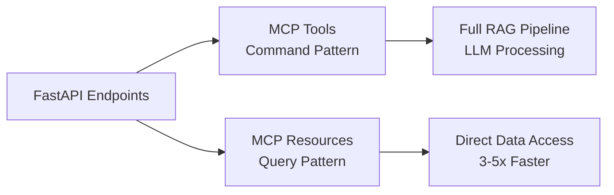

# Advanced RAG Quick Reference Guide

📖 **For complete setup instructions**: See **[SETUP.md](SETUP.md)**

## 🚀 Essential Commands

### System Status & Management (NEW)
```bash
# Check complete system status (RECOMMENDED)
python scripts/status.py                    # Comprehensive 5-tier status validation
python scripts/status.py --json             # JSON output for automation

# Expected output shows all tiers:
# Tier 1 (Environment): ✅ Ready
# Tier 2 (Infrastructure): ✅ All Services Running  
# Tier 3 (Application): ✅ FastAPI Running
# Tier 4 (MCP Interface): ✅ MCP Servers Available
# Tier 5 (Data): ✅ Collections Loaded

# Manage application tiers
python scripts/manage.py start              # Start all services
python scripts/manage.py stop               # Stop all services
python scripts/manage.py restart            # Restart everything
python scripts/manage.py clean              # Clean up orphaned processes

# Tier-specific management
python scripts/manage.py start --tier 2     # Start infrastructure only
python scripts/manage.py stop --tier 3      # Stop FastAPI server only
python scripts/manage.py restart --tier 4   # Restart MCP servers only
```

### Environment & Dependencies
```bash
# Virtual environment (REQUIRED for all work)
source .venv/bin/activate
which python  # Must show .venv path
uv sync --dev
```

### Service Management
```bash
# Infrastructure services
docker-compose up -d
docker-compose ps
docker-compose restart

# Health checks (or use python scripts/status.py)
curl http://localhost:6333/health    # Qdrant
curl http://localhost:6006           # Phoenix  
curl http://localhost:6379           # Redis
curl http://localhost:8000/health    # FastAPI
```

### Application Servers
```bash
# Main API server (with port conflict detection)
python run.py                               # Default port 8000
PORT=8001 python run.py                     # Use alternate port

# MCP Tools server (Command Pattern)
python src/mcp/server.py

# MCP Resources server (Query Pattern - CQRS)
python src/mcp/resources.py
```

### Data Pipeline
```bash
# Data ingestion (required before first run)
python scripts/ingestion/csv_ingestion_pipeline.py

# Evaluation and benchmarking
python scripts/evaluation/retrieval_method_comparison.py
python scripts/evaluation/semantic_architecture_benchmark.py
```

## 🏗️ Tier-Based Architecture (FUNCTIONAL)

**Status Check**: `python scripts/status.py` validates all tiers

| Tier | Components | Modification Rule | Status Validation |
|------|------------|------------------|-------------------|
| **Tier 1: Environment** | Virtual env, Python 3.13+, API keys | ⚠️ **REQUIRED** | Environment activation, uv availability |
| **Tier 2: Infrastructure** | Docker, Qdrant, Phoenix, Redis | 🏗️ **FOUNDATION** | Service health endpoints |
| **Tier 3: RAG Application** | FastAPI server, 6 endpoints | 🔒 **IMMUTABLE PATTERNS** | Process detection, health check |
| **Tier 4: MCP Interface** | MCP Tools & Resources servers | 🔌 **INTERFACE ONLY** | Process pattern matching |
| **Tier 5: Data & Validation** | Vector collections, schemas | 🛠️ **VALIDATION** | Collection existence, data integrity |

### ✅ Safe to Modify (By Tier)
- **Tier 1**: `.env` file, environment variables
- **Tier 3**: `src/api/app.py` - Add new FastAPI endpoints (auto-converts to MCP tools)
- **Tier 4**: `src/mcp/server.py`, `src/mcp/resources.py` - MCP server configuration
- **Tier 5**: `scripts/` - Data ingestion and evaluation, `tests/` - All test files

### ❌ Never Modify (Breaks Contracts)
- **Tier 3**: `src/rag/` - Core RAG pipeline components
- **Tier 3**: `src/core/settings.py` - Model pinning (`gpt-4.1-mini`, `text-embedding-3-small`)
- **Tier 3**: LangChain LCEL patterns in `src/rag/chain.py`

## 🔄 6 Retrieval Strategies

| Strategy | Complexity | Performance | Command |
|----------|------------|-------------|---------|
| **Naive** | Low | High | `curl -X POST localhost:8000/invoke/naive_retriever` |
| **BM25** | Low | High | `curl -X POST localhost:8000/invoke/bm25_retriever` |
| **Semantic** | Medium | Medium | `curl -X POST localhost:8000/invoke/semantic_retriever` |
| **Ensemble** | High | Medium | `curl -X POST localhost:8000/invoke/ensemble_retriever` |
| **Contextual Compression** | High | Low | `curl -X POST localhost:8000/invoke/contextual_compression_retriever` |
| **Multi-Query** | High | Low | `curl -X POST localhost:8000/invoke/multi_query_retriever` |

### Request Format (All Endpoints)
```json
{"question": "What makes John Wick movies popular?"}
```

### Response Format (All Endpoints)
```json
{
  "answer": "Generated response based on retrieved context",
  "context_document_count": 5
}
```

## 🔌 MCP Integration Patterns

### Dual MCP Architecture


### MCP Tools (Command Pattern)
- **Purpose**: Full RAG pipeline with LLM synthesis
- **Pattern**: `FastMCP.from_fastapi()` zero-duplication
- **Use Cases**: Answer generation, context processing

### MCP Resources (Query Pattern - CQRS)  
- **Purpose**: Direct data access for performance
- **Pattern**: Native FastMCP resource registration
- **Use Cases**: Raw search results, metadata extraction

## 🧪 Testing Commands

```bash
# All tests
pytest tests/ -v

# By category (defined in pytest.ini)
pytest tests/ -m unit -v          # Unit tests
pytest tests/ -m integration -v   # Integration tests  
pytest tests/ -m requires_llm -v  # Tests needing API keys

# MCP validation
python tests/integration/verify_mcp.py

# API endpoints
bash tests/integration/test_api_endpoints.sh
```

## 📊 Data Pipeline

### Ingestion
```bash
# Load John Wick movie reviews data
python scripts/ingestion/csv_ingestion_pipeline.py

# Verify collections created
curl http://localhost:6333/collections
```

### Evaluation
```bash
# Compare all retrieval strategies
python scripts/evaluation/retrieval_method_comparison.py

# Semantic architecture benchmark  
python scripts/evaluation/semantic_architecture_benchmark.py

# View results
open http://localhost:6006  # Phoenix dashboard
```

## 🔍 Schema Management (MCP 2025-03-26)

### Native Discovery (Recommended)
```bash
# Start server with streamable HTTP
python src/mcp/server.py

# Native MCP discovery
curl -X POST http://127.0.0.1:8000/mcp \
  -H "Content-Type: application/json" \
  -d '{"jsonrpc":"2.0","id":1,"method":"rpc.discover","params":{}}'
```

### Legacy Export (Development)
```bash
# Generate schemas
python scripts/mcp/export_mcp_schema.py

# Validate compliance
python scripts/mcp/validate_mcp_schema.py
```

## 🌐 External MCP Ecosystem

### Available MCP Servers
- `qdrant-code-snippets` (Port 8002) - Code pattern management
- `qdrant-semantic-memory` (Port 8003) - Contextual insights
- `ai-docs-server` - Documentation access
- `phoenix` (localhost:6006) - **Critical for AI agent observability**
- `memory` - Official MCP knowledge graph

### Claude Code CLI Usage
```bash
# Store patterns (requires permission)
claude -p --allowedTools "qdrant-store" "Store this pattern..."

# Interactive mode (recommended)
claude --verbose
```

## 🚨 Critical Constraints

### Model Pinning (IMMUTABLE)
- **LLM**: `ChatOpenAI(model="gpt-4.1-mini")`
- **Embeddings**: `OpenAIEmbeddings(model="text-embedding-3-small")`
- **Reason**: Public contract for deterministic responses

### Environment Requirements
- **Virtual Environment**: REQUIRED activation for all work
- **Python Version**: >= 3.13 (runtime), py311 (tooling compatibility)
- **Package Manager**: uv (recommended over pip)

### MCP Interface Rule
- **MCP serves as interface only**
- **Never modify core RAG business logic in `src/rag/`**
- **Use interface layers (Tier 4) to expose new functionality**

## 🔧 Code Quality

```bash
# Format code
black src/ tests/ --line-length 88

# Lint and fix
ruff check src/ tests/ --fix

# Quality pipeline
ruff check src/ tests/ --fix && black src/ tests/ --line-length 88
```

## 📋 Environment Variables

### Required
```bash
OPENAI_API_KEY=your_openai_key_here
COHERE_API_KEY=your_cohere_key_here  # Optional for basic functionality
```

### Optional
```bash
OPENAI_MODEL_NAME=gpt-4.1-mini  # Default
EMBEDDING_MODEL_NAME=text-embedding-3-small  # Default
MEMORY_FILE_PATH=/path/to/memory.json  # MCP memory storage
```

## 🎯 Quick Troubleshooting

### Service Issues
```bash
# Restart all services
docker-compose restart

# Check logs
docker-compose logs qdrant redis phoenix
```

### Environment Issues
```bash
# Verify virtual environment
which python  # Must show .venv path

# Reinstall dependencies
rm -rf .venv && uv venv && source .venv/bin/activate && uv sync --dev
```

### MCP Issues
```bash
# Test MCP conversion
python tests/integration/verify_mcp.py

# Restart MCP servers
pkill -f "src/mcp/server.py" && python src/mcp/server.py &
pkill -f "src/mcp/resources.py" && python src/mcp/resources.py &
```

## 📚 Documentation References

- **CLAUDE.md** - Comprehensive Claude Code guidance
- **docs/ARCHITECTURE.md** - System architecture details
- **docs/TROUBLESHOOTING.md** - Common issues and solutions
- **README.md** - Project overview and quick start
- **Phoenix Dashboard** - http://localhost:6006 (AI agent observability)

## 🔄 Adding New Retrieval Strategies

1. **Add FastAPI endpoint** in `src/api/app.py` (auto-converts to MCP tool)
2. **Implement retriever** in `src/rag/retriever.py` using factory pattern
3. **Create LCEL chain** in `src/rag/chain.py` following established patterns  
4. **Never modify** existing retrieval logic - only add new strategies
5. **Test both interfaces** - FastAPI endpoint and MCP tool conversion

Remember: Follow the tier-based architecture - interface layers only, never modify foundation components!