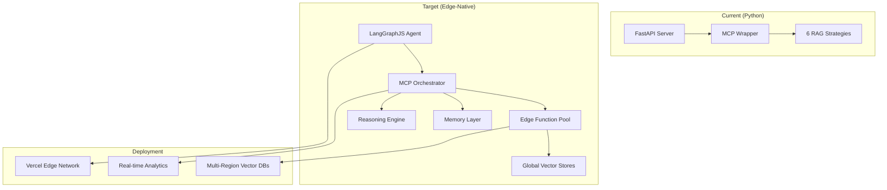

# 🚀 Advanced RAG → Edge-Native Agentic Platform Roadmap

## 🚨 **IMMEDIATE ACTIONS** (Next 1-2 weeks)

### **Critical Technical Fixes Required**

**Environment & Dependencies**
```bash
# Fix missing dependencies
source .venv/bin/activate
uv sync  # or pip install -e .[dev,test]

# Install missing packages
pip install langchain-qdrant
pip install fastmcp[cli]  # For CLI support

# Verify installation
python -c "from src.vectorstore_setup import setup_qdrant; print('✅ Imports working')"
```

**MCP Transport Configuration**
```bash
# Fix HTTP redirect issues (307 errors)
# Current issue: /mcp vs /mcp/ path handling
# Solution: Use streamable HTTP with proper path configuration

# Start MCP server with correct transport
python src/mcp_server/fastapi_wrapper.py
# Should serve on http://127.0.0.1:8001/mcp for schema discovery
```

**Schema Export & Validation**
```bash
# Fix connection issues in export scripts
python scripts/mcp/export_mcp_schema_http.py
python scripts/mcp/validate_mcp_schema.py

# Verify MCP compliance
curl -X POST http://127.0.0.1:8001/mcp \
  -H "Content-Type: application/json" \
  -d '{"jsonrpc":"2.0","id":1,"method":"rpc.discover","params":{}}'
```

### **Semantic Architecture Implementation**

**Current State**: FastAPI endpoints are converted to MCP "tools" (incorrect semantically)
**Target State**: RAG retrieval should be MCP "resources" (read-only data access)

```python
# ❌ Current: RAG as Tools (actions)
POST /invoke/semantic_retriever → MCP tool "semantic_retriever"

# ✅ Target: RAG as Resources (data access)
GET retriever://semantic/{query} → MCP resource with URI template
```

**Implementation Priority**:
1. **Fix current technical issues** (imports, CLI, transport)
2. **Create resource wrapper** with URI templates
3. **Benchmark performance** (Tools vs Resources)
4. **Validate schema compliance** (MCP 2025-03-26)

## 🎯 Vision Statement

Transform our proven Python FastAPI + MCP RAG system into a **next-generation edge-native agentic platform** that combines:
- **LangGraphJS** for sophisticated multi-agent workflows
- **Vercel Edge Functions** for global sub-100ms latency
- **FastMCP v2** server composition patterns
- **Native MCP integration** across the entire stack

## 🧠 **BREAKTHROUGH: Semantic Architecture Discovery**

### **The "Aha!" Moment: Tools vs Resources for RAG**

Our exploration revealed a **fundamental MCP design principle** that transforms RAG architecture:

**🔧 Tools** = "**Doers**" (side effects, mutations, complex logic)
- Document ingestion and indexing
- Vector store updates and configuration
- Batch processing and data mutations
- System administration actions

**📚 Resources** = "**Getter-uppers**" (read-only, parameterized, LLM context loading)
- Vector similarity search: `retriever://semantic/{query}`
- BM25 keyword retrieval: `retriever://bm25/{query}`
- Contextual compression: `retriever://compressed/{query}`
- Multi-query expansion: `retriever://multi_query/{query}`

### **Current Technical Reality vs Target Architecture**

| Component | Current State | Target State | Status |
|-----------|---------------|--------------|---------|
| **FastAPI Server** | ✅ Running (port 8000) | ✅ Maintain as backend | Complete |
| **MCP Conversion** | ⚠️ Tools (incorrect) | 🎯 Resources (correct) | **In Progress** |
| **Transport** | ⚠️ HTTP redirects | ✅ Streamable HTTP | **Fixing** |
| **Schema Export** | ⚠️ Connection issues | ✅ Native discovery | **Fixing** |
| **CLI Integration** | ❌ `fastmcp` not found | ✅ Proper installation | **Required** |

### **Recommended Architecture Pattern**

```python
# ✅ INDEXING/INGESTION → Tools (side effects)
@tool(name="index_documents", description="Ingest docs into vector store")
def index_documents(batch: List[Document]) -> IndexResult:
    vector_index.upsert(batch)
    return {"ingested": len(batch), "status": "success"}

# ✅ RETRIEVAL/CONTEXT → Resources (read-only, URI-based)
@resource(
    name="bm25_retriever",
    uri_template="retriever://bm25/{query}",
    description="BM25 keyword-based document retrieval"
)
def bm25_retriever(query: str) -> List[Document]:
    return bm25_index.search(query, top_k=5)

@resource(
    name="semantic_retriever", 
    uri_template="retriever://semantic/{query}",
    description="Vector similarity-based document retrieval"
)
def semantic_retriever(query: str) -> List[Document]:
    return vector_store.similarity_search(query, k=5)
```

### **Performance & Deployment Benefits**

| Benefit | Tools (Actions) | Resources (Data Access) |
|---------|----------------|-------------------------|
| **Caching** | Not cacheable (side effects) | ✅ URI-based caching (CDN-friendly) |
| **Pre-fetching** | N/A | ✅ Predictable patterns |
| **Edge Deployment** | Complex state management | ✅ Stateless, edge-optimized |
| **LLM Integration** | "Execute this action" | ✅ "Load this context" |
| **Latency** | Full request cycle | ✅ Optimized GET patterns |
| **CDN Compatibility** | ❌ POST requests | ✅ GET with query params |

## 🎯 **Phase 1: Foundation Stabilization & Semantic Refactoring** (2-3 weeks)

### **1.1 Technical Infrastructure Fixes** (Week 1)
**Priority**: Critical - blocks all other work

**Dependencies & Environment**
- ✅ Fix `langchain_qdrant` import errors
- ✅ Install `fastmcp[cli]` for proper CLI support
- ✅ Resolve `setup_qdrant` import issues
- ✅ Verify all RAG chains initialize correctly

**Transport Configuration**
- ✅ Fix HTTP redirect issues (307 errors on `/mcp` vs `/mcp/`)
- ✅ Configure streamable HTTP transport properly
- ✅ Test native schema discovery via `rpc.discover`
- ✅ Validate connection pooling for production

**Schema Export & Validation**
- ✅ Fix connection issues in `export_mcp_schema_http.py`
- ✅ Validate MCP 2025-03-26 specification compliance
- ✅ Test schema export via HTTP client
- ✅ Implement CI/CD validation pipeline

### **1.2 Semantic Architecture Migration** (Week 2)
**Priority**: High - enables performance optimization

**Resource-First Implementation**
- 🎯 Create `resource_wrapper.py` with URI templates
- 🎯 Migrate all 6 retrieval endpoints to MCP resources
- 🎯 Implement `retriever://{method}/{query}` URI patterns
- 🎯 Add resource-specific caching strategies

**Performance Benchmarking**
- 📊 Compare Tools vs Resources latency
- 📊 Measure URI-based caching effectiveness
- 📊 Test CDN compatibility with GET patterns
- 📊 Validate sub-100ms latency targets

**Schema Compliance**
- ✅ Validate semantic correctness (Resources for retrieval)
- ✅ Test with MCP Inspector and Claude Desktop
- ✅ Document semantic guidelines for future development
- ✅ Implement automated compliance checking

### **1.3 Transport-Agnostic Validation** (Week 3)
**Priority**: Medium - ensures compatibility

**Multi-Transport Testing**
- 🔄 STDIO transport (Claude Desktop integration)
- 🔄 Streamable HTTP (production deployment)
- 🔄 WebSocket transport (real-time applications)
- 🔄 Connection pooling and session management

**Integration Validation**
- 🧪 LangGraph integration via `langchain-mcp-adapters`
- 🧪 Claude Desktop MCP configuration
- 🧪 Vercel Edge Functions compatibility
- 🧪 Performance monitoring and alerting

## 🌟 Phase 2: Edge Optimization & LangGraph Integration (Q2 2025)

### **2.1 Edge-Native Performance Optimization**
**Timeline**: 4-6 weeks
**Goal**: Achieve sub-100ms latency with URI-based caching

#### **CDN-Optimized Resource Architecture**
```typescript
// Edge-optimized MCP resources
@resource({
  uri_template: "retriever://semantic/{query}",
  cache_policy: { ttl: 300, vary: ["query"] },
  edge_compatible: true
})
async function semantic_retriever(query: string) {
  // Optimized for Vercel Edge Functions
  return await vectorSearch(query, { 
    strategy: "semantic",
    cache_key: `semantic:${hash(query)}`
  })
}
```

#### **Performance Targets**
- **Latency**: Sub-100ms for cached resources
- **Throughput**: 1000+ requests/second per edge location
- **Cache Hit Rate**: >80% for common queries
- **Global Distribution**: <50ms additional latency worldwide

### **2.2 LangGraphJS Agent Architecture**
**Timeline**: 3-4 weeks
**Goal**: Implement sophisticated agentic workflows

#### **Multi-Agent RAG Orchestration**
```typescript
import { StateGraph } from "@langchain/langgraph"

const ragAgent = new StateGraph({
  channels: {
    query: String,
    context: Array,
    confidence: Number,
    strategy: String
  }
})
.addNode("classify_intent", classifyUserIntent)
.addNode("select_strategy", selectRetrievalStrategy)
.addNode("parallel_retrieval", parallelMCPRetrieval)
.addNode("confidence_check", evaluateConfidence)
.addNode("synthesize_response", generateFinalResponse)
.addConditionalEdges("confidence_check", {
  "high": "synthesize_response",
  "low": "parallel_retrieval"  // Try additional strategies
})
```

#### **Advanced Capabilities**
- **Intent Classification**: Route queries to optimal retrieval strategies
- **Confidence Scoring**: Multi-strategy validation and fallbacks
- **Memory Management**: Conversation context and user preferences
- **Human-in-the-Loop**: Approval workflows for sensitive queries

### **2.3 FastMCP v2 Server Composition**
**Timeline**: 2-3 weeks
**Goal**: Leverage FastMCP v2's advanced composition patterns

#### **Microservice Architecture**
```typescript
// Specialized MCP servers
const retrievalServer = new FastMCP({ name: "RAG-Retrieval" })
const reasoningServer = new FastMCP({ name: "RAG-Reasoning" })
const memoryServer = new FastMCP({ name: "RAG-Memory" })

// Compose into unified platform
const platformServer = FastMCP.compose({
  servers: [retrievalServer, reasoningServer, memoryServer],
  routing: "intelligent",  // Route based on query analysis
  fallbacks: true
})
```

## 🔥 Phase 3: Production Agentic Platform (Q3 2025)

### **3.1 Multi-Modal RAG Expansion**
**Timeline**: 6-8 weeks
**Goal**: Extend beyond text to images, audio, and structured data

#### **Enhanced Capabilities**
- **Document Understanding**: PDF layout preservation, table extraction
- **Image Analysis**: Visual question answering, chart interpretation
- **Audio Processing**: Transcription, semantic audio search
- **Code Analysis**: Repository-wide semantic search and generation

### **3.2 Enterprise Integration Layer**
**Timeline**: 4-6 weeks
**Goal**: Production-ready enterprise features

#### **Security & Compliance**
- **OAuth2/SAML integration** with enterprise identity providers
- **Role-based access control** for different retrieval strategies
- **Audit logging** with compliance reporting
- **Data residency controls** for sensitive information

#### **Scalability Features**
- **Auto-scaling** based on query volume and complexity
- **Intelligent caching** with semantic similarity detection
- **Rate limiting** with user-specific quotas
- **Performance monitoring** with real-time alerting

### **3.3 Advanced Agent Workflows**
**Timeline**: 5-7 weeks
**Goal**: Sophisticated multi-step reasoning and planning

#### **Research Agent Capabilities**
```typescript
const researchWorkflow = new StateGraph()
  .addNode("decompose_query", breakDownComplexQuery)
  .addNode("parallel_research", conductParallelResearch)
  .addNode("fact_verification", crossReferenceFindings)
  .addNode("synthesis", synthesizeFindings)
  .addNode("citation_generation", generateCitations)
```

## 🌍 Phase 3: Ecosystem Integration (Q4 2025)

### **3.1 LangChain Ecosystem Integration**
**Timeline**: 4-5 weeks
**Goal**: Seamless integration with LangChain tools and agents

#### **Integration Points**
- **LangSmith telemetry** for agent performance monitoring
- **LangGraph Cloud** deployment and scaling
- **LangChain Tools** integration via MCP adapters
- **Community agents** integration and marketplace

### **3.2 Developer Platform & SDK**
**Timeline**: 6-8 weeks
**Goal**: Enable third-party developers to extend the platform

#### **Developer Experience**
```typescript
// Simple SDK for custom retrieval strategies
import { RAGPlatform } from '@advanced-rag/sdk'

const platform = new RAGPlatform()

// Register custom retrieval method
platform.registerRetriever('custom-domain', {
  async retrieve(query: string) {
    // Custom domain-specific retrieval logic
    return await customDomainSearch(query)
  }
})
```

### **3.3 AI-Native Features**
**Timeline**: 5-6 weeks
**Goal**: Leverage latest AI capabilities for enhanced performance

#### **Cutting-Edge Capabilities**
- **Self-improving retrieval** via reinforcement learning
- **Automatic strategy optimization** based on query patterns
- **Dynamic prompt engineering** for different domains
- **Predictive caching** based on user behavior patterns

## 🛠️ Technical Architecture Evolution

### **Current → Target Architecture**



## 📈 Success Metrics & KPIs

### **Performance Targets**
- **Latency**: <100ms P95 response time globally
- **Throughput**: 10,000+ concurrent queries
- **Accuracy**: >95% retrieval relevance score
- **Availability**: 99.9% uptime with graceful degradation

### **Developer Experience**
- **Setup Time**: <5 minutes from clone to running
- **Documentation Coverage**: 100% API coverage with examples
- **Community Adoption**: 1,000+ GitHub stars, 100+ contributors
- **Integration Ease**: <10 lines of code for basic integration

## 🎯 Strategic Advantages

### **Why This Evolution Matters**

1. **🌍 Global Scale**: Edge deployment enables worldwide sub-100ms latency
2. **🤖 Agentic Intelligence**: LangGraphJS enables sophisticated reasoning workflows
3. **🔧 Developer Velocity**: TypeScript ecosystem accelerates development
4. **💰 Cost Efficiency**: Serverless scaling reduces operational overhead
5. **🚀 Future-Proof**: Positions us at the forefront of agentic AI platforms

### **Competitive Differentiation**
- **First-to-market** with edge-native agentic RAG platform
- **Proven architecture** validated through our Python implementation
- **Zero-lock-in** via standard MCP protocol compliance
- **Enterprise-ready** with security, compliance, and scalability built-in

## 🤝 Community & Ecosystem

### **Open Source Strategy**
- **Core platform** remains open source with permissive licensing
- **Enterprise features** available via commercial licensing
- **Community contributions** encouraged via clear contribution guidelines
- **Developer advocacy** through conferences, blogs, and tutorials

### **Partnership Opportunities**
- **Vercel**: Official partnership for edge deployment optimization
- **LangChain**: Integration with LangGraph Cloud and LangSmith
- **Vector DB providers**: Optimized integrations with Pinecone, Qdrant, Weaviate
- **Enterprise vendors**: Integration with Salesforce, Microsoft, Google Workspace

## 🎉 Conclusion

This roadmap represents the natural evolution of our proven MCP + RAG architecture into the next generation of agentic AI platforms. By leveraging the insights from our successful Python implementation and the cutting-edge capabilities of LangGraphJS, Vercel Edge, and FastMCP v2, we're positioned to create a platform that defines the future of intelligent information retrieval and reasoning.

The combination of **proven patterns** + **cutting-edge technology** + **global edge deployment** creates a unique opportunity to build something truly transformative in the agentic AI space.

---

*This roadmap is a living document that will evolve based on community feedback, technological advances, and market opportunities. Join us in building the future of agentic AI! 🚀* 