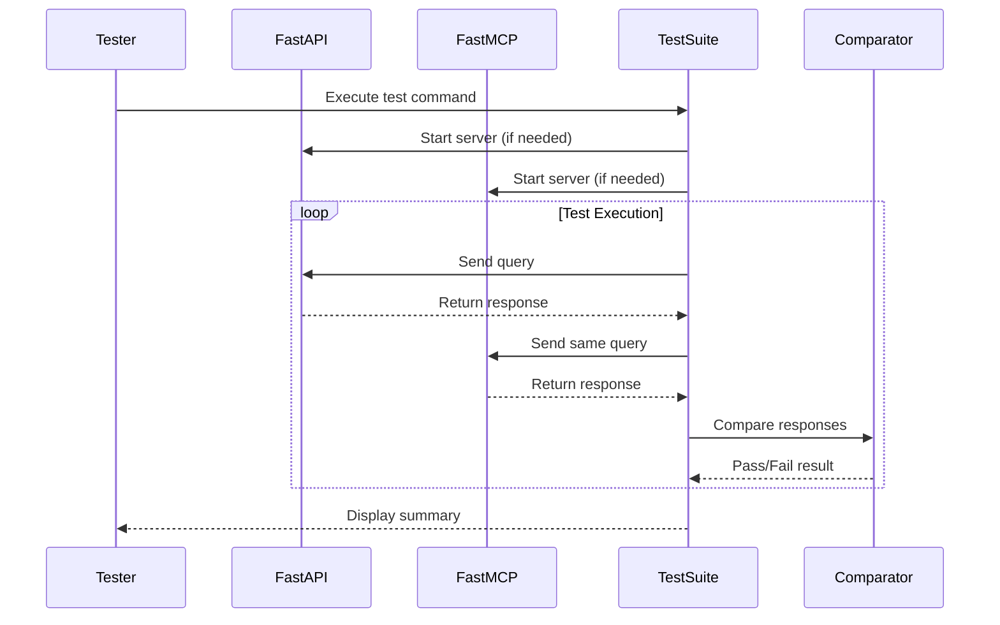

# 🧪 MCP Server Testing Guide

---

## 🚀 **Key Features**
- **Structured troubleshooting** with priority indicators (❗🔧🚨)
- **Clear visual hierarchy** for quick scanning
- **Action-oriented commands** with context annotations
- **Production readiness checklist** with validation steps
- **Performance baselining** and CI/CD integration
- **Reorganized test structure** for better maintainability

## 🗺️ Test Bootstrapping Sequence



---

## 📁 **Reorganized Test Structure**

```
tests/
├── integration/                    # Integration & system tests
│   ├── test_api_endpoints.sh      # FastAPI validation (ESSENTIAL)
│   ├── functional_quality_comparison.py  # FastAPI vs MCP quality
│   └── test_mcp_comprehensive.py  # Full MCP protocol validation
├── mcp/                           # MCP-specific tests (CONSOLIDATED)
│   ├── 01-initialization/         # Milestone 1: Server startup
│   ├── 02-tools/                  # Milestone 2: Tool discovery
│   ├── 03-tool-execution/         # Milestone 3: Tool execution
│   ├── simple_mcp_test.py        # Basic connectivity
│   ├── test_mcp_endpoints.sh     # System-level MCP validation
│   └── run_all_milestones.py     # 🆕 Master MCP test runner
├── unit/                          # Unit tests
│   └── test_retriever_factory.py
├── performance/                   # Performance & load tests
│   └── fastmcp_performance_optimization.py
└── fixtures/                     # Test data & mocks
    └── sample_documents/
```

---

## 🔍 **Test Suite Comparison**

| Test Type                  | Purpose                                                                 | When to Run                          | Key Features                          |
|----------------------------|-------------------------------------------------------------------------|--------------------------------------|---------------------------------------|
| **🚨 FastAPI Integration** | Validate underlying FastAPI interface (ESSENTIAL)                       | Every deployment, critical changes  | API endpoint validation, baseline performance |
| **🔧 MCP Milestones**      | Comprehensive MCP protocol validation                                   | Development, protocol changes        | Milestone-based testing, JSON-RPC validation |
| **⚡ Functional Quality**   | Validate response parity between FastAPI and MCP                       | Pre-deployment, pipeline changes     | Quality validation, performance tracking |
| **🧪 Simple MCP Client**   | Basic connectivity & smoke testing                                      | CI/CD, quick validation              | Connection test, basic tool execution |
| **📊 Performance Tests**   | Load testing and optimization validation                                | Performance tuning, capacity planning | Throughput, latency, resource usage |

---

## 🛠️ **Enhanced Execution Guide**

### 🚨 **Priority 1: Essential FastAPI Validation**
```bash
# ESSENTIAL: Validate underlying FastAPI interface
uv run bash tests/integration/test_api_endpoints.sh

# With detailed logging
LOG_LEVEL=DEBUG uv run bash tests/integration/test_api_endpoints.sh
```

### 🆕 **Priority 2: Comprehensive MCP Validation**
```bash
# NEW: Run all MCP milestones with master runner
uv run python tests/mcp/run_all_milestones.py

# Individual milestone testing
uv run python tests/mcp/01-initialization/test-initialize.py
uv run python tests/mcp/02-tools/test-tools-discovery.py
uv run python tests/mcp/03-tool-execution/semantic-search/test.py
```

### 🔧 **Priority 3: Integration Tests**
```bash
# Functional quality comparison (FastAPI vs MCP)
uv run pytest tests/integration/functional_quality_comparison.py -v --durations=5

# Full MCP protocol validation
uv run pytest tests/integration/test_mcp_comprehensive.py --cov=src

# Quick connectivity test
uv run pytest tests/mcp/simple_mcp_test.py -v
```

### 📊 **Priority 4: Performance & Load Testing**
```bash
# Performance optimization tests
uv run pytest tests/performance/fastmcp_performance_optimization.py --benchmark-histogram

# Unit tests
uv run pytest tests/unit/ -v
```

---

## 🚨 **Enhanced Troubleshooting Guide**

| Priority | Issue Type | Symptoms | Solution | Command |
|----------|------------|----------|----------|---------|
| ❗ **P0** | Server Won't Start | Connection refused, import errors | Check dependencies, environment | `uv pip list \| grep mcp` |
| ❗ **P0** | FastAPI Baseline Fails | API endpoints return 500/404 | Validate core FastAPI functionality | `uv run bash tests/integration/test_api_endpoints.sh` |
| 🔧 **P1** | MCP Protocol Issues | Tool discovery fails, JSON-RPC errors | Run milestone tests individually | `uv run python tests/mcp/run_all_milestones.py` |
| 🔧 **P1** | Session Fixture Errors | `async_generator` attribute errors | Check pytest-asyncio decorators | `grep -r "@pytest.mark.asyncio" tests/` |
| 🚨 **P2** | Quality Degradation | Response differences between APIs | Compare FastAPI vs MCP outputs | `uv run pytest tests/integration/functional_quality_comparison.py -s` |
| 🚨 **P2** | Performance Issues | High latency, timeouts | Run performance benchmarks | `uv run pytest tests/performance/ --benchmark-histogram` |

---

## 🎯 **Production Readiness Checklist**

### ✅ **Essential Validations**
```bash
# 1. FastAPI baseline (MUST PASS)
uv run bash tests/integration/test_api_endpoints.sh
echo "FastAPI Status: $?"

# 2. MCP milestone validation
uv run python tests/mcp/run_all_milestones.py
echo "MCP Milestones Status: $?"

# 3. Quality parity check
uv run pytest tests/integration/functional_quality_comparison.py
echo "Quality Check Status: $?"
```

### 📊 **Performance Baselines**
```bash
# Establish performance baselines
uv run pytest tests/performance/ --benchmark-json=baseline.json

# Validate against SLA (< 100ms p95)
uv run pytest tests/integration/functional_quality_comparison.py --durations=0
```

### 🔍 **Health Validation**
```bash
# System health check
curl -f http://localhost:8000/health || echo "Health check failed"

# MCP server connectivity
uv run python tests/mcp/simple_mcp_test.py
```

---

## 🚀 **CI/CD Integration**

### GitHub Actions Example
```yaml
name: MCP Server Validation
on: [push, pull_request]

jobs:
  test:
    runs-on: ubuntu-latest
    steps:
      - uses: actions/checkout@v4
      - uses: astral-sh/setup-uv@v1
      
      # Essential FastAPI validation
      - name: FastAPI Integration Test
        run: |
          uv sync
          uv run bash tests/integration/test_api_endpoints.sh
      
      # Comprehensive MCP validation
      - name: MCP Milestone Tests
        run: uv run python tests/mcp/run_all_milestones.py
      
      # Quality validation
      - name: Functional Quality Tests
        run: uv run pytest tests/integration/functional_quality_comparison.py -v
      
      # Performance validation
      - name: Performance Tests
        run: uv run pytest tests/performance/ --benchmark-histogram
```

---

## 📈 **Test Metrics & Monitoring**

### Key Performance Indicators
- **FastAPI Baseline**: Must maintain < 50ms p95 latency
- **MCP Protocol Compliance**: 100% milestone test pass rate
- **Quality Parity**: < 5% response difference between FastAPI and MCP
- **Test Coverage**: > 80% code coverage across all test types

### Monitoring Commands
```bash
# Generate coverage report
uv run pytest --cov=src --cov-report=html tests/

# Performance trend analysis
uv run pytest tests/performance/ --benchmark-compare=baseline.json

# Test execution summary
uv run python tests/mcp/run_all_milestones.py | tee test_summary.log
```

---

## 🔧 **Advanced Debugging Strategies**

### 1. **MCP Protocol Debugging**
```bash
# Enable MCP debug logging
export MCP_LOG_LEVEL=DEBUG
uv run python tests/mcp/simple_mcp_test.py

# JSON-RPC message tracing
uv run python tests/mcp/01-initialization/test-initialize.py --verbose
```

### 2. **Async Test Debugging**
```bash
# Check pytest-asyncio configuration
cat pytest.ini | grep asyncio

# Validate async fixture decorators
grep -r "@pytest_asyncio.fixture" tests/
```

### 3. **Performance Profiling**
```bash
# Profile test execution
uv run python -m cProfile tests/mcp/run_all_milestones.py

# Memory usage analysis
uv run python -m memory_profiler tests/integration/functional_quality_comparison.py
```

### 4. **Integration Debugging**
```bash
# Test server startup in isolation
uv run python -m src.mcp_server.main &
sleep 5 && kill %1

# Validate tool registration
uv run python -c "from src.mcp_server.main import app; print([tool.name for tool in app.list_tools()])"
```

### 5. **Environment Validation**
```bash
# Check all dependencies
uv pip check

# Validate Python environment
uv run python -c "import sys; print(sys.version); import mcp; print(mcp.__version__)"

# Test data validation
ls -la tests/fixtures/sample_documents/
```

---

## 💡 **Best Practices**

### Test Execution Order
1. **FastAPI Integration** (Essential baseline)
2. **MCP Milestones** (Protocol compliance)
3. **Functional Quality** (Response parity)
4. **Performance Tests** (Load validation)

### Debugging Workflow
1. Start with essential FastAPI validation
2. Use MCP milestone runner for systematic debugging
3. Enable debug logging for detailed analysis
4. Compare outputs between FastAPI and MCP implementations

### Performance Optimization
1. Establish baselines with performance tests
2. Monitor trends with benchmark comparisons
3. Validate SLA compliance in CI/CD pipeline
4. Use profiling tools for bottleneck identification

---

## 🎉 **Success Criteria**

✅ **Ready for Production:**
- All FastAPI integration tests pass
- MCP milestone tests achieve 100% success rate
- Quality parity tests show < 5% difference
- Performance tests meet SLA requirements

⚠️ **Needs Review:**
- 1-2 test failures with clear remediation path
- Performance within 10% of SLA requirements
- Minor quality differences with documented explanations

🚨 **Requires Major Work:**
- FastAPI baseline tests failing
- Multiple MCP milestone failures
- Significant quality degradation
- Performance below SLA requirements

---

*This guide provides comprehensive testing validation for MCP server implementations with emphasis on production readiness and systematic debugging approaches.* 